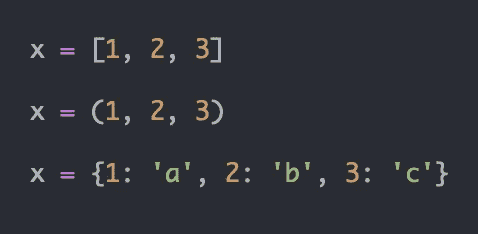
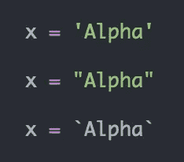
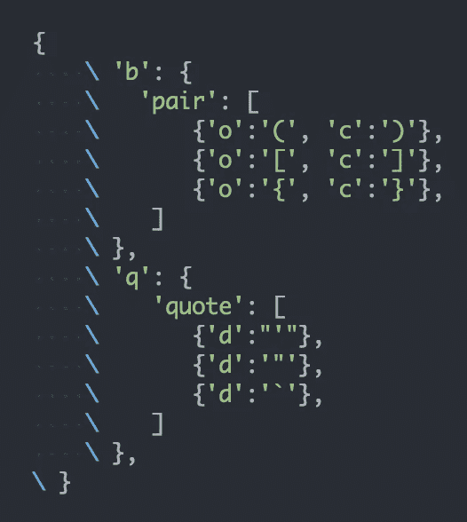
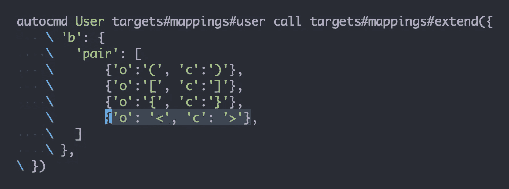
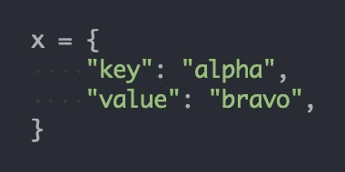
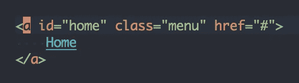
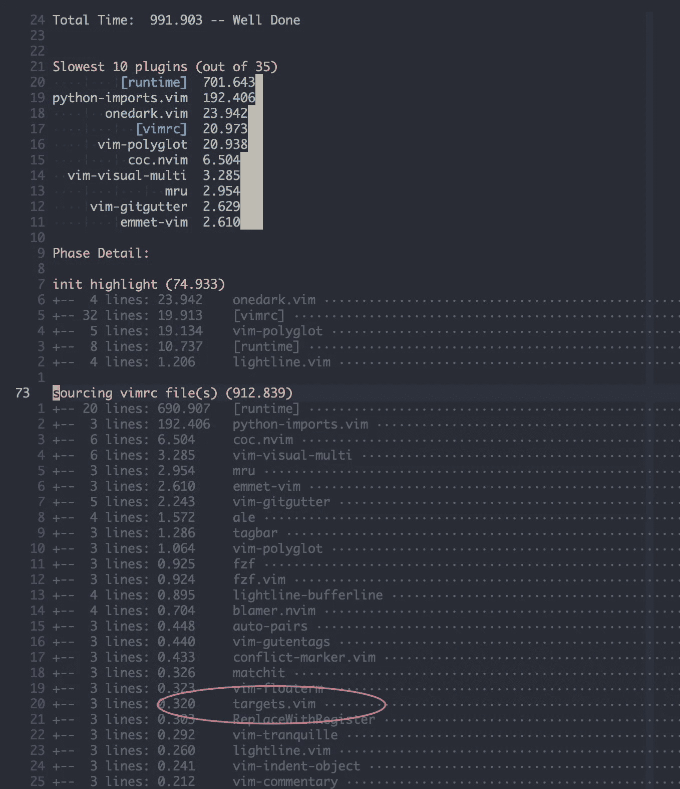

# Vim 目标:使用更少的按键操作处理远距离文本对象

> 原文：<https://medium.com/codex/vim-targets-work-on-text-objects-with-less-keystrokes-684683bbaeea?source=collection_archive---------1----------------------->

## 使用便捷的按键从远处锁定文本对象

迈克尔·泽兹奇在 [Unsplash](https://unsplash.com?utm_source=medium&utm_medium=referral) 上拍摄的照片

# 背景

如果你搜索一下 [Vim Targets](https://github.com/wellle/targets.vim) ，只有少数资源。然而，这个插件可以通过键入更有效和更方便的键来极大地改善你的工作流程。不可否认，当我第一次阅读这个插件的文档时，我并没有真正被说服，因为有太多的细节，我无法想象有必要使用它。另外，我觉得对我的口味来说太重了。事后看来，我错了。

过了一段时间，我偶然看到了 Jaime Gonzalez Garcia 的精彩 [Vim 文章](https://www.barbarianmeetscoding.com/blog/boost-your-coding-fu-with-vscode-and-vim)，以及他关于 [Vim 目标](https://www.barbarianmeetscoding.com/blog/exploring-vim-plugins-improve-and-extend-your-text-objects-with-targets-vim)的讨论。让我意识到要重新审视一下目标插件。

# b 和 q 文本对象

编码时，通常花费大量时间导航和编辑以下内容的**内容**:

*   括号:函数调用/参数、元组、生成器等
*   花括号:字典、关联数组、JSON 等
*   方括号:列表、索引等
*   报价:标签、消息、文本等

由于我使用 Targets 已经有一段时间了，我可以说它对于常见的编辑工作流有两个主要的有价值的特性:

*   `b`:操作**任意**块——圆括号( **()** )、花括号( **{}** )、方括号( **[]** )。
*   `q`:操作**任何**引号——单引号(**“**)、双引号(**“**)、反引号(**`**)

# 实际应用

*阻挡物体*

给定这些例子，并假设光标位于第一个字符`x`:

改变它们的内容时通常有哪些选项？

*   `f1`然后`ct]`:找到[]内的第一个字符`1`，然后改变内容，直到到达`]`
*   `f1`然后`ct)`:找到()中的第一个字符`1`，然后改变内容，直到到达`)`
*   `f1`然后`ct}`:找到{ 0 }里面的第一个字符`1`，然后改变内容，直到到达`}`

所以，我们需要**5**23】字符来改变它们的内容，它们不符合人体工程学，因为它们涉及数字和标点符号。

然而，如果你正在使用目标插件，或者[Vim 8 . 2 . 3255(2021 年 7 月 31 日)build](https://github.com/vim/vim/commit/b9115da4bec5e6cfff69da85cc47c42dd67e42e4) ，你可以有这些自动搜索机制:

*   `ci]`:改变最近`[]`的内容
*   `ci(`:改变最近的`()`的内容
*   `ci{` / `ciB:`改变最近的`{}`的内容

它使用了 3 个字符，因此比上面的 5 个字符有所改进。不过在使用插件的时候，还有一个更好的方法，通过统一的`cib`(**c**hange**I**nner**b**lock)——适用于**以上所有**情况，打字真的很方便！此外，该插件将自动寻找当前行或相邻行中最近的适用文本对象。它也是双向的。

*报价对象*

如果您不知道的话，本机 Vim/Neovim 对**引号**对象具有自动搜索行为(即无需将光标移到引号内即可对其进行操作)。所以，你可以**传送**你的光标/焦点到里面。给定以下场景:

假设光标在`x`处，我们想改变引号内的内容，我们可以这样做:

*   `ci'`:改变光标右侧单引号的内容。
*   `ci"`:改变光标右侧双引号的内容。
*   `ci``:改变光标右侧反勾的内容。

使用`ciq`有更好的方法，因为它是:

*   双向，不关心光标是在引用对象的左侧还是右侧
*   打字更符合人体工程学，因为你不需要输入标点符号
*   更少的认知开销，因为`q`涵盖了所有类型的报价

# 映射

**b** 和 **q** 是统一的文本对象，它之所以有效是因为插件[为各种类型的括号/引号定义了这些映射](https://github.com/wellle/targets.vim#targetsmappingsextend):

我们可以通过定义其他映射或扩展当前的映射来进一步扩展这个想法。例如，我创建了这个映射，这样`<>`尖括号将包含在 **b** 文本对象中(见高亮部分):

我经常更新我的 Vim/Neovim 映射，这通常涉及到`<>`块/文本对象，所以现在我只需键入`cib`来更新它们，而不是键入`ci<`或`ci>`，这样不太方便。当您处理大量 HTML 标签时，这也很方便。

# 在相邻的 b 或 q 上操作

一个常见的场景是操作 JSON 或字典。假设我们有这个对象:

一旦你进入一个文本对象，比如“alpha”上的文本对象，你可以快速跳转到相邻的文本对象，即使它们在其他行中:

*   `cinq`:改变**I**nner**n**ext**q**文本对象即“值”
*   `cilq`:更改**I**nner**l**ast**q**文本对象，它是“关键”(*最后一个*的简单意思是*前一个)*

如果您想要处理相邻的括号、花括号、方括号或尖括号(即使用`cinb`或`cilb`)，这也是适用的。

# 对任何 b 或 q 进行操作

有时你需要处理同一行中的多个 **b** 或 **q** 。例如，在 HTML 中，这种情况很常见:

假设我们想将“menu”类更改为“menu-item”，我们可以使用编号为`inq`的:

*   `c2inq`:改变**2**nd**I**nner**n**ext**q**uote 文本对象。这里的三个 **q** 对象分别是`1inq`或简称为`inq`(“主页”)、`2inq`(“菜单”)和`3inq`(“#”)。

然而，如果你像我一样喜欢键入字母而不是数字，你可以使用[单字符动作](https://ranelpadon.medium.com/vim-for-the-win-the-power-of-single-char-motion-82d93b4bf6d6)结合目标来改变“菜单”类，如上:

*   `s”a`:搜索出现的**“**以转到“菜单”，然后键入`a`(假设`a`是“菜单”的跳转标签)
*   `ciq`:改变 **i** nner **q** uote 文本对象，因为你已经在“菜单”上了

本质上，我更喜欢打`s”aciq`而不是`c2inq.`，它多了一个字符，但打字更快更容易。

注意，上面例子中的操作只是使用了**改变** ( `c`)操作(例如`cib`或`ciq`)，主要是为了简洁，当然，我们可以很容易地将其扩展到其他操作，如`yib` / `yiq`、`dib` / `diq`等。

# 表演

目标可能会显得臃肿，因为它能做很多事情。令人惊讶的是，它很轻。下面是我尝试检查它的 [StartupTime](https://github.com/tweekmonster/startuptime.vim) 时的结果:

# 关键要点

*   使用目标可以通过最小化认知超载和键入人体工程学按键来提高你的效率。
*   目标有许多特性(包括定位特定的函数参数或序列项)，但是 **b** 和 **q** 文本对象是我最喜欢的，因为它们可以在各种场景中使用。尽管这个插件拥有强大的功能，它仍然是轻量级的。
*   目标可以操作相邻的 **b** 和 **q** 文本对象，并且可以使用数字操作它的多次出现。对于多次出现的情况，您可能需要考虑[单字符运动](https://ranelpadon.medium.com/vim-for-the-win-the-power-of-single-char-motion-82d93b4bf6d6)。
*   您可以创建自己的目标或扩展现有的目标。
*   “目标”应该在他们的文档中更多地强调 **b** 和 **q** 对象，因为它们可能是他们最大的卖点。

感谢您的阅读。如果你发现了一些有价值的东西，请关注我，或者给文章鼓掌/评论，或者[请我喝杯咖啡](https://ko-fi.com/ranelpadon)。这对我意义重大，鼓励我创作更多高质量的内容。