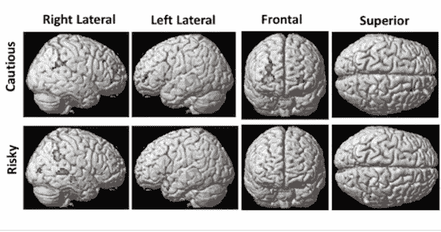

# 虚拟现实作为精神健康的神经成像

> 原文：<https://medium.com/codex/virtual-reality-neuroimaging-of-mental-health-605fb0a57926?source=collection_archive---------25----------------------->

青少年大脑图片来自贝塞斯达国立卫生研究院图片库

当一个人处于抑郁或焦虑危机时，大脑活动的 fMRI 图像或 EEG 脑电波可能在讲述一个可以以可控方式让大脑平静下来的故事方面作用不大。

虽然自动思维有影响，但有一些方法可以让被控制的思维超越那些情境中的泡沫。有可能看到应该引起恐慌的东西，但确定不是看上去的样子。这在内心告诉思想不要去那里。

如何控制和自动思维——启动和驱动——是比目前的神经成像技术更好地发现其原因的关键。

这个故事，在虚拟现实中播放，可以成为不同情况下的一个位置，有可能诱导更多控制思想的精神状态。

为什么文字会伤人？为什么伤人的话不能被忽略，或者不予理会？为什么一个新水龙头在有客人的重要周末损坏会导致严重的熔毁？那个龙头和最终的情绪障碍有什么关系？

这些问题属于大脑中的思维路径——思想如何产生，然后传输，以保持这种力量。伤人的话不仅仅是声音，还有思想。受损的龙头不仅仅是一个物体，而是一个通向不安的目的地的思想版本。

在某些精神健康的案例中，一旦它开始运行并且没有以某种方式被排除，它就会一直运行下去。这种“向下感觉”效应占用了大脑其他部分的大量注意力，并可能在其他地方引起身体感觉。

对一些人来说，他们滥用药物，对另一些人来说，他们有其他的应对机制，但虚拟现实在心理健康方面的一个可能的作用是[展示大脑中各种情况下的思维路径](https://writer.zoho.com/writer/open/dpbiea67ec9ee78fe4654b2649387ec49c7ca)，目的是给受控制的思想一个战斗的机会。