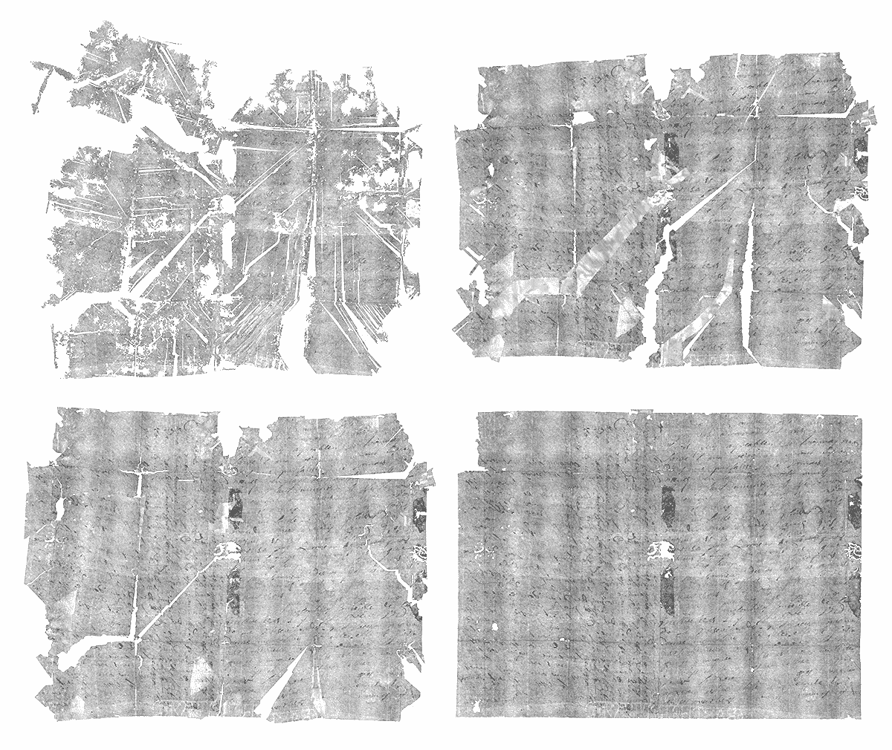

# 虚拟展示密封的 17 世纪信件——一个关于历史、艺术、技术和友谊的故事

> 原文：<https://medium.com/codex/virtually-unfolding-sealed-17th-century-letters-a-story-of-history-art-technology-friendship-e8d258eb6b68?source=collection_archive---------8----------------------->

300 多年前的 1697 年 7 月 31 日，法国人雅克·森纳克坐下来给他的表弟皮埃尔·拉·佩斯写了一封信。雅克在跟进一个悲惨的请求——索要丹尼尔·勒佩斯的死亡证明的认证副本。雅克的语气很急切——法国继承法在 1697 年刚刚改变，我们怀疑他需要证据证明丹尼尔在修正案之前就去世了。正如任何 17 世纪的法国人一样，雅克在信的结尾用了一个长长的宗教落款。他小心翼翼地用一系列复杂的对角折叠和折缝折叠他的信息，用淀粉封合整个包裹。

虽然 Jacques 复杂的折叠技术可能看起来非常规，但在 19 世纪 30 年代现代信封普及之前，大多数信件都被折叠并固定成自己的信封。这种被称为[字母锁](https://letterlocking.org/)的做法，是几个世纪以来跨越文化、国界和社会阶层的日常活动。

尽管雅克小心翼翼地起草了这封信，但不幸的是，皮埃尔从未收到过这封信。事实上，雅克的信至今仍完全密封着——藏在[一个装有 2600 多封其他未投递信件的箱子里](https://brienne.org/)——只有皮耶的名字和地址可以从外面看到。雅克的信息和他的信的错综复杂的内部结构只有我们知道，因为他们已经完全虚拟重建。

**从 15 岁开始，我和研究人员** [**阿曼达·加塞伊**](http://amandaghassaei.com)**——一直在开发全自动虚拟展开过程，揭示雅克的信息和他的信的 3D 折叠几何形状，以及从同一个行李箱中重建其他未打开的信件包。**

这项工作是一个奇妙的跨学科国际合作的一部分，由历史学家、数学家和研究科学家组成，名为“解锁历史研究小组”。我们的新技术使管理员能够保存一封信的复杂内部工程，同时允许历史学家阅读它的文字。

在 [*自然通讯*](https://www.nature.com/articles/s41467-021-21326-w)*查看我们的工作，访问[我的个人网站](http://holly-jackson.com)，或者继续阅读下面的内容，了解更多关于该项目的精彩背景故事。*

**

*图片由霍利·杰克逊提供。*

*在过去的 20 年里，Jana Dambrogio(现任麻省理工学院 Thomas F. Peterson (1957)管理人)是字母锁定研究的先驱。她与国王学院的教授[Daniel Starza Smith](https://www.kcl.ac.uk/people/dr-daniel-starza-smith)博士一起研究了超过 25 万封历史锁定信件，并首次将字母锁定技术系统化。这些技术——可能小到纸张上的裂缝和褶缝——经常在信件被打开时丢失，特别是因为它们被设计成不可逆转的损坏，因此预期的收件人可以检测到任何篡改。目前的成像和修复协议可能会破坏或模糊珍贵的信件锁定细节，更糟糕的是，许多机构根据要求打开幸存的锁定信件包。*

*在很大程度上，贾纳和丹尼尔依靠逆向工程幸存的公开文件来追溯字母锁定趋势。然而，[布蕾妮收藏](https://brienne.org/)——一个欧洲邮政局长的箱子，里面装着 300 年前未投递的信件，其中 600 封仍未投递(包括雅克的信)——提供了一个难得的机会来研究具有令人难以置信的折叠模式多样性的未拆封信件。贾纳和丹尼尔开始寻找一个小组，他们可以开发技术，建立新的、非破坏性的途径来保存这些文物，并挑战世界各地的档案馆，以完整地保存锁定的信件。*

**

*布蕾妮行李箱。图片由解锁历史研究小组提供。*

*当 Jana 和 Daniel 在伦敦玛丽女王大学遇到显微断层摄影术专家 Graham Davis 教授和 David Mills 博士时，新的保护方法的希望开花了。格雷厄姆和大卫在他们定制的 x 射线显微断层扫描仪(想想 CT 扫描仪)上扫描了 Brienne 系列的几个信件包——最初是为牙齿的医学成像而设计的。XMT 扫描产生表示 3D 空间中材料密度的体积数据集；17 世纪的墨水含铁量高，导致文本在扫描时显示为明亮(密度更高)的区域。*

**

*10 个信件包的 XMT 扫描的计算机渲染。图片由解锁历史研究小组提供。*

**

*伦敦玛丽女王大学微地形研究小组对 11 个信件包进行的鸟瞰 XMT 扫描。图片由解锁历史研究小组提供。*

**

*布里恩收集的信件包的 XMT 扫描的计算机渲染。图片由解锁历史研究小组提供。*

***进入 15 岁的我。***

*我在美国国家航空航天局艾姆斯基地在[的张锦荣博士](https://www.nasa.gov/centers/ames/cct/about/bios/kennycheung)手下实习不到一年。有一天，在艾姆斯的欢乐时光里，肯尼一边吃着小蛋卷，一边问我是否想在那个夏天和他以前的博士导师尼尔·格申菲尔德教授一起在麻省理工学院比特和原子中心实习。很自然地，我尖叫着“是的”，五个月后，我在剑桥的麻省理工学院媒体实验室。*

*在麻省理工学院，我遇到了阿曼达，她当时是尼尔在 CBA 的一名硕士生。Jana 向我们介绍了字母锁定的妙处，并在麻省理工学院教授[Erik de Maine](http://erikdemaine.org/)教授(计算折纸专家)和麻省理工学院机器人工程师兼驻校艺术家 [Martin Demaine](http://martindemaine.org/) 的高水平建议下，我们开始开发虚拟展开算法。*

*在接下来的五年里，在埃里克的指导下，阿曼达和我设计了一个高度复杂的全 3D 通用展开算法。*

**

*我们的虚拟展开结果的增量改进。图片由解锁历史研究小组提供。*

*阿曼达和我是两个年轻的女学生，在以男性为主的麻省理工学院媒体实验室从事前沿的几何数据处理研究。在许多重要的转变过程中，当我从高中转到大学，阿曼达从研究生院转到 Adobe Research 工作时，我们一直在一起——虚拟地和面对面地合作。*

*我在麻省理工学院的几个高中暑假都在做这个项目，实际上是在学年期间从加利福尼亚开始的，并且贯穿了我在麻省理工学院大学经历的前半部分。在麻省理工学院的暑假里，我和阿曼达在白板上一遍又一遍地涂满画得很糟糕的自由体图、网格草图和冗长的微积分方程(在我还没学微积分之前)。有时候，我们会在下午 5 点走到一家咖啡馆小憩片刻——我们都会点一份巧克力脆饼和一份薄荷酸橙。*

*有一段时间，阿曼达和我都住在湾区，我白天为美国国家航空航天局工作，晚上研究虚拟展开算法。我会和阿曼达在山景城的市中心共进晚餐——我们会分一份鹰嘴豆泥，聊一个小时的闲话，然后去李丁丁咖啡馆，在打印纸上写下算法的想法。咖啡店关门后，我们会在波霸的一家商店工作到凌晨 3 点，关掉一台笔记本电脑上的代码。*

*当我在麻省理工学院开始第一年的学习时，阿曼达和我会在网上合作。为了我们的虚拟会议，我会前往 [Wunsch 保护实验室](https://libraries.mit.edu/distinctive-collections/wunsch-conservation-lab/)，在那里 Jana 进行她的保护工作。贾娜总是会从[面粉面包店](https://flourbakery.com/)拿一块奥利奥饼干等我，还有各种不同的茶。有时我会留下来，用 Jana 最近研究过的折叠方式折叠一个信件包——从麻省理工学院混乱的本科生活中获得一个美妙的喘息机会。(查看她在[字母锁定 youtube 频道](https://www.youtube.com/channel/UCNPZ-f_IWDLz2S1hO027hRQ)上的放松折叠教程！)*

*我们合作的一个亮点是,“解锁历史”研究小组两次前往荷兰海牙——那里离我们团队中许多历史学家的驻地很近。第一次去的时候，我高中毕业后几个小时就直接飞到了荷兰。我们参观了博物馆 voor Communicatie(现在是海牙的[声音和视觉](https://denhaag.beeldengeluid.nl/en/#))，那里展出了 Brienne 行李箱，这是我第一次能够拿着我们一直致力于虚拟展开的密封信件包。*

*2020 年 3 月 13 日，也就是所有学生因新冠肺炎而不得不撤离麻省理工学院的两天后，我们向《自然通讯》杂志提交了我们的技术论文。大约六个月后，我们收到了《华尔街日报》的确认，我们的论文成功通过了同行评审的所有阶段，在对格式做了一些小的修改后，将很快发表。几天后，我在隔离区庆祝了我的 20 岁生日。*

**

*计算机生成的布蕾妮收藏中密封信件的展开序列。图片由解锁历史研究小组提供。*

*使用我们的虚拟展开方法，我们分析了四个信件包(包括三个未打开的信件包),得到了它们折叠和展平状态的几乎完整的重建。我们的方法是全自动的，对扫描方向没有偏见，并且不需要关于信件包折叠几何形状的先验知识。*

*历史学家[丽贝卡·阿伦特博士](https://www.uu.nl/medewerkers/RSAhrendt&t=0)、[纳丁·阿克曼博士](https://www.universiteitleiden.nl/en/staffmembers/nadine-akkerman#tab-1)和[大卫·范德林登博士](https://www.dcvanderlinden.com/)用清晰的墨水转录并翻译了其中一封几乎展开的信件。他们把文件放在丰富的历史背景中，让我们深入了解 17 世纪欧洲像雅克·森纳克这样的普通人的生活。此外，Jana 和 Daniel 能够根据虚拟展开算法输出的 3D 重建和折痕模式来验证他们关于三个未打开的信件包的折叠配置的假设。*

*我们的结果表明，我们的方法可以广泛应用于许多类型的历史文本(包括信件、卷轴和书籍)，因为我们的方法可以处理平坦、弯曲和急剧折叠的区域。其他潜在的应用包括可展曲面的分析，如制造中使用的折纸和板材(如塑料和金属)。*

*最重要的是，我们很高兴看到下一阶段研究人员将为这项研究带来的应用和改进。这只是项目的开始。我们已经在 Github 上发布了我们所有的免费和开源代码，希望其他人能够继续使用和改进我们的方法，进一步研究加锁信件和其他历史领域。*

***谢谢。***

*这项工作是团队的努力。没有每个团队成员的重要贡献，没有无数个人和团体的支持，这一切是不可能完成的。*

*阿曼达(Amanda)——谢谢你是一个不可思议的榜样、合作者和朋友。和你一起工作让这次经历变得非常有趣。感谢你认真对待我，并在我伴随这个项目成长的过程中成为我的职业和个人导师。*

*贾娜——谢谢你的好意，谢谢你总是来看我，谢谢你贴心的礼物，谢谢你做我的“麻省理工妈妈”*

*丹尼尔:谢谢你的口才、幽默和始终如一的乐观。即使在困难时刻，你也保持了团队精神。*

**Erik —* 谢谢你把我当同龄人看待。你随和谦逊的性格总能给群体带来一份平静。*

*尼尔——谢谢你第一个给我这个难以置信的机会，尽管我年纪大，经验不足。*

*肯尼——谢谢你是第一个让我觉得自己是科学家的人。没有你我不会在这里。*

*马蒂、格雷厄姆、大卫、丽贝卡、纳丁、大卫——感谢你们令人难以置信的耐心和慷慨。你富有启发性的讨论和建设性的评论是非常宝贵的。*

*感谢我的父母和我的妹妹——谢谢你们的漫画救济，谢谢你们校对电子邮件，谢谢你们的遗传物质。*

*最后，感谢我在麻省理工学院的生活小组——伯顿第三轰炸机——给了我信心和混乱。*