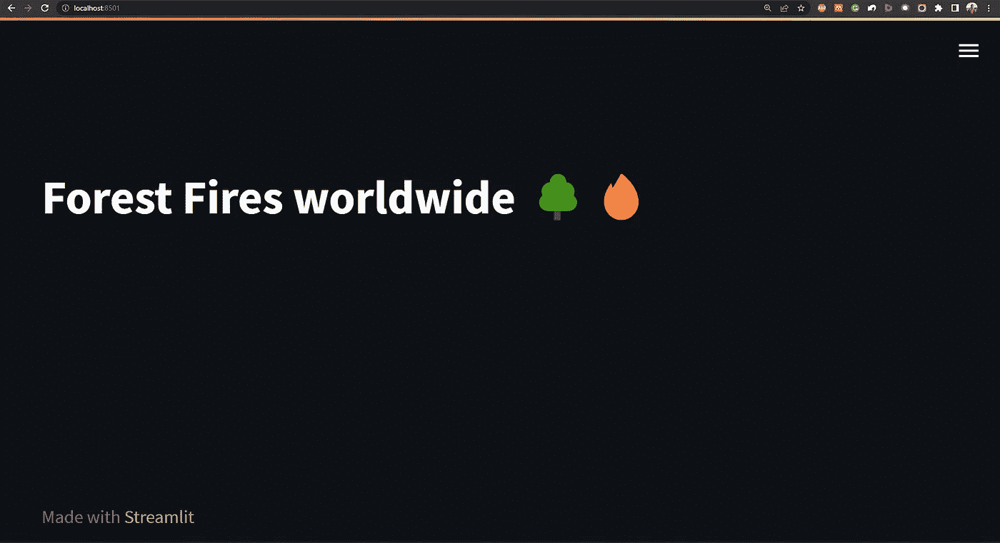
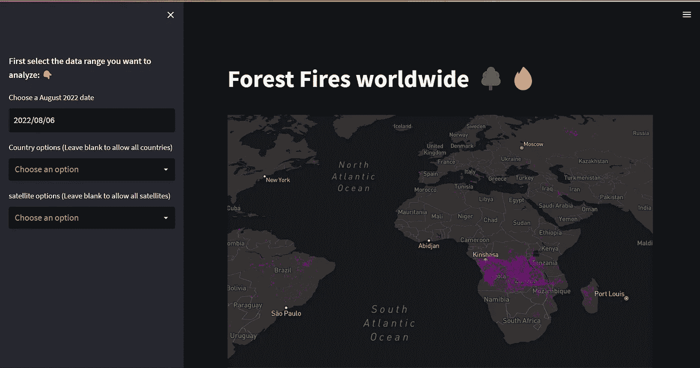

# 使用 Pydeck 和 Streamlit 可视化卫星数据，发现世界范围内可能的森林火灾

> 原文：<https://medium.com/codex/visualising-satellite-data-with-pydeck-and-streamlit-to-discover-possible-forest-fires-worldwide-7cb4f25351ba?source=collection_archive---------5----------------------->

美国宇航局在 [Unsplash](https://unsplash.com?utm_source=medium&utm_medium=referral) 拍摄的照片

根据[联合国](https://www.unoosa.org/oosa/osoindex/search-ng.jspx#?c=%7B%22filters%22:%5B%7B%22fieldName%22:%22en%23object.status.inOrbit_s1%22,%22value%22:%22Yes%22%7D%5D,%22sortings%22:%5B%7B%22fieldName%22:%22object.launch.dateOfLaunch_s1%22,%22dir%22:%22desc%22%7D%5D,%22match%22:null%7D)的消息，9686 颗卫星正围绕地球运行，执行监测、通信和成像等任务。已执行任务的一个例子是分析世界范围的森林火灾。不同的项目一直在使用卫星数据来更好地可视化和协助森林火灾控制，而[项目 Queimadas](https://queimadas.dgi.inpe.br/queimadas/portal) 就是其中之一。在巴西政府的支持下，Projeto Queimadas 致力于提供与火灾爆发、气象火灾风险和火烧区地图相关的公开数据。

目前，该项目每天分析、使用和共享来自十颗卫星的数据。卫星输出被管理并用于调查和他们门户网站上的可视化。此外，研究人员可以在 [Projeto Queimadas 数据门户](https://queimadas.dgi.inpe.br/queimadas/dados-abertos/)轻松检索数据集。

从 Projeto Queimadas 数据开始，我们将开发一个带有 Streamlit 的简单应用程序，以可视化基于 Pydeck 的卫星捕捉到的全球可能的火灾。这个项目的最终结果可以在[这里](https://matheusfeijoo-forestfires-app-q9x54z.streamlitapp.com/)看到。

## 正在检索数据集

Programa Queimadas 数据门户提供了一系列按巴西各州和时期分类的独特数据集。这些数据集提供了与捕获的火灾像素相关的基本信息。火点(或热点)可以定义为通过卫星图像获得的可能的植被火点。

在我们的例子中，我们将使用 2022 年 8 月的数据集，它提供了世界范围的数据(可以在门户中随意使用另一个数据集)。由于数据集的大小，我们首先创建一个 dataextractor.py 脚本来下载并提取项目所需的数据，其中每一行都是一个火像素，相关的列有:

*   **lat** :热点所在的纬度。
*   **lon** :热点的经度
*   **data_hora_gmt** :热点所在 gmt 时区的日期和时间
*   **卫星**:捕捉热 spor 的卫星
*   **pais** :观察到这个热点的国家。

## 创建我们的简化应用程序

生成数据集后，我们可以开始编写 app.py 脚本来运行我们的应用程序。首先需要安装**[**熊猫**](https://pandas.pydata.org/getting_started.html) 和 [**Pydeck**](https://deckgl.readthedocs.io/en/latest/installation.html) 库并导入到代码中。接下来，我们用`st.title()`函数添加我们的 app 的标题，并在终端中执行`streamlit run app.py`。**

**执行 streamlit 后，应用程序将在默认的 web 浏览器中运行:**

****

**简化应用程序**

## **导入和格式化数据集**

**处理 Programa Queimadas 数据的一个问题是数据集的大小。我们已经将该数据集从 717 MB 减少到 187 MB。但是，我们也可以通过将数据集列类型从 object 改为 category 以及从 float64 改为 float32 来减少内存使用。通过这些更改，我们可以将内存使用量减少到 79MB。以下函数导入数据集并执行格式化 df_heatSpots 数据帧任务:**

**Streamlit 库提供了一系列的输入部件，在`choosing_variables()`中，我们将使用`st.date_input()` 和`st.multiselect()`函数来过滤数据，以便用 Pydeck 绘制在地图上。这些功能通过`with st.sidebar:`放在 app 侧边栏上。**

**本机`st.multiselect()`不提供选择所有选项的方式。我们可以配置这个多选，这样当字段为空时，所有选项都将被选中。为此，我们首先在`all_options = df_heatSpots[''].unique()`之前收集所有选项。之后，`select`变量接收 multiselect 的输出，`if len(select) > 0:`条件返回过滤数据帧的变量。**

## **查询热点数据框架**

**在调用编码的`importing_dataset()`和`choosing_variables()`函数后，我们可以执行查询来过滤`df_heatSpots`。此外，我们添加了一些初始变量，当应用程序被访问时，这些变量将显示在生成的地图中。**

## **设置 Pydeck 地图**

**为了渲染 Pydeck 地图和绘制过滤后的数据，我们需要定义`pdk.ViewState()`、`pdk.Layer()`、`tooltip`和`mapstyle`。`view_state`接收等于零的纬度和经度以使地图居中，零度的方位和 45 度的俯仰(随意改变这些变量并查看应用程序中的更新)。**

**Pydeck 地图的第二部分是图层定义。该层的基本变量是:**

*   ****类型**:要渲染的层的类型，如 HexagonLayer 或 ColumnLayer。**
*   ****id:** 层的唯一名称。**
*   ****数据:**要加载的数据的 URL 或者数据的数组。**
*   ******kwargs:** 可用于层的任何参数。**

**最后一个参数是`tooltip`和`map_style`。对于地图样式，我们通过使用关联的样式 URL 采用了 [Mapbox](https://docs.mapbox.com/api/maps/styles/) 样式定义。对于工具提示，我们在使它们在 Streamlit 中可执行时遇到了一些问题。Pydeck 提供的工具提示示例在 Streamlit 应用程序中不起作用。以下代码是为地图中的每个点生成工具提示的一种可能方式，在本例中引用相关的卫星。**

**如果一切按计划进行，您的 Streamlit 应用程序将如下所示:**

****

**全球森林火灾应用程序**

## **摘要**

**卫星数据是一种强大的人工制品，可用于不同的领域。在我们的项目中，收集的数据集可以更好地可视化和过滤，以跟踪全球潜在的森林火灾。通过使用 Pandas、Streamlit 和 Pydeck，我们可以提供一种创新的方式来可视化提取的数据并进行更好的调查。**

**你可以在我的 GitHub 库找到这个项目的代码:[https://github.com/MatheusFeijoo/forestfires](https://github.com/MatheusFeijoo/forestfires)**

**最后，这个应用也在流云在线:[https://matheusfeijoo-forest fires-app-q9x 54 z . streamlitapp . com/](https://matheusfeijoo-forestfires-app-q9x54z.streamlitapp.com/)**

**我希望你喜欢这个教程！**

**请随意评论你对它的看法。**

***还有，别忘了连线上* [*LinkedIn*](https://www.linkedin.com/in/feijo%C3%B3/) *和*[*GitHub*](https://github.com/MatheusFeijoo)*来多聊聊数据科学！***