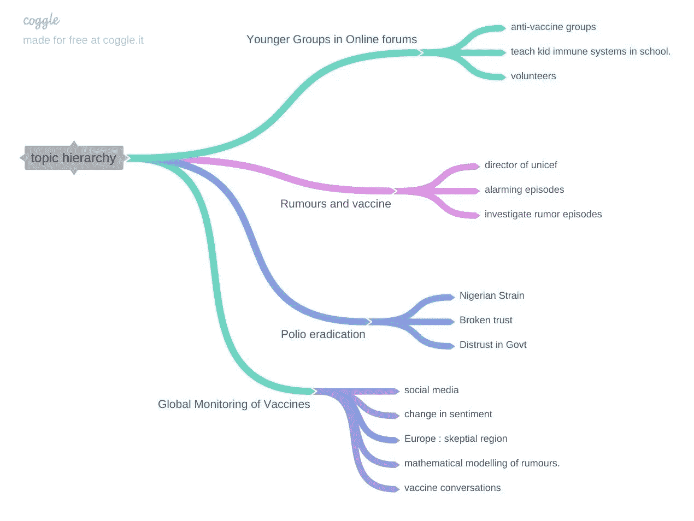

# 在 Postman 中用 Symbl 的 API 可视化分层主题

> 原文：<https://medium.com/codex/visualize-hierarchical-topics-with-symbls-apis-in-postman-6b80daf5f3ce?source=collection_archive---------4----------------------->

## [法典](http://medium.com/codex)

主题是人工智能的一个重要主题。在人工智能中，话题是谈话的主要焦点。如果两个人在讨论他们最喜欢哪袋咖啡，那么咖啡就是他们谈话的焦点。 [Symbl 的主题 API](https://www.docs.symbl.ai/docs/conversation-api/concepts/topic-hierarchy) ，也就是下面这篇博客的主题，使开发者能够…