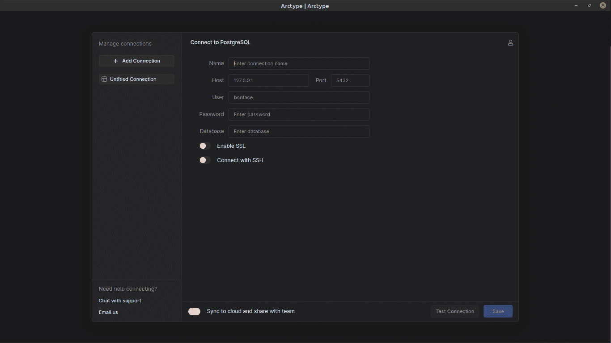
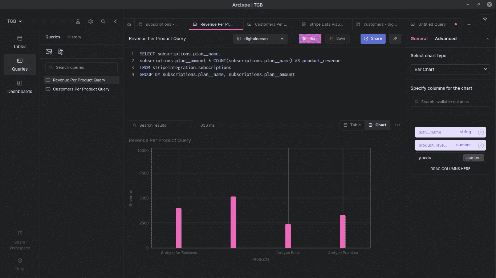
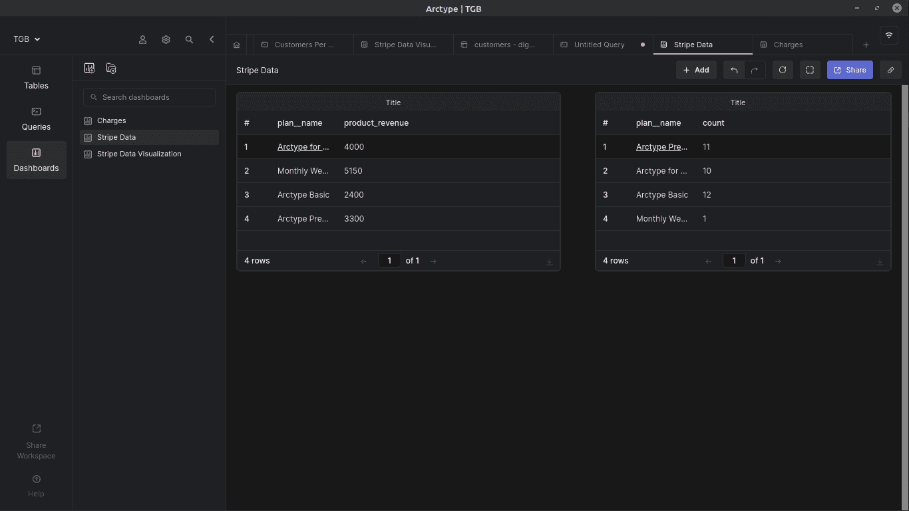

# 使用 SQL 在 Postgres 中可视化条带支付数据

> 原文：<https://medium.com/codex/visualize-stripe-payments-data-in-postgres-using-sql-fbd97ca3436e?source=collection_archive---------4----------------------->


当通过 [Stripe](https://stripe.com/) 接受在线支付时，内置工具将足以了解您的业务开展情况。一开始。

但是[条纹仪表盘](https://stripe.com/docs/dashboard)有一些局限性:

*   没有查询数据和可视化结果的方法。
*   [Stripe 适马](https://stripe.com/sigma)允许你使用 SQL 构建自定义查询，并提供一些非常有用的报告模板，但有一些重要的例外，如每月经常性收入(MRR)。
*   条带适马数据总是有 24 小时的滞后。
*   您无法访问适马运行的底层数据库条带。这使得不可能用每周活跃用户、正常运行时间或任何其他重要的运营指标来覆盖支付数据。

通过将条带数据加载到可以控制查询位置的数据库中，可以克服所有这些限制。在那里，您可以构建更高级的图表来显示业务绩效。

在本文中，我将一步一步地指导您如何将条带数据加载到数据库，查询它，并使用 [Arctype](https://arctype.com) 构建仪表板。

# 将针脚数据与条纹整合

要将条带数据加载到 Postgres 中，可以使用诸如 [Stitch Data](https://www.stitchdata.com/) 和 [Rudderstack](https://rudderstack.com/) 等平台。在本指南中，我们将使用缝合数据，因为它是一种廉价而快速的解决方案。

将条带数据加载到 Postgres 后，我们会将其连接到 Arctype 以可视化数据。Arctype 是一个 SQL 客户端和数据库管理工具，您可以使用它通过两次点击来构建漂亮的图表，并在仪表板中组合多个图表。

首先，访问 [Stitch](https://www.stitchdata.com/) 网站，在主页上你可以登录你的账户，如果你已经有一个账户的话。


如果您没有帐户，请单击“免费注册”按钮，您将被重定向到设置帐户的页面。有一个免费试用，你可以确保服务是一个很好的适合。

建立帐户后，下一步是添加集成。根据 Stitch data 的说法，集成是可以用来通过管道发送数据的应用程序和数据库。

在这种情况下，条带是您将作为集成添加的内容。在集成页面上，有一个不同应用程序和数据库的表格，您可以从中进行选择。在页面的左侧，有一个搜索栏。开始输入 Stripe，它将出现在列表中，您可以选择它作为您的集成。


选择条带作为集成后，您将被重定向到配置条带集成的页面。添加您选择的集成名称。然后向下滚动页面并单击授权按钮。


您将被重定向到 Stripe 以将您的帐户与 Stitch 数据连接起来。选择您想要连接到 Stitch 的帐户。这将使 Stitch 看到您的帐户数据，如所有付款和支出历史。单击“连接”按钮完成连接。


之后，您将被重定向回 Stitch 以选择您想要存储在 Postgres 中的条带数据。如果您不知道选择哪个数据，请单击顶部的“表名”下拉菜单，然后选择所有表。然后点击页面右下角的“完成您的选择”按钮。


您将被定向到一个页面，显示您的条带集成已成功。点击“全部完成”按钮，完成整合过程。点击此处了解更多关于如何连接针脚数据和条纹的信息。

# 将 Postgres 添加为您的数据目标

一旦用 Stitch 连接了 Stripe，下一步就是添加数据目标。在这种情况下，您的数据目的地将是 Postgres。在缝合仪表板上，转到“选择目标”部分。从选项中选择 Postgres 作为条带数据的目标。


然后，您将被引导到一个页面，在该页面中，您告诉 Stitch Data 您希望如何连接到您的数据库。

在此页面上，您需要填写一个显示名称，以帮助区分同一类型的各种连接。您还需要添加描述(可选)、主机(端点)、端口、用户名、密码和数据库名称。查看文档[这里](https://www.stitchdata.com/docs/destinations/postgresql)了解更多关于如何连接 PostgreSQL 和 Stitch 数据的信息。

# 将数据加载到 Postgres

Postgres 连接到 Stitch 后，在 Stitch dashboard 上，单击“集成”部分，并在页面底部选择您为集成连接指定的名称。


接下来，您将被引导至集成的控制面板。在集成名称下方的部分，单击“提取”选项，您将被重定向到提取页面，在此您可以提取条带数据并将其加载到 Postgres。

单击页面右侧的“立即运行提取”按钮提取条带数据，并等待提取过程完成。


将条带数据加载到 Postgres 后，下一步是将 Postgres 连接到 Arctype 以可视化数据。您可以运行一些查询来创建表格、图表和图形。

# 将 Postgres 连接到 Arctype

您需要首先[创建一个新的工作空间](https://docs.arctype.com/workspace-management/create-a-workspace)来将 Postgres 连接到 Arctype。工作空间是为给定项目定义的空间。输入您选择的工作区名称，然后单击“创建工作区”按钮。


创建工作空间后，您将看到连接类型列表。选择 [Postgres 作为您的连接](https://arctype.com/postgres/connect/client-postgres)。下一步是填写 Postgres 证书。完成后，测试您的连接并保存。



一旦连接成功，您将被定向到您的工作区，在那里您可以可视化 Postgres 数据库中的数据。在这里，您可以运行查询、创建图表和仪表板。

在工作区的左上方，选择表格。在表格的右侧，从下拉菜单中选择连接名称。

在连接下方，从下拉菜单中选择将 Stitch 连接到 Postgres 时在 Stitch 中添加的数据目标的显示名称。


您可以[搜索您想要可视化的表格](https://docs.arctype.com/workspace-management/searching-a-workspace)，编辑、插入行、添加过滤器、添加排序、创建查询或导出。

# 在 Postgres 中查询您的条带数据

查询允许您显示或修改数据库中的数据，在本文中，我将向您展示一些查询，您可以运行这些查询来创建表、图表和仪表板，以可视化条带数据。

假设你有一个使用订阅业务模式的企业，你有三个产品或计划。

*   基本计划。
*   保费计划。
*   商业计划

您希望从条带数据中获得的一些重要统计信息是:

*   订阅每个计划或产品的客户数量。
*   每个计划或产品的收入。

## 按产品划分的客户

从包含 Postgres 上条带数据的模式中选择订阅表。您可以在屏幕左侧找到表格。


单击屏幕右上方的“创建查询”按钮，将出现下面的屏幕，您可以在其中运行查询。我喜欢用一个描述性的名称保存我的查询，比如“每个产品的客户”。然后编写以下 SQL 查询，并单击顶部的 run 按钮。

```
SELECT subscriptions.plan__name,
COUNT(subscriptions.plan__name)
FROM stripeintegration.subscriptions
GROUP BY subscriptions.plan__name
```

运行查询后，将创建一个表，您可以使用它来创建图表。不要忘记点击屏幕右上角的保存按钮来保存您的查询。


要创建图表，您需要选择屏幕中间右侧的“图表”按钮。在右侧，相对于 y 轴和 x 轴拖动列。在这种情况下，拖动 plan__name 列并将其放置在 x 轴上。然后拖动 count 列并将其放在 y 轴上，以比较按计划的订阅数。


单击屏幕左上方的“高级”选项来修改图表。您可以在此添加图表标题、x 轴标题、垂直 x 轴标签、y 轴标题、x 轴范围和 y 轴范围。

## 按产品划分的收入

按照上面每个产品的客户查询的步骤，运行下面的 SQL 查询。

```
SELECT subscriptions.plan__name,
subscriptions.plan__amount * COUNT(subscriptions.plan__name) AS product_revenue
FROM stripeintegration.subscriptions
GROUP BY subscriptions.plan__name, subscriptions.plan__amount
```

你应该想出下面这样的东西。



# 创建仪表板

仪表板是维护图表和表格的优秀工具，可以让您分析数据。单击屏幕左上角的+按钮创建一个控制面板。添加仪表板的名称，然后单击“创建”按钮。


## 将表格添加到仪表板

单击仪表板右上角的添加按钮。在下拉菜单中，选择表格。单击仪表板上的粉色“选择表格数据”按钮。从菜单中选择一个表，比如在运行每个产品的客户查询和每个产品的收入查询时创建的`subscriptions`。


添加其中一个表后，重复将表添加到仪表板的相同过程来添加另一个表。你应该想出这样的东西。



## 将图表添加到仪表板

在屏幕的左上方，点击“查询”。然后选择“每个产品的收入查询”或“每个产品的客户查询”。单击图表右上角的溢出菜单。然后单击菜单中的“将图表添加到仪表板”，将您的图表直接添加到仪表板。

选择要添加图表的仪表板。下面是你的仪表板应该是什么样子的表格和图表。


现在，您的业务真正跟上了时代的步伐！

# 结论

将条带数据加载到数据库使您能够自由运行 SQL 查询，这些查询有助于显示 Stripe dashboard 无法提供的有趣且重要的业务指标。在这里，您可以将条带数据与来自应用程序的事件数据混合搭配，将新的用户群与更高的收入相关联，并充分了解每个变化对您的底线的影响。