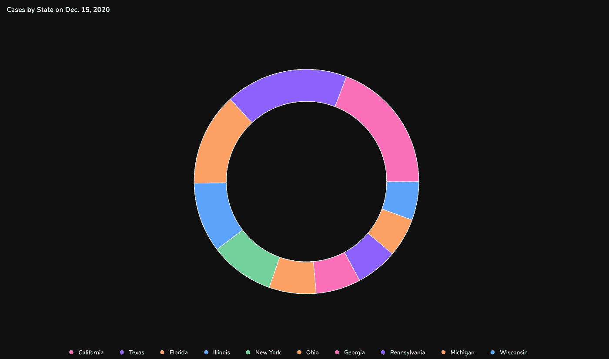
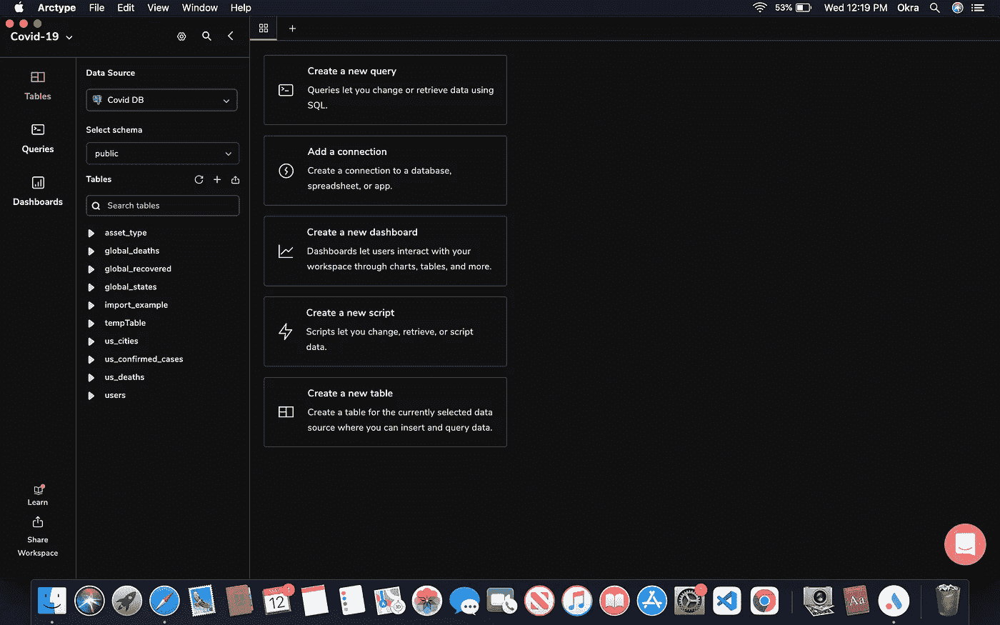
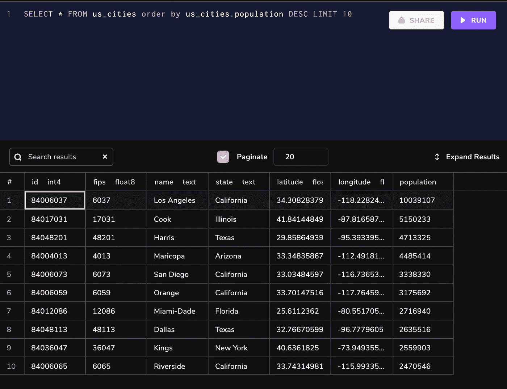
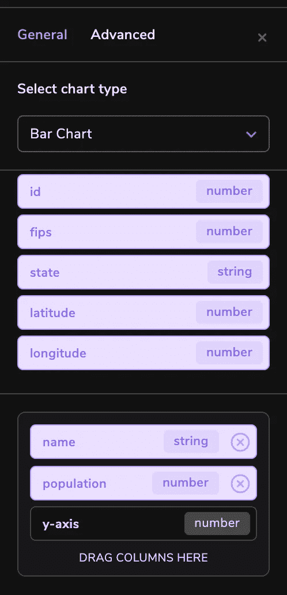
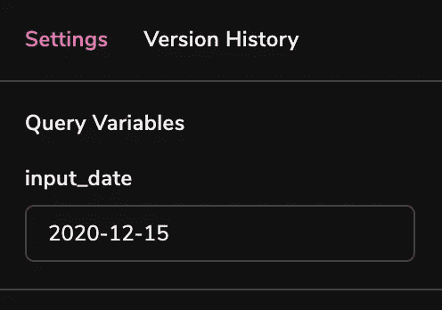
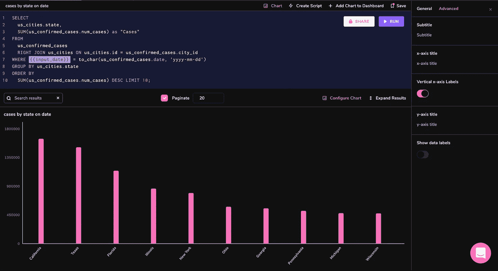
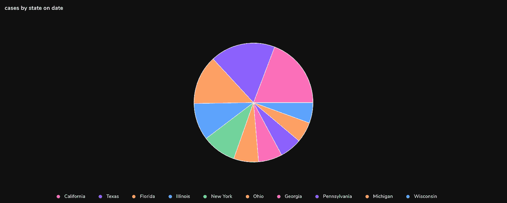
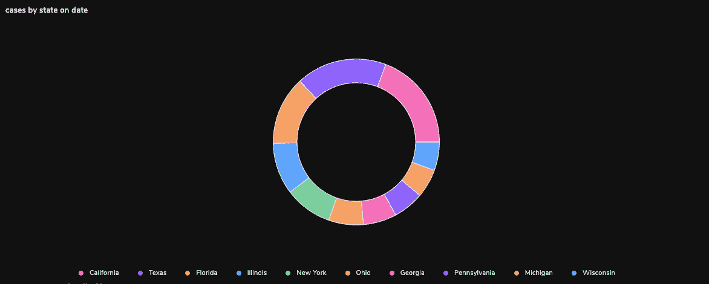
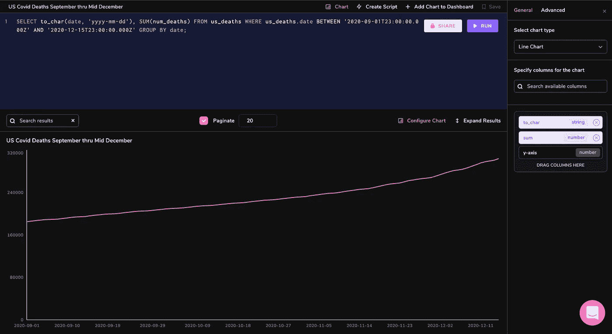
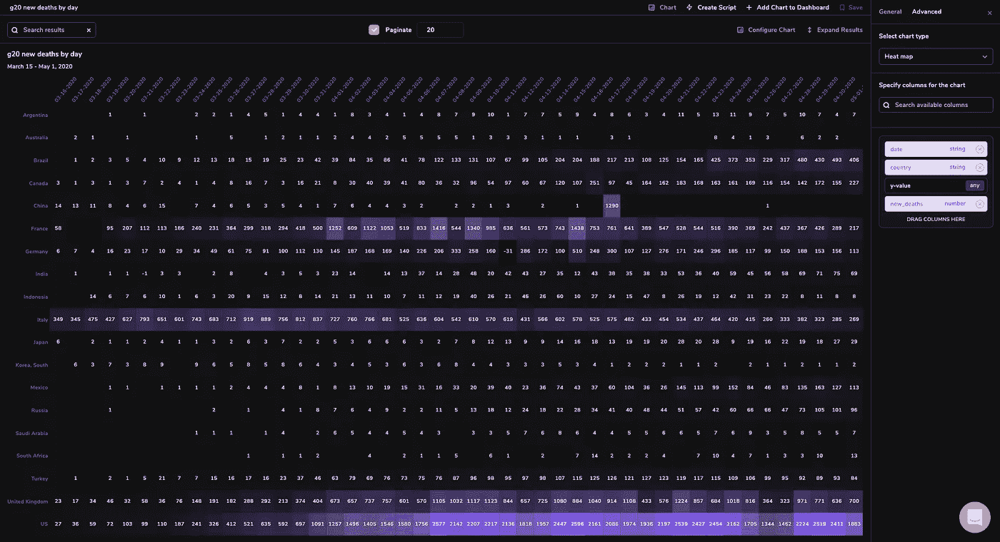

# 使用 Arctype 可视化新冠肺炎 PostgreSQL 数据

> 原文：<https://medium.com/codex/visualizing-covid-19-postgresql-data-with-arctype-9630c59d5691?source=collection_archive---------16----------------------->



# 介绍

作为技术领域中增长最快的行业之一的竞争对手，数据分析公司一直在努力寻找更快、更可靠地将原始 SQL 查询转换为有效可视化的方法。可以说，在当今日益复杂的数据世界中，可视化是一项非常受欢迎的技能。虽然在外人看来这可能听起来微不足道，但分析师知道这通常绝非易事。

数据分析师和软件工程师花时间搜索和过滤多个数据源，然后为关键时刻准备好数据——可视化数据。数据可视化是所有数据处理工作的顶点——它们应该采用长数字列表和复杂的 KPI，并以直观、易于理解的方式呈现它们。也就是说，如果您为数据选择了正确的可视化工具。

这带来了一个潜在的问题。由于数据可视化的质量通常取决于用来创建它们的工具，我们如何确保为我们的数据选择正确的可视化工具呢？我们的目标是比较价值观还是分析趋势？可视化您的数据的最佳方式是什么，以便于提取见解？

在本文中，我们将演示任何以数据为中心的团队或个人如何使用 Arctype 作为 SQL 工具来过滤、获取和直观地可视化数据，从而提供对建议数据的更深入的了解。最精彩的部分？我们将使用真实的新冠肺炎数据集来做这件事。

注意:本文不是介绍性的，因此假设您已经熟悉任何数据库，如 Postgres 或 MySQL。

# 数据可视化的重要性

数据可视化通过数据的交互式可视化表示对组织的决策过程产生积极影响。企业现在可以更快地识别模式，因为他们可以用图形或图像的形式解释数据。以下是数据可视化对组织有益的一些更具体的方式:

*   关系中的相关性:没有数据可视化，很难识别独立变量之间可能存在的相关性。通过理解这些独立变量，我们可以做出更好的商业决策。
*   审视市场:数据可视化从不同的市场获取信息，让我们更好地了解受众——不仅关注哪些受众，还关注哪些受众应该回避。通过在图表上显示相关数据，我们可以更清楚地了解这些市场中的机会。
*   风险和回报:在没有可视化的情况下查看价值和风险度量需要更多的专业知识，因为充满数字的电子表格本来就更难理解。一旦信息可视化，我们就可以很容易地确定需要或不需要采取行动的领域。
*   对市场做出反应:通过在功能仪表板上清晰显示数据，快速、轻松地获取信息的能力使企业能够迅速采取行动并对调查结果做出反应，从而帮助他们避免犯错。
*   一段时间内的趋势:虽然这似乎是数据可视化的一个明显的用途，但它也是最实际的应用之一。没有过去和现在的必要信息，就不可能做出预测。随着时间的推移，趋势会告诉我们已经达到了什么程度，以及我们可能会达到什么程度。
*   频率:与趋势密切相关的是频率。考察顾客购买的频率和时间，可以让我们更好地了解潜在新顾客对不同营销和顾客获取策略的反应。

面向开发人员和 teamsTry Arctype 的快速易用的 SQL 客户端

# 将 SQL 查询结果转换成图表

在本文中，我们将利用 [Arctype](https://arctype.com/) 的魅力。Arctype 支持所有类型的图表-从条形图和折线图到更专业的类型，如热图甚至饼图。它还有一个功能，可以让您轻松地将图表转换成表格，反之亦然。为了减少这个过程的难度，我们将把它分成不同的步骤。现在，让我们开始有趣的事情吧！💪🏻

# 步骤 Arctype 入门

出于本指南的目的，我们将对 Arctype 上公开提供的冠状病毒相关数据集进行分析和可视化。首先，我们需要下载并注册 Arctype。登录后，我们将选择演示工作区，并选择`Covid DB`作为我们的数据源。最初，视图面板应该如下所示:



# 步骤 2:使用 SQL 查询获取图表数据

首先，点击`create a new query`按钮。Arctype 将为我们新创建的查询自动打开一个 SQL 编辑器选项卡。首先，让我们看看数据集中人口最多的前 10 个城市。为此，我们可以运行如下查询:
`SELECT * FROM us_cities order by us_cities.population DESC LIMIT 10`

我们的结果应该是这样的:



# 步骤 3:为 SQL 查询结果创建可视化图表

现在我们已经能够查询我们的首选表(`us_cities`)，让我们开始显示不同查询结果的图表。

为此，首先从查询视图顶部的工具栏中选择`chart`。


在右侧边栏中，从列表中选择所需的图表类型，然后拖动列来表示图表的 x 轴和 y 轴。



注意:x 轴和 y 轴都表示查询结果中的列。

# 使用条形图显示各州的新冠肺炎案例

让我们看看在特定日期美国新冠肺炎病例最多的 10 个州，并制作一个条形图。

```
SELECT
  us_cities.state,
  SUM(us_confirmed_cases.num_cases) as "Cases"
FROM
  us_confirmed_cases
  RIGHT JOIN us_cities ON us_cities.id = us_confirmed_cases.city_id
WHERE {{input_date}} = to_char(us_confirmed_cases.date, 'yyyy-mm-dd')
GROUP BY us_cities.state
ORDER BY
  SUM(us_confirmed_cases.num_cases) DESC LIMIT 30;
```

如您所见，我们正在创建一个名为“input_date”的查询变量，这将在右侧栏中引入一个输入框。这里，您需要以“yyyy-mm-dd”格式输入一个日期，以便查询可以返回结果。对于这个例子，我选择了 2020 年 12 月 15 日——美国记录在案的感染人数最多的月份的中间。



输入一个日期，然后按照上面的步骤创建一个条形图，这就是我们的数据的样子:



注意:为了显示较长的州名(如宾夕法尼亚州)，x 轴标签需要是垂直的

# 使用饼图和圆环图按州分解新冠肺炎病例

使用上面的条形图示例查询的结果，如果我们将图表类型更改为饼图，它看起来会是这样:



同样，我们可以为这些结果创建一个圆环图:



# 使用折线图追踪一段时间内的新冠肺炎死亡人数

让我们看看 2020 年 9 月 1 日至 12 月 15 日期间，美国因新冠肺炎病毒导致的总死亡人数是如何增加的。这个查询应该给我们提供数据:

```
SELECT
  to_char(date, 'yyyy-mm-dd'),
  SUM(num_deaths)
FROM
  us_deaths
WHERE
  us_deaths.date BETWEEN '2020-09-01T23:00:00.000Z'
  AND '2020-12-15T23:00:00.000Z'
GROUP BY
  date;
```

现在，只需从图表类型中选择“折线图”，将日期列拖到 x 轴，将 SUM()列拖到 y 轴:



# 构建一个热图来可视化 G20 国家每天的新冠肺炎死亡人数

热点图可能是目前 Arctype 客户端中提供的最强大、最动态的可视化工具。因为这些图表往往在大型 3D 数据集中非常出色，所以让我们建立一个记录每个 G20 国家按日期计算的新增新冠肺炎死亡人数的图表。为此，我们需要一个类似如下的查询:

```
SELECT
  global_states.country,
  to_char(global_deaths.date, 'mm-dd-yyyy') AS date,
  SUM(global_deaths.num_deaths) - COALESCE(
    LAG(SUM(global_deaths.num_deaths)) OVER (
      PARTITION BY global_states.country
      ORDER BY
        to_char(global_deaths.date, 'mm-dd-yyyy')
    ),
    0
  ) AS new_deaths
FROM
  global_deaths
  RIGHT JOIN global_states ON global_states.id = global_deaths.state_id
WHERE
  global_states.country IN(
      'Argentina','Australia','Brazil','Canada',
      'China','France','Germany','India',
      'Indonesia','Italy','Japan','Korea, South',
      'Mexico','Russia','Saudi Arabia','South Africa',
      'Turkey','United Kingdom','US'
      ) AND
  global_deaths.date BETWEEN '2020-03-15T23:00:00.000Z'
  AND '2020-05-01T23:00:00.000Z'
GROUP BY
  to_char(global_deaths.date, 'mm-dd-yyyy'),
  global_states.country
ORDER BY
  to_char(global_deaths.date, 'mm-dd-yyyy'),
  global_states.country OFFSET 19;
```

在我们查看这些结果的热图之前，让我们解释一下这个(相当复杂的)查询。您可能已经注意到了，`global_deaths`中的`num_deaths`列是累积的。这意味着为了找到某一天的新死亡人数，我们需要减去前一天的总数。我们仍然需要使用`SUM()`,因为有些国家是按地区或省份划分的，因此会占用多行。此外，由于有限的屏幕空间，我们将选择范围缩小到 46 天(3 月 15 日至 5 月 1 日)。最后，因为我们的`LAG()`函数假设在开始日期之前累积的所有死亡都是当天的新死亡，所以我们需要用 19(G20 中的国家数，sans-EU)来抵消我们的结果。

唷！解决了这个问题，让我们来看看热图！我们把日期放在 x 轴上，国家放在 y 轴上，死亡人数放在 z 轴上。它看起来是这样的:



正如您可能知道的那样，这种热图可视化中的数据几乎不可能以原始形式进行解释，但像这样显示，发现趋势和异常变得非常容易。

# 结论

数据库可视化对于确保所有数据集的直观显示至关重要。这篇简明的文章介绍了如何轻松地可视化数据集，最大限度地利用 Arctype 的图表功能来探索新冠肺炎的深远影响。

# 资源

*   [连接到数据库](https://docs.arctype.com/getting-started/connecting-to-a-database) — Arctype
*   [导入 CSV](https://docs.arctype.com/qeries/importing-a-csv) — Arctype
*   [使用图表](https://docs.arctype.com/dashboards/working-with-charts) — Arctype
*   [数据可视化工具的重要性、用途和优势](https://splashbi.com/importance-purpose-benefit-of-data-visualization-tools/) — SlashBI