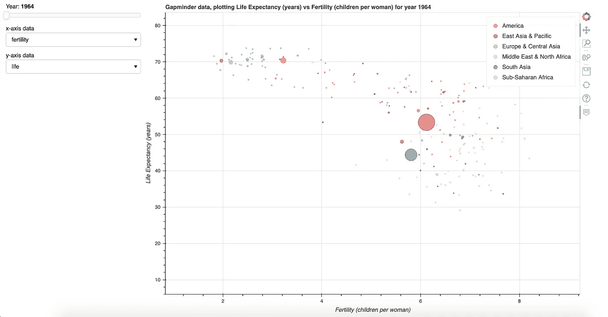
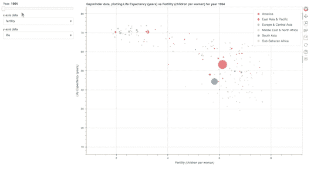

# 使用散景可视化 Gapminder 数据

> 原文：<https://medium.com/codex/visualizing-gapminder-data-using-bokeh-1aeeb7c85e6d?source=collection_archive---------2----------------------->

## 在 Python 中创建交互式数据可视化


由 [Unsplash](https://unsplash.com?utm_source=medium&utm_medium=referral) 上的[希克迈特](https://unsplash.com/@hikmethl?utm_source=medium&utm_medium=referral)拍摄的照片

作为一个处理数据的人，你很可能熟悉已故的汉斯·罗斯林和他在 Gapminder 的工作。他的演讲很吸引人，使用散点图等可视化方式来讲述一个故事。

如果您使用 Python 处理数据，您可能已经使用 matplotlib 或 seaborn 进行了数据可视化。它在大多数情况下完成了工作，但有时你想要一个互动的情节，而不是静态的。这就是散景发挥作用的地方。

根据[的散景文档](https://bokeh.org/)，它自诩为灵活、互动、可共享、高效、强大和开源。你可以用它做一个简单的可视化或者一个更复杂的可视化，通过利用散景服务器，你将能够进行交互式可视化，接近汉斯·罗斯林的演示(好吧，这篇文章不会给你完全相同的杰作，但概念是存在的)。

我们的目标是做一个交互式的可视化，你可以看到不同的国家是如何随着时间的推移通过播放按钮和滑块，以及可修改的 x 轴和 y 轴取得进展的。


最终目标(图片由作者提供)

## 创建基础图

在我们开始之前，你可以在这里下载数据集。此外，请确定您的电脑中已经安装了散景。如果没有，您可以使用 pip 安装它:

```
pip install bokeh
```

现在我们已经安装了散景，我们将从一个基本的静态图开始。首先，我们从 Bokeh 和 pandas 导入所需的包，然后导入数据。

然后，我们定义绘图轴和轴标签。我为轴标签使用了一个字典，这样当我们更新轴时，它将提供清晰的标签。我们使用 *ColumnDataSource* 为散景图提供数据源，并使用 *CategoricalColorMapper* 使用 *Spectral6* 调色板对不同的地理区域进行颜色编码。

然后我们制作*图*并使用 *plot.circle()制作散点图。*我们使用生育率作为 x 轴，预期寿命作为 y 轴，人口作为点大小(我使用 pop_size，以便点适合绘图)。然后，我们使用 *output_file()* 将绘图保存为. html 文件，并使用 *show(plot)* 来显示绘图。


基本情节(作者提供的图片)

## 添加悬停工具提示

散景允许您添加悬停工具提示，当您悬停在数据点上时提供额外的信息。要添加一个悬停工具提示，导入 *HoverTool* 并用你想要的信息初始化它。参数*工具提示*接受一个元组列表作为输入，标签在左边，数据在右边。与*图*一样，数据源定义在*列数据源*上。最后，使用 *plot.add_tools()* 将刚刚制作的悬停工具提示添加到图形中。确保在 *output_file()* 和 *show(plot)* 之前添加此代码**。**


使用中的 HoverTool(图片由作者提供)

## 添加滑块和下拉菜单

为了使绘图具有交互性，散景也允许你添加滑块和下拉菜单。为此，我们从散景导入更多的库。要添加滑块，我们使用*滑块*并为其指定参数。要添加下拉菜单，我们使用*选择*并输入可能的下拉选项列表，给出默认值和标题。当我们移动滑块或使用下拉菜单时，为了使图形更新，我们使用*。*on _ change()【法。这是一个更新绘图的回调方法，它将函数 *update_plot()* 作为参数。稍后将详细介绍。

我们还需要为我们的地块创建一个布局。使用*列*和*行*，我们设计我们地块的布局。最后，我们使用*show(layout)*代替 *show(plot)* 来显示布局(而不是情节)。

在我们继续之前，我们必须为我们的回调方法定义函数 *update_plot()* 。该函数的作用是从滑块和下拉菜单中获取新值，并将其设置为绘图的数据源。我们还通过删除和添加新创建的悬停工具来更新悬停工具。将悬停工具定义为*全局*对于该函数的工作很重要，因为最初的悬停工具是在该函数之外定义的。记得把这个函数**放在前一个代码**之前。

在实现了这段代码之后，我们将在图的左侧得到这个带有滑块和下拉菜单的漂亮布局。



带有滑块和下拉菜单的绘图(图片由作者提供)

## 在散景服务器上运行

您可能会注意到，当您使用滑块或下拉菜单时，图不会更新。这是因为 *show(layout)* 只会显示一个静态的剧情。我们需要在散景服务器上运行代码，使其具有交互性。为此，我们首先需要用下面的代码使用 *curdoc* 而不是 *show(layout)* 。

```
# Import curdoc
from bokeh.io import curdoc# Replace output_file and show(layout) with this
curdoc().add_root(layout)
curdoc().title = 'Gapminder'
```

然后我们在终端上运行这段 bash 代码(添加*！*如果你在 Python 笔记本上运行代码的话，在开始的时候)。确保您已经保存了文件，您的终端在正确的目录中，并且您的文件名是正确的。对我来说，文件名是*gapminder _ bokehserver . ipynb .*

```
bokeh serve --show gapminder_bokehserver.ipynb
```



滑块和下拉菜单的作用(图片由作者提供)

## 添加播放按钮

虽然前一步已经足够好了，但我决定再进一步，添加一个播放按钮，它将与滑块进行交互，以便数据在这些年中自动流动。一旦播放，播放按钮将变成暂停按钮来停止流动。为此，我们使用*按钮*并设置标签和宽度。

滑块和下拉菜单也是如此，我们需要为带有*按钮的按钮添加一个回调方法。这有点棘手，所以请耐心等待。*

就在 *animate()* 函数之前，我们定义了一个空的*回调 _animate* 变量。我们通过调用*全局回调 _animate* 在 *animate()* 函数中使用这个新定义的变量。我们使用条件语句在播放和暂停按钮之间切换。在 *if* 语句中，我们将 *callback_animate* 定义为另一个回调方法来触发 *animate_update()* ，这将更新滑块，进而更新绘图。在 *else* 语句中，我们移除回调，以便滑块停止更新。对于为什么我们必须定义一个空变量，然后在函数内部全局调用它，我没有一个好的答案，但是这是唯一对我有效的方法。

然后我们更新布局以包含新创建的按钮。

```
layout = row(column(slider, button, x_select, y_select), plot)
```

最后，我们再次在散景服务器上运行这段代码。

```
bokeh serve --show gapminder_bokehserver.ipynb
```


最终结果(图片由作者提供)

我希望你觉得这很有用。对我来说，使用散景比 matplotlib 或 seaborn 更有挑战性。但散景提供的交互性确实让这个情节比静态情节突出。你可以在我的 [GitHub 库](https://github.com/abrahamzetz/gapminder_bokeh)上找到完整的代码。

干杯！