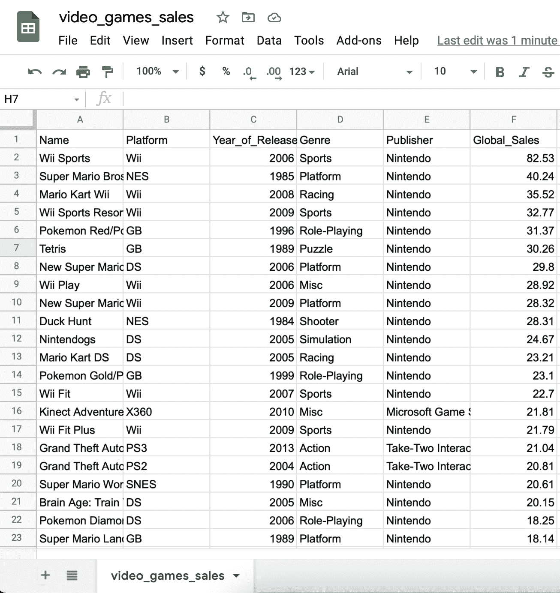

# 使用 Arctype 仪表盘可视化销售数据

> 原文：<https://medium.com/codex/visualizing-sales-data-with-arctype-dashboards-1cf544cc7c03?source=collection_archive---------19----------------------->


# 介绍

## 什么是 Arctype？

Arctype 是一个高性能的 SQL 客户端，允许您通过简单的用户界面管理数据库。它还使您能够直接从查询构建可视化，以处理电子表格的方式修改数据库，并与您的团队共享常用的 SQL 查询。


# 什么是 Arctype 仪表盘？

Arctype 仪表盘允许您生成图表和表格来检查数据。您还可以使用它们来创建工具，以修改和可视化数据库中的数据，并自动化技术和繁琐的活动。

## 先决条件

要遵循并完全理解本教程，您需要具备以下条件:

*   [弧型](https://docs.arctype.com)
*   [SQL](https://www.tutorialspoint.com/sql/sql-overview.htm) 的基础知识

# 准备我们的数据库

## 获取示例销售数据

我们需要获得销售数据来可视化。在本教程中，我们将使用公开可用的数据，您可以在这里下载。数据集只有 1MB，包括来自 [Metacritic](https://www.metacritic.com/browse/games/release-date/available) 的约 16000 款视频游戏的名称、平台、发行年份、流派、发行商和全球销量。



## 将数据集导入 Arctype

接下来，我们需要在 Arctype 中创建一个表并导入数据集。为此，使用 Arctype 客户端的`Import Table`按钮。


完成后，选择要导入的 CSV 文件。Arctype 将显示您要导入的数据的预览。如果正确，按下位于弹出窗口右下角的`Accept`按钮。


然后，我们需要确认从导入的 CSV 中自动生成的表模式:


我们将把这个新表重新命名为`sales`。我们还需要将`year_of_release`列的数据类型更改为`int`，将`global_sales`列的数据类型更改为`double`。

完成后，按下位于弹出窗口右下角的`Import CSV`按钮。


# 创建 Arctype 仪表盘

## 使用 Arctype 可视化总销售额

现在，让我们开始使用 Arctype 可视化我们的数据库。我们将从显示所有销售额开始。Arctype 仪表盘提供了一个名为`scorecard`的便捷组件，可以在卡片上显示数值。

为此，我们需要编写一个 SQL 查询来获取记录的计数。点击 Arctype 侧边栏(屏幕左侧)旁边的`Queries`选项卡，然后点击`Create Query`按钮。


在出现的编辑器中粘贴并保存以下查询:

```
SELECT
	COUNT(*) AS sales_count 
FROM 
	sales;
```

在 Arctype 中运行查询时，您应该会得到类似于以下屏幕截图的结果:


接下来，点击 Arctype 侧边栏(屏幕左侧)旁边的`Dashboards`选项卡，然后点击`Create Dashboard`按钮。


然后点击`Dashboards`部分标题的`Add`按钮，选择`Chart`。


现在，点击`Select chart data`按钮并选择我们之前创建的`sales count`查询。


导航到右侧边栏。更改仪表板组件的标题，选择`Scorecard`作为图表类型，拖动`sales_count`列进行显示。


## 使用 Arctype 可视化表

让我们用 Arctype 创建一个表格组件来显示销售额最高的游戏名称。

创建一个名为`top sales`的新查询，并将以下代码保存在其中:

```
SELECT 
	name,
	global_sales AS sales 
FROM 
	sales 
ORDER BY 
	global_sales DESC 
LIMIT 10;
```


然后点击`Dashboards`部分标题的`Add`按钮，选择`Table`。


完成后，单击`Select chart data`按钮并选择我们之前创建的`top sales`查询。


## 使用 Arctype 创建饼图

让我们用 Arctype 创建图表组件来显示游戏平台和流派，并分组到饼图中。

创建一个名为`platforms`的新查询，并将以下代码保存在其中:

```
SELECT 
	platform, 
	COUNT(*) AS platform_count 
FROM 
	sales 
GROUP BY 
	platform;
```

接下来，创建另一个名为“流派”的新查询，并在其中保存以下代码:

```
SELECT 
	genre, 
	COUNT(*) AS genre_count 
FROM 
	sales 
WHERE 
	genre IS NOT NULL 
GROUP BY 
	genre;
```

然后点击`Dashboards`部分标题的`Add`按钮，选择`Chart`。选择`Pie chart`作为图表类型，将`platform`列拖动到`category`框，将`platform_count`列拖动到`values`框。


重复这个过程，为`genres`查询生成一个饼图:


## 使用 Arctype 创建条形图

让我们用 Arctype 创建图表组件，在条形图上显示每年发布的游戏数量和游戏发行商。

创建一个名为`year_of_release`的新查询，并将以下代码保存在其中:

```
SELECT 
	year_of_release, 
	COUNT(*) as release_count 
FROM 
	sales 
WHERE 
	year_of_release IS NOT NULL 
GROUP BY 
	year_of_release 
ORDER BY 
	year_of_release;
```

接下来，创建另一个名为`publisher`的新查询，并将以下代码保存在其中:

```
SELECT 
	publisher, 
	COUNT(*) AS publisher_count 
FROM 
	sales 
GROUP BY 
	publisher 
LIMIT 15;
```

然后点击`Dashboards`部分标题的`Add`按钮，选择`Chart`。

之后，点击`Select chart data`按钮并选择我们之前创建的`year_of_release`查询。同样，更改仪表板组件的标题，选择`Bar Chart`作为图表类型，并将`year_of_release`列拖到`x-axis`框中，将`release_count`列拖到`y-axis`框中。


重复该过程，为`publisher`查询生成一个水平条形图:


## 使用 Arctype 创建圆环图

让我们使用 Arctype 为 publisher 查询创建一个圆环图。点击`Dashboards`部分头部的`Add`按钮，选择`Chart`。

更改仪表板组件的标题，选择`Doughnut Chart`作为图表类型，将`publisher`列拖到`category`框中，将`publisher_count`列拖到`values`框中。


## 使用 Arctype 创建折线图

让我们用 Arctype 创建一个图表组件，在折线图上显示游戏的年销售额。

创建一个名为`annual_game_sales`的新查询，并将以下代码保存在其中:

```
SELECT 
	year_of_release, 
	SUM(global_sales) AS sales 
FROM 
	sales 
WHERE 
	year_of_release IS NOT NULL 
GROUP BY 
	year_of_release 
ORDER BY 
	year_of_release;
```

与所有其他图表类型一样，选择`Line Chart`作为图表类型，并将`year_of_release`列拖至`x-axis`框，将`sales`列拖至`y-axis`框。


## 使用 Arctype 创建面积图

让我们用 Arctype 为我们的`annual_game_sales`查询创建一个面积图。点击`Dashboards`部分头部的`Add`按钮，选择`Chart`。

选择`Area Chart`作为图表类型，将`year_of_release`列拖动到`x-axis`框，将`sales`列拖动到`y-axis`框。


# 为动态结果引入查询变量

我们一直在创建基于特定查询和设定参数的可视化。如果我们想给 Arctype 输入，并让它根据我们的信息创建可视化效果会怎么样？我们可以使用查询变量来帮助我们解决这个问题。

[查询变量](https://docs.arctype.com/queries/query-variables)允许您将变量连接到您的查询，并在执行期间为它们提供各种值。它们的功能类似于[预准备语句](https://en.wikipedia.org/wiki/Prepared_statement)，使您能够构建查询的结构并将值传递给其中的参数。

# 在 Arctype 中使用查询变量

我们将创建一个查询，使用查询变量返回一年中的游戏销售额。创建一个名为`yearly_sales`的新 SQL 查询，并将以下代码保存在其中:

```
SELECT 
	SUM(global_sales) AS year_sales 
FROM 
	sales 
WHERE 
	year_of_release = ;
```

当这个查询在 Arctype 中执行时，您会注意到它允许您为`year`变量提供值。这是因为查询变量会准备一个查询结构，然后提供将不同的值传递给变量以获得所需结果的功能。


## 在仪表板中使用查询变量

我们将创建一个记分卡来显示带有查询变量的`yearly_sales`查询的结果。为此:

*   创建仪表板组件，
*   选择`yearly_sales`查询作为数据源，
*   将图表类型更改为记分卡，
*   将`year_sales`列拖至显示文本框。


您会注意到`year`变量也出现在右边栏。更改该值将立即更新记分卡的结果。


# 结论

在本文中，我们了解了 Arctype，并了解了如何使用其内置仪表盘可视化销售数据。我们还研究了查询变量，并使用它们来生成动态可视化结果。

你可以从[官方文档](https://docs.arctype.com)中了解更多关于 Arctype 的信息。如果有任何问题，请随时在 Twitter 上联系我:[@ lordgostx](https://twitter.com/LordGhostXh)。