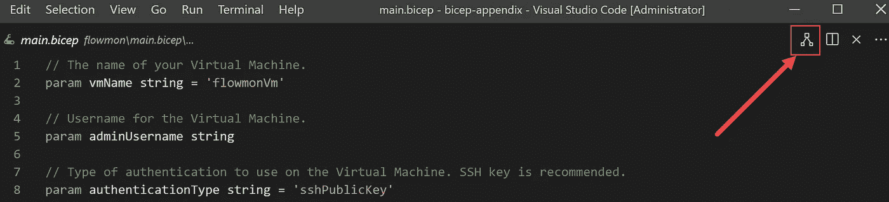
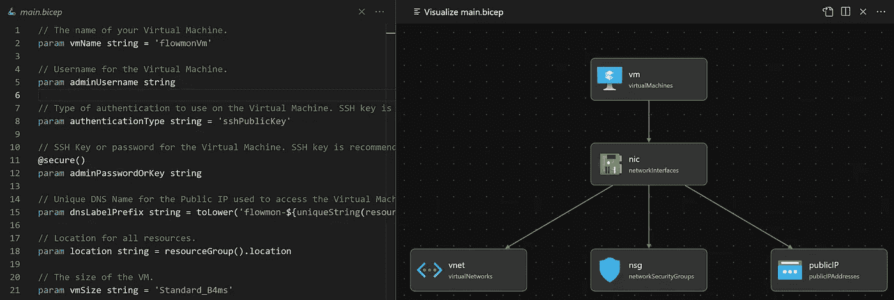

# 💪使用 Bicep VS 代码扩展可视化您的基础架构代码 Azure Bicep 模板

> 原文：<https://medium.com/codex/visualizing-your-infrastructure-as-code-azure-bicep-templates-with-the-bicep-vs-code-extension-e9c757c7b9ff?source=collection_archive---------3----------------------->

一个图形化的**可视化工具**用于 **Azure 二头肌模板**中的资源

在本文中，我们将回顾如何可视化在 Bicep 模板中定义的资源。

# 蓝色二头肌——它来自哪里

Azure Bicep 简化了我们在 Azure 中声明式部署资源的方式。来自 Azure PM 团队的话:

> “我们希望首次体验 Azure 或使用 Azure 作为主要云的客户拥有一流的部署体验。”

如果你想开始使用 azure Bicep，请查看以下文章:

*   [为什么 Azure Bicep 是你的下一个代码基础设施选择？](https://blog.azinsider.net/why-is-azure-bicep-your-next-choice-for-infrastructure-as-code-f10a2b924ca7)
*   [Azure 二头肌游戏场:从手臂模板过渡到二头肌](https://blog.azinsider.net/azure-bicep-playground-transitioning-from-arm-templates-into-bicep-5c10c864c863)
*   [安装 Azure 二头肌](https://github.com/Azure/bicep/blob/main/docs/installing.md?WT.mc_id=AZ-MVP-5000671)

一旦你在你的环境中安装了 Azure Bicep，是时候使用你的 Bicep 模板并可视化它们了。

# 1.获取 Azure Bicep VS 代码扩展

Bicep VS Code 扩展具有许多您期望从另一种语言工具中获得的特性。[这里](https://marketplace.visualstudio.com/items?itemName=ms-azuretools.vscode-bicep)可以抢这个扩展。


Azure Bicep Visual Studio 代码扩展

该扩展包括一系列有用的功能，如:

*   确认
*   智能感知
*   点属性访问
*   资源属性名称和属性值
*   列出所有可用的资源类型
*   完成
*   片段
*   代码导航
*   重构
*   视觉型的人

这个扩展显示了你的二头肌模板的图形预览。该视图将显示官方 Azure 图标的所有资源，以及资源之间的关系。

# **2。创作您的二头肌模板**

一旦安装了 Bicep VS 扩展，创建一个名为“ *main.bicep* ”的新 Bicep 文件。我们将使用以下二头肌模板作为示例:

```
// The name of your Virtual Machine.
param vmName string = 'flowmonVm'// Username for the Virtual Machine.
param adminUsername string// Type of authentication to use on the Virtual Machine. SSH key is recommended.
param authenticationType string = 'sshPublicKey'// SSH Key or password for the Virtual Machine. SSH key is recommended.
[@secure](http://twitter.com/secure)()
param adminPasswordOrKey string// Unique DNS Name for the Public IP used to access the Virtual Machine.
param dnsLabelPrefix string = toLower('flowmon-${uniqueString(resourceGroup().id)}')// Location for all resources.
param location string = resourceGroup().location// The size of the VM.
param vmSize string = 'Standard_B4ms'// Name of the VNET.
param virtualNetworkName string = 'vNet'// Name of the subnet in the virtual network.
param subnetName string = 'Subnet'// Name of the Network Security Group.
param networkSecurityGroupName string = 'SecGroupNet'var publicIPAddressName = '${vmName}PublicIP'
var networkInterfaceName = '${vmName}Nic'
var subnetRef = '${vnet.id}/subnets/${subnetName}'
var osDiskType = 'Standard_LRS'
var subnetAddressPrefix = '10.5.0.0/24'
var addressPrefix = '10.5.0.0/16'
var linuxConfiguration = {
  disablePasswordAuthentication: true
  ssh: {
    publicKeys: [
      {
        path: '/home/${adminUsername}/.ssh/authorized_keys'
        keyData: adminPasswordOrKey
      }
    ]
  }
}resource nic 'Microsoft.Network/networkInterfaces@2020-06-01' = {
  name: networkInterfaceName
  location: location
  properties: {
    ipConfigurations: [
      {
        name: 'ipconfig1'
        properties: {
          subnet: {
            id: subnetRef
          }
          privateIPAllocationMethod: 'Dynamic'
          publicIPAddress: {
            id: publicIP.id
          }
        }
      }
    ]
    networkSecurityGroup: {
      id: nsg.id
    }
  }
}resource nsg 'Microsoft.Network/networkSecurityGroups@2020-06-01' = {
  name: networkSecurityGroupName
  location: location
  properties: {
    securityRules: [
      {
           name: 'SSH'
           properties : {
               protocol : 'Tcp' 
               sourcePortRange :  '*'
               destinationPortRange :  '22'
               sourceAddressPrefix :  '*'
               destinationAddressPrefix: '*'
               access:  'Allow'
               priority : 1010
               direction : 'Inbound'
               sourcePortRanges : []
               destinationPortRanges : []
               sourceAddressPrefixes : []
               destinationAddressPrefixes : []
          }
      }
      {
           name : 'HTTPS'
           properties : {
               protocol :  'Tcp'
               sourcePortRange :  '*'
               destinationPortRange :  '443'
               sourceAddressPrefix :  '*'
               destinationAddressPrefix :  '*'
               access :  'Allow'
               priority : 1020
               direction :  'Inbound'
               sourcePortRanges : []
               destinationPortRanges : []
               sourceAddressPrefixes : []
               destinationAddressPrefixes : []
          }
      }
      {
           name :  'Collector'
           properties : {
               protocol :  'Udp'
               sourcePortRange :  '*'
               destinationPortRange :  '3000'
               sourceAddressPrefix :  '*'
               destinationAddressPrefix :  '*'
               access :  'Allow'
               priority : 103
               direction :  'Inbound'
               sourcePortRanges : []
               destinationPortRanges : []
               sourceAddressPrefixes : []
               destinationAddressPrefixes : []
          }
      }
      {
           name :  'ALL'
           properties : {
               protocol :  '*'
               sourcePortRange :  '*'
               destinationPortRange :  '*'
               sourceAddressPrefix :  '*'
               destinationAddressPrefix : '*'
               access :  'Allow'
               priority : 1040
               direction :  'Inbound'
               sourcePortRanges : []
               destinationPortRanges : []
               sourceAddressPrefixes : []
               destinationAddressPrefixes : []
          }
      }
  ]
  }
}resource vnet 'Microsoft.Network/virtualNetworks@2020-06-01' = {
  name: virtualNetworkName
  location: location
  properties: {
    addressSpace: {
      addressPrefixes: [
        addressPrefix
      ]
    }
    subnets: [
      {
        name: subnetName
        properties: {
          addressPrefix: subnetAddressPrefix
          privateEndpointNetworkPolicies: 'Enabled'
          privateLinkServiceNetworkPolicies: 'Enabled'
        }
      }
    ]
  }
}resource publicIP 'Microsoft.Network/publicIPAddresses@2020-06-01' = {
  name: publicIPAddressName
  location: location
  properties: {
    publicIPAllocationMethod: 'Dynamic'
    publicIPAddressVersion: 'IPv4'
    dnsSettings: {
      domainNameLabel: dnsLabelPrefix
    }
    idleTimeoutInMinutes: 4
  }
  sku: {
    name: 'Basic'
  }
}resource vm 'Microsoft.Compute/virtualMachines@2021-03-01' = {
  name: vmName
  location: location
  properties: {
    hardwareProfile: {
      vmSize: vmSize
    }
    storageProfile: {
      osDisk: {
        createOption: 'FromImage'
        managedDisk: {
          storageAccountType: osDiskType
        }
      }
      imageReference: {
        publisher: 'flowmon'
        offer: 'flowmon_collector'
        sku: 'v1101-byol'
        version: 'latest'
      }
    }
    networkProfile: {
      networkInterfaces: [
        {
          id: nic.id
        }
      ]
    }
    osProfile: {
      computerName: vmName
      adminUsername: adminUsername
      adminPassword: adminPasswordOrKey
      linuxConfiguration: any(authenticationType == 'password' ? null : linuxConfiguration)
    }
    diagnosticsProfile: {
      bootDiagnostics: {
        enabled: true
      }
    }
  }
  plan: {
    name: 'v1101-byol'
    publisher: 'flowmon'
    product: 'flowmon_collector'
  }
}output administratorUsername string = adminUsername
```

上面的 Bicep 模板为 Kemp Flowmon VM 创建了一个基于 Linux 的虚拟机。你可以在这里查看关于这个模板[的更多信息。](https://blog.azinsider.net/how-to-create-a-linux-virtual-machine-with-azure-bicep-template-e22f50f2baea)

一旦你在本地机器上有了 Bicep 模板，你就可以在 VS 代码的右上角点击" *Visualizer* "图标，如下图所示:



Azure 二头肌 VS 代码扩展

一旦你选择了这个选项，你会在右边看到一个新的面板，里面有你的二头肌模板的可视化。在本例中，我们看到了虚拟机及其相关资源。



Azure 二头肌 VS 代码扩展

这个 Bicep 可视化工具为您的 Bicep 模板提供了一个很酷的可视化，因为它反映了语言服务器在资源定义方面看到的内容。

可视化工具基本上只是向您展示这个定义，并且还包括所有的依赖信息，什么与什么对话，以及模块引用在哪里。

# 3.动态可视化

现在去你的二头肌模板的左侧面板。您可以向 Bicep 模板添加或修改资源，当您添加更多资源或修改现有资源时，您将在可视化工具中实时看到渲染。

因此，当您创作代码时，Bicep visualizer 将不断更新画布中的资源。

在以下示例中，我们将为虚拟机定义一个新的专用 IP 地址。您将看到，当我们在 Bicep 模板中定义资源时，Bicep visualizer 会呈现新的私有 IP 地址。


天蓝色二头肌可视化

# 比较手臂模板可视化和二头肌可视化。

虽然 Bicep visualizer 提供了 Bicep 模板中定义的资源的良好呈现，但它缺少 ARM 模板 visualizer 中的一些功能，如选择特定资源和查看定义细节的能力。

如果能够在 Bicep 可视化工具中查看资源细节，或者在 Bicep 模板中突出显示所选资源的代码定义，那肯定会非常有用。

我推荐你试一试，看看对你有没有用。让我知道你的意见和反馈。

[*在此加入****azin sider****邮箱列表。*](http://eepurl.com/gKmLdf)

*-戴夫·r·*