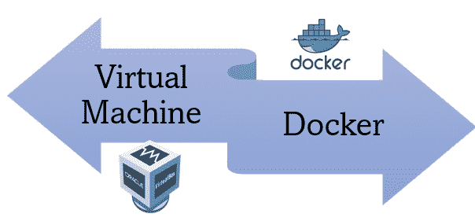
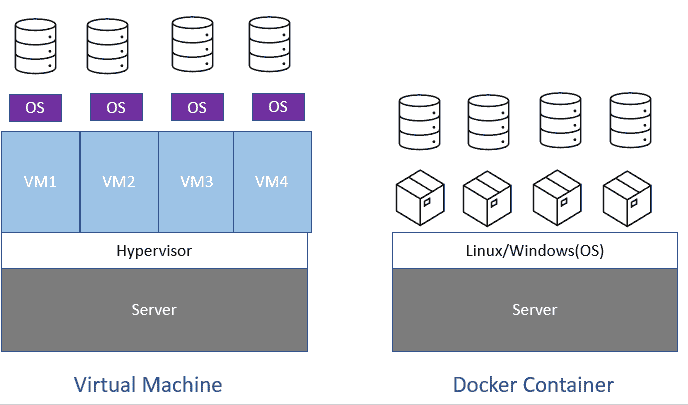

# 虚拟机 vs Docker

> 原文：<https://medium.com/codex/vm-vs-docker-e01b9b5084fe?source=collection_archive---------9----------------------->

照片版权尼基塔

向所有在那里工作的公司员工问好！！

这个博客是专门为像我这样刚进入工业世界，只有很少的工业和技术知识，但非常渴望从日常项目活动中抓住机会和技能的新生准备的。

最近在做一个项目时，我的高级经理问我是否知道 VM 和 Docker 之间的区别。那一瞬间让我重新思考，真的有区别还是他们是一样的？它让我对将它链接到云的类似想法一无所知，毕竟它们共享相同的虚拟化概念。

但是你猜怎么着，我完全错了！！虽然它们共享相同的概念，但是具有不同的实现和优点。

在跳到 Docker 的正确的字典概念之前，让我们快速回顾一下虚拟化的旧实现，它使开发人员的生活变得更加轻松，但效率却不是那么高。

# 云革命的时代

众所周知，作为一名 IT 专业人员，该应用程序运行着当今的业务。无论是航空公司、零售、银行等。每个企业都需要一个应用程序来高效平稳地运行。

早在 20 年代中期，应用程序就运行在单台服务器上。对于服务器，我们指的是部署在数据中心的大型、昂贵的物理设备，这些设备反过来要求公司支付额外的维护费用，作为他们资产负债表上的额外费用。

以前，如果企业出于任何原因需要应用程序，他们必须出去寻找新的物理服务器。这增加了他们的额外成本和运营成本。我说的额外费用是指电力，冷却，管理这些东西的人不是免费的。

现在，IT 部门在购买时面临的一个常见问题是，他们需要多大、多快的服务器？这个问题在他们的头脑中仍然没有答案。他们很难定义服务器规模和速度的确切需求。所以，它只选择最合理的。想象一下，他们做出的选择并没有带来好处。他们开始失去客户和收入，只是因为他们在速度不够快的服务器上降低了价格。

因此，IT 部门总是试图为他们的业务获得大而快的服务器，尽管实际利用率最终达到服务器实际能力的 5–10%。最终，浪费了服务器的剩余电力和空间。这意味着对公司资源和资本的适当浪费。

为了克服这些糟糕的损失，出现了图中的虚拟机(VM)。因此，使用虚拟机的想法基本上是重用剩余的额外服务器空间，并充分利用这些空间。因此，基本上不是每个应用使用一台服务器，企业现在可以在一台服务器上运行多个应用。

嘣！！IT 运营人员，干得好！！！这有助于公司节省资金，开发者充分利用单个硬件空间。

但是，但是，但是……每个解决方案都有一个但是，因为不总是有完美的解决方案。让我们深入研究一下 VM，以了解为什么它不是解决现有的服务器空间利用问题的完美解决方案。

# 虚拟机时代

服务器内部有进程、内存和磁盘空间，我们可以在上面运行多个应用程序。现在，假设我们想在这台服务器上运行四个应用程序，这确实需要四个虚拟机。每个虚拟机都是物理服务器硬件的一部分。每个虚拟机都由自己的 CPU、内存和来自物理服务器的磁盘空间组成。

现在，这些虚拟机都需要自己的操作系统。每个操作系统最终都会窃取大量资源。我们可能还需要四个操作系统许可证。现在，这增加了额外的资源成本。即使我们不运行应用程序，操作系统也需要资源来保持运行。它不仅增加了潜在的许可成本，还需要良好的维护和保养。每个操作系统都会带来大量的操作负担，如更新、修补、防病毒管理。

毫无疑问，VMware 和虚拟机管理程序让生活变得更加轻松，但仍然存在问题，并且有进一步的收获。这让我们看到了我们的主图片“Docker”。

# 码头工人时代

在谈论码头工人之前，让我们试着理解什么是集装箱。继续上面的场景。假设我们有一台物理服务器，它有进程、内存和磁盘空间。在这个服务器中，我们希望运行四个应用程序。因此，我们将安装一个操作系统并将操作系统分成四个容器，而不是在其上安装一个虚拟机管理程序并创建四个虚拟机，每个虚拟机都有特定的操作系统。

在这些容器中，我们分别运行我们的应用程序。因此，我们不再有多个操作系统和维护它们的负担，而是通过安装单个操作系统并将其分割成所需的部分来降低运营成本和额外资源成本。

最好的部分是容器在大小上比虚拟机相对更小，这使得采用它更有效率。容器内的应用程序启动如此之快，因为启动前没有虚拟机、没有虚拟机管理程序可引导。只有一个操作系统在窃取资源并占用管理时间。

下图清楚地展示了两者的区别。

照片版权尼基塔

今天就到这里吧！！希望这篇文章让你对 VM 和 Docker 容器之间的区别有一个清晰的认识。

当我继续探索的时候，我将继续 Docker 和 Kubernetes 系列，并让您也探索编排和自动化的世界。

在那之前，祝阅读愉快！！！