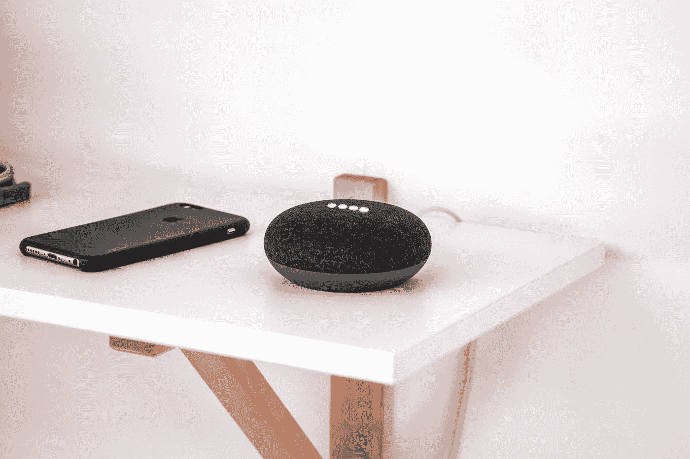

# 语音助手不是你的朋友。你应该摆脱它吗？

> 原文：<https://medium.com/codex/voice-assistants-are-not-your-friend-should-you-get-rid-of-it-c65a2fb8b12b?source=collection_archive---------18----------------------->

莱纳斯·罗格在 [Unsplash](https://unsplash.com?utm_source=medium&utm_medium=referral) 上的照片

我总是向前思考，并且几乎为任何推动技术进步的事情鼓掌。

*然而*，有一件事一直让我小心翼翼。但我试着相信这里面有好的一面。

语音辅助。为什么这些东西几乎进入了每个家庭和每个人的生活，而且几乎不花钱？没有服务费，他们…