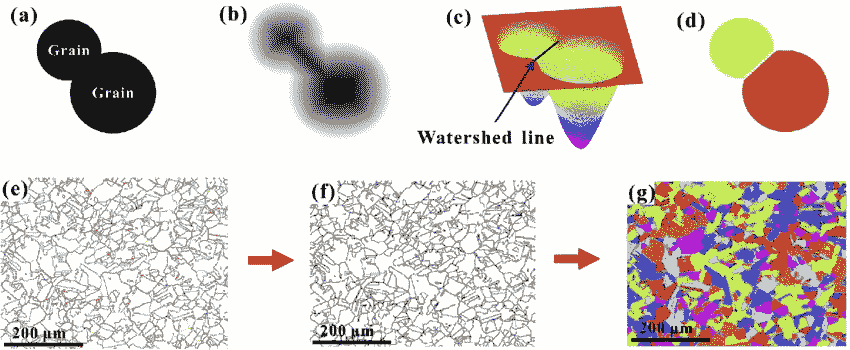

# 第 1 卷:ML 管道

> 原文：<https://medium.com/codex/vol-1-the-ml-pipeline-1cc1359b41?source=collection_archive---------11----------------------->

机器学习管道(来源:Analytics Vidhya)

## ***TL；【T2 博士】***

ML 管道描述了数据流以及进出 ML 模型的信息的**端到端编排。一般封装了原始**数据挖掘**、**预处理** & **特征提取**、模型**训练**、数据**后处理**和模型**评估**的流程。每个 ML 流水线都是特定于应用的，其中一些阶段比其他阶段更易于自动化。**

# **什么是机器学习？**

## **简介:**

机器学习(ML)是一门没有边界的学科，其视野可以无限延伸。ML 有着广泛的应用——其中许多甚至还没有被发现。已经发现并值得注意的有:

*   无人驾驶汽车，例如特斯拉的 Autopilot
*   国际象棋引擎，例如 DeepMind 的 AlphaZero
*   自动诊断，例如 Babylon 的健康应用程序。

ML 不仅有多种多样的应用，它是建立在多种基础构件之上的；包括但不限于*统计学、微积分、计算机视觉、数字图像处理*和*物理学的模块。*

## **理论:**

任何好的最大似然模型的主要特征是它概括数据的能力，以给定的概率分布为特征。此外，一个学习良好的 ML 模型能够提供对数据的足够准确的预测，而这些数据以前可能没有被准确地看到。作为补充说明，听说 ML 模型经常被拟人化是很有趣的——原因是它们的设计，特别是在*深度学习*模型的情况下，受到了人类大脑的启发。

ML 模型培训可以分为三个核心方面:

1.  ***决策* :** 通常，ML 模型用于对数据中的模式/结构进行预测和/或产生估计。
2.  ***误差* :** 误差函数用于评估模型的预测和/或分类。
3.  ***优化* :** 通常指调整模型的超参数，以减少数据样本的基本事实标签与其预测标签之间的误差的过程。*例如，*神经网络通过带有反向传播的随机梯度下降进行优化。

前面提到的 ML 核心方面在某种程度上被 Tom Mitchell 的引用所概括，Tom Mitchell 是一位美国教授、作家和计算机科学家，以其对机器学习和认知神经科学的贡献而闻名。

> “如果一个计算机程序在 T 个任务中的性能(由 P、**来衡量)随着经验 E 而提高**，那么就可以说该程序从与某类**任务 T** 和**性能 P、**相关的**经验 E** 中进行了学习。”

# 什么是 ML 管道？

## 定义:

ML 管道描述了数据流的端到端编排，从而描述了进出 ML 模型的信息。尽管存在过多的机器学习应用，但所有生产的 ML 模型都是 ML 管道的一部分，或者说是展示了 ML 管道。每条管道的长度、吞吐量和复杂性将根据手头的应用及其相关的成功标准而有所不同。

值得注意的是，当开发一个 ML 管道时，ML 工程师并不轻松地通过每个阶段(或者继续类推，每个管道部分)。通常存在吞吐量减少或增加的管道部分、需要多次迭代才能完成的部分以及更加依赖资源的部分。因此，不言而喻，有些部分比其他部分更适合自动化。

## 数据挖掘:

数据挖掘是从我们生活的环境中提取数据的过程。以分割生物图像中包含的通过光学显微镜捕获的单个神经元细胞为例。在*计算机视觉*中，分割图像描述了检测和描绘与其周围环境截然不同的物体。在这项任务中，数据挖掘是捕获生物图像的过程和注释所述图像的实践。数据挖掘的输出是一个数据集，在这种情况下，它是图像-注释组合的集合。其中注释是识别相关生物图像中包含一部分神经元细胞的像素和不包含一部分神经元细胞的像素的二元掩模。注释图像通常由人来执行，因此，数据集可能需要大量的时间来产生。为了确保质量，注释生物图像的任务应该由领域专家来执行；并且如果可能的话，至少由另一个人来验证。

> 亮点:为了保证质量，注释生物图像的任务应该由领域专家来完成。

数据质量是做出准确预测和明智决策的关键。因此，花时间慢慢挖掘原始数据是必要的——这样才能确保数据的质量。在 ML 中很重要的质量数据的重要特征包括但不限于:

*   ***准确性****——正确性的衡量标准。*
*   ****一致性****——衡量相等样本之间相似程度的指标。**
*   *****完整性*** -衡量缺失数据的比例。**
*   ****——衡量数据陈旧程度的指标。****

## ***预处理和特征提取:***

***在大多数情况下，在 ML 模型使用原始数据之前，有必要对其进行清理和预处理。正如之前暗示的那样，ML 模型产生的东西和它所包含的东西一样好。***

***此外，通常需要进一步处理数据，以帮助 ML 模型的训练，从而提高其整体性能。特征提取是将数据转换成有用的数字特征的过程；它是一种技术，要求识别和描述最能提供潜在模式信息的特征，这些特征在描述给定问题空间的人群特征的数据中显而易见。在大多数情况下，很好地理解问题域有助于做出明智的决定，即应该提取哪些特征。特征提取过程可以通过专门的算法来自动化，并且在一些应用中可以使用其他 ML 模型(例如， *VGG16 特征提取器*用于*图像分类*任务)。***

> **亮点:在大多数情况下，对问题域有一个很好的理解有助于做出关于应该提取哪些特征的明智决定。**

**根据具体应用，提取要素并丢弃信息量较少的要素的过程可用于降低维度，从而减少数据集的内存占用。与任何降维方法一样，数据质量的损失应该可以忽略不计。**

## ****模型训练:****

**训练 ML 模型是将模型拟合到训练数据的过程。ML 模型(由算法定义)将自动更新其超参数(例如，*深度学习*模型的*权重&偏差*)，以便最小化预定义的损失/误差函数。根据上面的 ML 理论，误差函数用于量化 ML 模型的表现。它的大小、方向以及梯度被用来更新模型的超参数，以便改进它对训练数据的拟合。ML 工程师可以控制某些模型超参数，即优化器的类型、学习速率、时期&运行值、批次值等。，但是甚至其中的一些也可以通过函数回调来改变。**

**使用系统的和可重复的方法进行模型训练是至关重要的——特别是如果组织计划大规模地建立和部署 ML 模型。**

## ****后处理:****

**在某些情况下，可能有必要对由 ML 模型产生的数据进行处理，以便提高其质量或使其成为合适的形式，从而可以产生洞察力。类似于预处理和特征提取阶段，通常需要在计算时间和数据质量之间进行权衡。通常，ML 工程师需要从大量的算法中选择最佳的数据处理技术，以足够的速度提供高质量的数据。**

**作为数据后处理的一个例子，让我们再次接受分割单个神经元细胞的挑战。可能存在两个单元没有被彼此描绘的情况，即，预测的掩码表明这两个单元是一个。在这种情况下，应用被称为*分水岭分割*算法的*数字图像处理*技术可能是有利的。该算法的名称隐喻性地指一个地质分水岭，它将相邻或重叠的流域分开。简而言之，该算法使用距离变换和形态学操作来产生连接的分割边界。**

****

**图 1:分水岭分割算法可视化(来源:傅浩等，ResearchGate)**

**如果将*分水岭分割*算法应用于两个连接的神经元细胞的预测掩模，如图 1a 所示，那么图 1d 中处理后的掩模将更具代表性。**

## ****评估**:**

**评估阶段的第一步是选择和实现性能指标，使 ML 工程师能够了解模型的运行情况。这些指标应该足够详尽，以便从中产生见解，并在以后用于指导 ML 工程师如何改进 ML 管道阶段。此外，正是这些度量标准，或者通常是它们的子集，被用来向重要的利益相关者强调模型的优点，从而强调模型的可取性。**

**特定于当前应用程序的数据集创建后，应该至少划分为一个训练集和一个测试集(也称为“保持集”)。如果 ML 模型要在相同的数据集上训练和评估，那么它将具有近乎完美的性能，这很可能不代表该模型对“看不见的”数据的实际表现——这种情况发生的模型被称为具有*数据泄漏。*一般来说，ML 模型应该用全部数据集的 80%来训练，用另外 20%来测试。**

**应该使用的性能指标取决于 ML 任务。一般来说，对于*分类*任务*准确度*，*精密度*，*召回率*，*F1-得分*，*平均绝对误差*，*ROC 下面积(AUC)，混淆矩阵*等。，被使用。其中*分类*任务是为给定问题领域的数据样本分配类别标签的过程。了解给定数据集中每个类有多少样本非常重要。如果数据集是不平衡的(即一类样本占少数，另一类占多数)，那么*精度*、*召回*和*F1-分数*更能代表模型的性能。然而，如果数据集是平衡的，那么仅仅*精度*可能就足够了。**

> **重点:如果数据集不平衡，那么精确度、召回率和 F1 分数更能代表模型的性能。**

**应当注意，有一些应用，尤其是在*图像分割*任务中，需要设计自己的性能指标，以便能够创建比使用上述通用性能指标创建的性能指标更好的洞察力。**

**感谢阅读。请考虑订阅和/或资助我[https://gofund.me/c397684d](https://gofund.me/c397684d)**