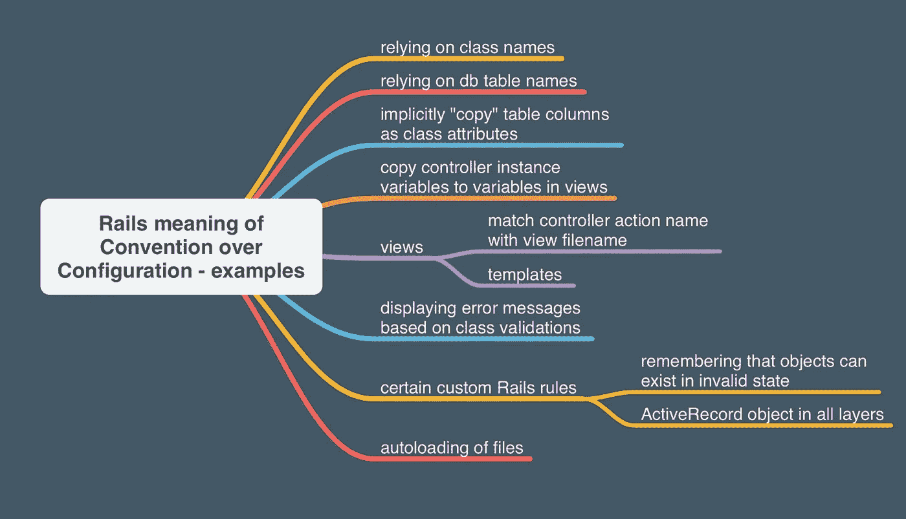

# 第 2 卷:语法糖，锋利的刀，和红宝石魔术

> 原文：<https://medium.com/codex/vol-2-syntactic-sugar-sharp-knives-and-ruby-magic-8b2951cdd4e9?source=collection_archive---------24----------------------->


帕韦尔·奥莱克·鲁比

到目前为止，在我学习编码的过程中，Ruby on Rails 是我最喜欢钻研的语言。Ruby on Rails 是一种非常强大和灵活的开源编程语言。作为一个喜欢结构的人，我喜欢 RoR，因为它的文档非常全面，语言本身也非常简单易懂。不像 Java Script，我发现它有更多的学习曲线，因为它更像是一种“无所不能”的语言。代码的狂野西部。但不是露比。这是一种非常强大的语言，因为在几个小时内，你就可以从一张白纸变成一个功能齐全的多页应用程序，包括登录和注销功能、多种模型和路径。想想就觉得挺疯狂的。

事实上，你日常使用的许多网站实际上都是由 Rails 驱动的。AirBnb、Shopify、Twitter、Kickstarter、Hulu、Github 等等。正如你所知，这种语言在有社交媒体背景的公司中最受欢迎。有时候 Rails 因为“慢”而受到指责，但是老实说，我认为这更多的是关于开发人员如何选择合适的工具来完成工作。肯定有 Rails 不适合这项工作的情况，但是您可以用 Java Script、Python、Django 或任何其他编程语言来证明这一点。他们每个人都有自己的长处和短处。

关于 Rails，最让我感兴趣的事情之一是我如何不断遇到“Ruby magic”这个短语。当调试我的代码时，我会在 StackOverflow 或论坛上看到这个短语。我从来不明白大家都在谈论什么。但是这个短语引起了我的兴趣，让我对这种语言的起源非常好奇。在花了几个月的时间真正钻研和掌握这门语言之后，我现在明白了。让我告诉你，Ruby *是*魔法。

## 什么是红宝石魔法？

为了回答这个问题，让我给你一个简单的语言历史和起源的概述。Ruby 是由一位名叫[松本幸宏](https://en.wikipedia.org/wiki/Yukihiro_Matsumoto)，又名“马茨”的日本计算机科学家在 1995 年设计和创造的。

> 他的行为在 Ruby 社区中带来了一句格言:“Matz 很好，所以我们也很好”，通常缩写为 MINASWAN。

然后，在 2004 年，出现了一个名叫大卫·海涅梅尔·汉森的丹麦程序员。当时，Hansson 实际上正与另一名开发人员一起开发一个项目管理工具，后来成为 Basecamp。在这个工具的开发过程中，Hansson 使用 Ruby 创建了一个定制的 web 开发框架，后来他以开源语言 Ruby on Rails 的形式发布了这个框架，Rails 就这样诞生了——这是一个令人高兴的意外。阅读 Rails 教义与阅读其他语言的文档是非常不同的体验。汉森学说充满了富有表现力的，甚至是宗教性的语言，宣称这种语言背后的指导原则。

## 铁路原则的 9 大支柱

1.  [为程序员的快乐而优化](https://rubyonrails.org/doctrine/#optimize-for-programmer-happiness)
2.  [配置约定](https://rubyonrails.org/doctrine/#convention-over-configuration)
3.  [菜单是 omakase](https://rubyonrails.org/doctrine/#omakase)
4.  [无人范式](https://rubyonrails.org/doctrine/#no-one-paradigm)
5.  [高举美码](https://rubyonrails.org/doctrine/#beautiful-code)
6.  [提供锋利的刀具](https://rubyonrails.org/doctrine/#provide-sharp-knives)
7.  [价值集成系统](https://rubyonrails.org/doctrine/#integrated-systems)
8.  [进展超过稳定](https://rubyonrails.org/doctrine/#progress-over-stability)
9.  [推起一个大帐篷](https://rubyonrails.org/doctrine/#big-tent)

我们不会对每个支柱进行太多的描述，但我会重点介绍一下。Rails 被设计得很有趣，在当时是一个新颖的编程概念。

Hansson 说，“Ruby 不仅认识到，而且适应和提升程序员的感受。无论他们是不充分的，古怪的，还是快乐的。Matz 跳过了令人震惊的复杂的实现障碍，使机器看起来像是在微笑，奉承它的人类同伙。Ruby 充满了视错觉，在我们看来简单、清晰、美丽的东西实际上是遮光罩下一团乱麻。”

这是我读过的关于 Rails 的最好的总结。这些“视错觉”就是红宝石魔法一词的来源。

更具体地说，他所说的“视错觉”实际上只是一些简单而有思想的代码，让你的应用程序更加优雅和直观。让我给你举个例子。Rails 遵循约定胜于配置的原则。这不仅仅是一个风格上的决定。约定优于配置意味着在 Rails 中，您的应用程序及其文件和文件夹遵循特定的命名和组织约定。原因是引擎盖下发生了太多的事情。为了让您的模型、视图和控制器能够像它们应该的那样一起工作，它们必须被恰当地命名，以便发挥作用。你所遵循的惯例是向 Rails 发出你希望你的应用程序做什么的信号。



克孜勒苏达 2020

像任何事情一样，这种类型的语言肯定有它的缺点。首先，当幕后有如此多的“rails 魔术”发生时，事情会变得非常抽象。作为程序员，你必须对实际发生的事情有深入的了解。由于这个原因，Rails 可以被硬调试。其次，如果您正在查看其他人的 Rails 代码，可能会有点不清楚那个人打算用那个方法或视图来完成什么。在构建 Rails 应用程序时，如何命名方法、控制器、视图和路径至关重要。


## **句法糖**

输入语法糖。这是编程中的一个术语，我认为它很可爱，但不知道它是什么意思。事实证明，语法糖在 Rails(以及几乎所有编程语言)的世界中非常有用。)实际上，它只是在你的代码中加入了一些额外的语法，以使你的代码更“可爱”和更易读。我举一个很基本的例子。假设您有下面一行代码:`x = x + 5`

如果你想给变量`x`加上`5`，这段代码的‘更好’的版本应该是只写`x += 5.`

很整洁，是吧？

三元运算符是一种更常见、更广泛使用的甜语法。以下是如何使用三元组:

```
if apple_stock > 1*:eat_apple*else*:buy_apple*end
```

这 5 行代码实际上可以表示为一行:

```
apple_stock > 1 ? :eat_apple : :buy_apple
```

哇！

之所以称之为“语法糖”,是因为虽然它不会直接影响代码的功能，但对于其他开发人员来说，阅读和理解它会更加美观。此外，你的应用程序越大越复杂，你的代码就会越来越长。所以这些小捷径是确保你的代码干净、简洁、甜美的完美工具！