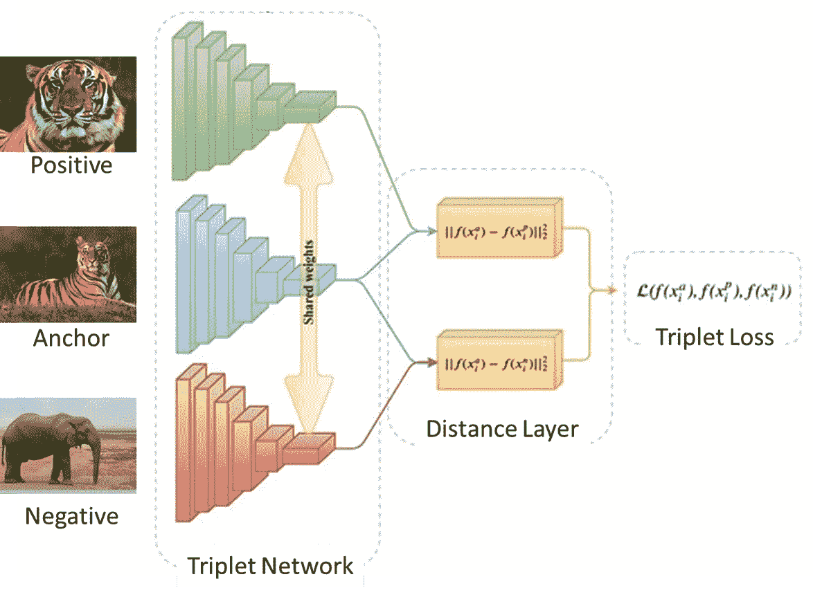
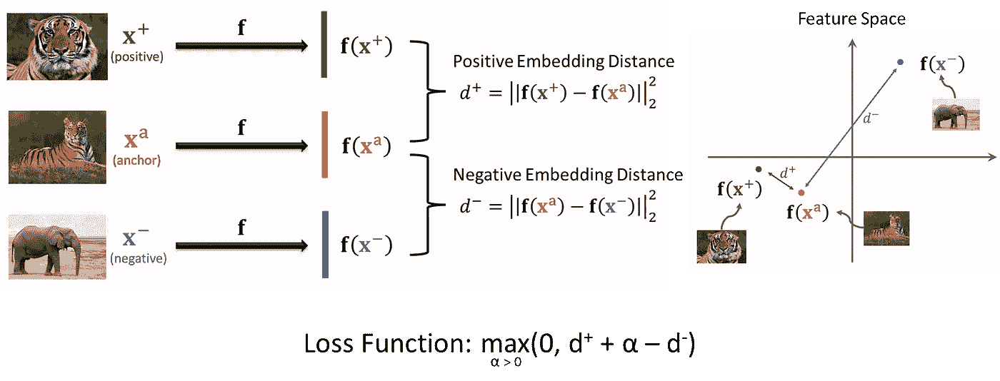
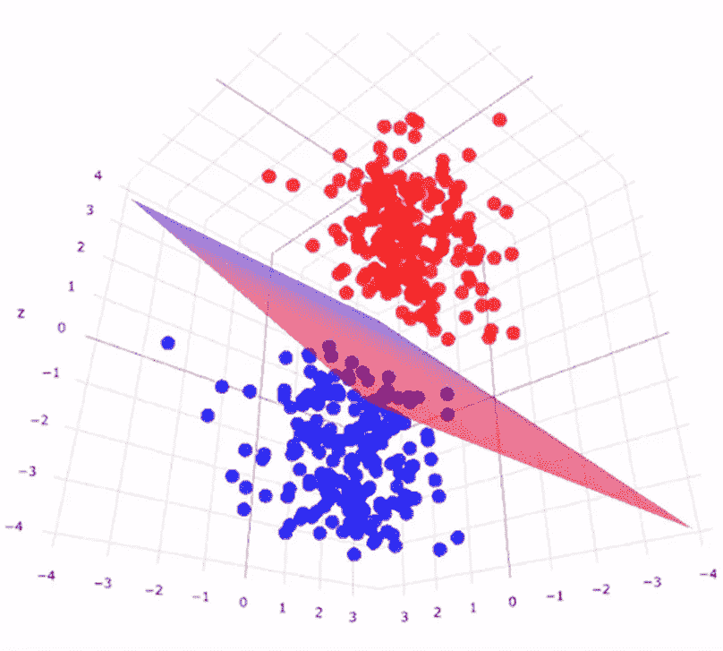

# 2A 卷:连体神经网络

> 原文：<https://medium.com/codex/vol-2a-siamese-neural-networks-6df66d33180e?source=collection_archive---------4----------------------->

暹罗神经网络(来源:GreatLearning)

## TL；博士:

暹罗神经网络(SNN)是一种相似性分类器，它使用区别性特征来概括给定分布中的未知类别。SNN 可以用作*特征提取器*，并且可以在其后安装其他 ML 机制，以便产生概率和/或类别标签。该网络的架构受到连体双胞胎的启发，拥有多个相同的卷积神经子网络(CNN ),具有相同的权重&偏差。在训练期间，CNN 产生由距离层处理的*嵌入*。然后使用*距离嵌入*计算损失，并通过*随机梯度下降*和*反向传播*进行更新。在推理过程中，CNN 产生可被支持向量机(SVM)使用的*嵌入*。

本文是由两部分组成的系列文章的第一部分，重点是为读者提供如何将 SNN 用作*特征提取器的高级概述。*本系列的第二篇文章将为读者提供一个 python 教程，解释如何使用在 *Omniglot* 数据集上训练过的预训练 SNN 对来自 *MNIST* 数据集的图像样本进行精确分类。

# 什么是连体神经网络？

SNN 是一种相似性分类器，它使用区别性特征来归纳给定分布中的未知类别。它的架构受连体双胞胎的启发，拥有多个相同的卷积神经子网络(CNN ),具有相同的权重和偏差。子网络在不同的输入图像上协同工作，以产生可比较的输出向量，称为*嵌入*。使用为每个相应图像计算的*嵌入*来计算损失值。最后，损失值用于同时更新 CNN 子网络权重&偏差，使得子网络保持相同。与大多数传统的深度学习模型一样，该模型通过*随机梯度下降*和*反向传播*进行优化。

## SNN 专业

*   SNNs 学习相似性函数，并可用于区分两个图像是否属于同一类。因此，这种类型的神经网络可以用于*图像分类*任务
*   传统的神经网络学习预测类；当需要添加/删除类时，这是一个问题。一旦训练好 SNN，它就可以用来将数据分类到模型从未“见过”的类别
*   SNNs 可用于 *K-Shot 分类-* 一般来说，k-shot *图像分类*旨在每类仅用 k-image(s)训练分类器。此外，与传统的*深度学习*技术相比，snn 对类别不平衡更加鲁棒

## SNN 骗局

*   SNN 的最终输出是相似性值，而不是概率。如果需要一个概率，SNN 可以作为一个*特征提取器*来实现，其他的 ML 机制可以安装到神经网络上
*   神经网络的架构更加复杂。根据所使用的损失函数，可能需要创建一个定制的训练循环(假设没有可以利用的代码库)来计算损失并*反向传播。*如果 SNN 被视为*特征提取器*，则需要添加额外的最大似然机制，例如，完全/密集连接层、硬/软支持向量机等。
*   与传统的神经网络结构相比，需要更多的训练时间，因为 SNN 学习机制需要大量的训练样本组合来产生精确的模型

## 社交网络的现实应用

示例包括但不限于:

*   面部识别
*   签名验证
*   钞票欺诈检测
*   音频分类

让我们以钞票欺诈检测为例。现在一种货币有许多不同的面值。同样，对于一种给定的货币，也有许多伪钞面额。训练传统的*图像分类*神经网络将需要大量的真钞和伪钞面额，以便产生准确的钞票欺诈检测。事实上，传统的神经网络需要看到每种货币的每一张真钞面额以及大量相关的假钞。相比之下，SNN 可用于此任务，需要的数据较少。以下是自动 SNN 用于钞票欺诈检测的一种方法:

1.  从每种货币中取出一些面值的钞票——不需要全部都是
2.  训练* SNN 对每种货币的所选钞票面额及其相关伪钞的组合
3.  取每种货币剩余的纸币面额，并推动它们通过 SNN，得到*嵌入物*
4.  找到并记录每种货币的每种面额聚类的质心(定义给定聚类的所有*嵌入*的平均值的向量)。可以使用多个软支持向量机来产生类别标签
5.  将钞票面额的图像推过经过训练的 SNN，并评估返回到每个质心的*嵌入*的距离
6.  如果钞票是真的，则其相关联的真实面额质心之间的距离应该很小。货币的其他真实面额质心之间也应该有很大的距离
7.  如果钞票是假的，那么在它相关的真实面额质心之间应该有很大的距离。货币的其他真实面额质心之间也应该有很大的距离

# SNN 建筑看起来像什么？

如前所述，SNN 可以用作*特征提取器*，并且可以在其后安装其他 ML 机制，以便产生概率和/或类别标签。在本文中，SNN 将被解释为一个*特征提取器*，并且一个单独的硬 SVM 将被添加以产生一个分类标签。本文中描述的 SNN *特征提取器*展示了一个三元组网络——也就是说它有三个相同的 CNN 子网络。

值得注意的是，SNN 实际上并没有将多个 CNN 子网络加载到 GPU 内存中。相反，根据所采用的损失函数的类型，图像的成对/三对/四对都被通过。然后使用输出的*距离嵌入*计算损失，并且通过*反向传播更新子网络的权重&偏差。重复这一过程，直到收敛。*

## SNN 作为特征提取器；

图 1: SNN 特征提取器(来源:王书申，YouTube——但由作者编辑)

## 卷积神经网络(CNN)

*   生成*嵌入*,这些嵌入实际上只是拼合的 1D 要素地图
*   在*训练*模式中，*嵌入*被传递到距离层
*   在*推理*模式中，*嵌入*被传递到 SVM 上
*   对于给定的应用，可以从预先建立的“主干工厂”中选择 CNN(通常称为嵌入模型、编码器或主干)，因此，可以利用*迁移学习*，例如，在 *ImageNet* 数据集上训练的 VGG16/Resnet50/InceptionV3

## 距离层

*   它计算*嵌入*之间的距离。对于三元组网络(由三元组损耗定义)*距离嵌入*是:
    -正*距离嵌入*(锚&正*嵌入* )
    -负*距离嵌入*(锚&负*嵌入*)
*   使用欧几里得的平方(也称为 L2 范数)来计算距离

## 损失函数

*   使用从*嵌入*计算的距离计算损耗
*   为了防止平凡解，使用了一个称为余量的超参数，以确保负距离嵌入*比正距离嵌入*大得多
*   *有几个可用的损失函数:
    -对比损失(双网络架构)
    -三重损失(三重网络架构)
    -四重损失(四重网络架构)*

**作者怀疑四联丢失对于上面概述的钞票欺诈检测任务是理想的。与三重损失相比，四重损失会导致模型输出产生较大的类间变化和较小的类内变化。*

**

*图 2:距离层和损失函数逻辑(来源:王书申，YouTube——但由作者编辑)*

## *作为量词的 SVM*

*线性 SVM 是一种监督学习技术，它能够通过线性超平面(如果数据是 2D，则为直线)来分离数据，从而对数据进行分类。如果数据不是线性可分的，则数据点可以被映射到更高维的特征空间，直到 SVM 能够分离类别。SVM 试图优化超平面的姿态(位置和方向),以确保不同类别的数据点之间的最大余量。对于每个类别，位于最大边缘(定义为不同类别的数据点之间的垂直距离)的数据点被称为支持向量。SVM 的一些关键特征包括但不限于:*

*   *适合于训练数据(可以使用验证子集来代替训练子集，以便增加另一个正则化级别)*嵌入*，其从 CNN 产生(距离层和三元组损失函数在训练之后是不必要的，因此被移除)*
*   *可以实现不同的内核，例如线性、高斯、Sigmoid、多项式等。，以便分离具有不同概率分布的数据点*
*   *生成类别标签*

**

*图 3:可视化的 SVM 分类(来源:KDnuggets)*

***感谢阅读。请考虑订阅和/或资助我**[https://gofund.me/c397684d](https://gofund.me/c397684d)*