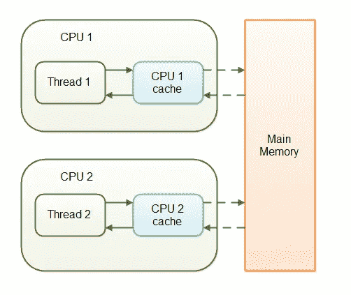

# Java 中的 volatile 关键字

> 原文：<https://medium.com/codex/volatile-keyword-in-java-9e8792b4e6ba?source=collection_archive---------6----------------------->

## 为什么、何时以及如何使用它

修饰符是 Java 中的特定关键字，我们可以使用它们来改变变量、方法或类的特征，并限制其范围。Java 编程语言有丰富的修饰语。

Java 中的修饰语分为两种 **—** [**访问修饰语**](https://www.geeksforgeeks.org/access-modifiers-java/?ref=lbp) 和**非访问修饰语**。

# 非访问修饰符

非访问修饰符向 JVM 提供关于类、方法或变量的特征的信息。Java 中有七种类型的非访问修饰符。他们是

1.  **决赛**
2.  **静态**
3.  **摘要**
4.  **同步**
5.  **易变**
6.  **瞬发**
7.  **原生**

本文将深入讨论 **volatile** 关键字的细节。我们先来探讨一下，我们为什么要用它，如果决定要用的话应该什么时候用，最后也是最重要的，怎么用。

## 为什么:

Java 中的 volatile 关键字用于将一个 Java 变量标记为“存储在主存中”。

每个访问 volatile 变量的线程都将从主内存中读取它，而不是从 CPU 缓存中读取。这样，所有线程看到的 volatile 变量的值都是相同的。

volatile 关键字可以用于任何类型的变量，包括基本类型和对象引用。当与对象一起使用时，所有线程都将看到对象中所有字段的最新值。

volatile 关键字通常与指示线程需要停止运行的标志一起使用。例如，一个线程可能有一个名为“done”的布尔标志，当另一个线程将该标志设置为“true”时，第一个线程将知道停止运行。如果没有 volatile 关键字，第一个线程可能会无限期地运行，因为它永远不会看到“done”标志的更新值。

volatile 关键字还有其他用法，但这是最常见的用法之一。一般来说，如果您需要确保所有线程都看到某个变量的相同值，那么您应该将该变量标记为 volatile。

## 时间和方式:

## 1.易变场

在上面的例子中，我们在第一个请求到来时创建实例。

如果我们不把`_instance`变成变量`volatile`，那么创建`Singleton`实例的线程就不能与另一个线程通信。因此，如果线程 A 正在创建单例实例，并且在创建之后，CPU 损坏了等等，所有其他线程将不能看到`_instance`的值不为空，并且它们将认为它仍然被赋值为空。

为什么会这样？因为读线程不做任何锁定，直到写线程从同步块中出来，内存将不会同步，`_instance`的值也不会在主内存中更新。对于 Java 中的 Volatile 关键字，这是由 Java 本身处理的，所有的阅读器线程都可以看到这样的更新。

最清楚为什么、如何以及何时使用 **volatile** 以及其他修饰语，来自于经验，而经验来自于时间。

享受旅程，快乐编码！

> 亲爱的读者，感谢您的宝贵时间！

> *我的一些文章:*

[Java 中的 10 个最佳实践](/@alexthedev/10-best-practices-in-java-dc0b06dda858)
[Java 中的哈希](/@alexthedev/hashing-in-java-f0436cd4284b)
[Java 中的最终关键词](/@alexthedev/final-keyword-in-java-dd0281080643)
[我的第一份软件开发工作的奋斗](/@alexthedev/the-struggle-of-getting-my-first-job-as-a-software-developer-d48a198f57f4)
[2023 年的 Java 还值吗？☕](/@alexthedev/will-java-still-be-worth-in-2023-849921b21080)
[the blub paradox](/@alexthedev/the-blub-paradox-d43c5cb9e3e0)
[作为一个初学程序员我希望知道的事情](/@alexthedev/things-i-wish-i-knew-as-a-beginner-programmer-96b9cbe264de)
[春训:好与坏](/@alexthedev/spring-boot-the-good-and-the-bad-20be1b409f2)
[我们为什么热爱编码？💻](/@alexthedev/why-do-we-love-coding-43d0b3cfe0b)
[保持积极性](/@alexthedev/stay-motivated-e6102f86c4b3)
[艾是扯淡](/@alexthedev/ai-is-bullshit-fa21e28898d0)
[100 追随者搞定。下一步是什么？](/@alexthedev/100-followers-done-whats-next-d3c054c2d544)
[在家工作就要结束了吗？](/@alexthedev/is-work-from-home-going-to-end-7f0bd202a329)