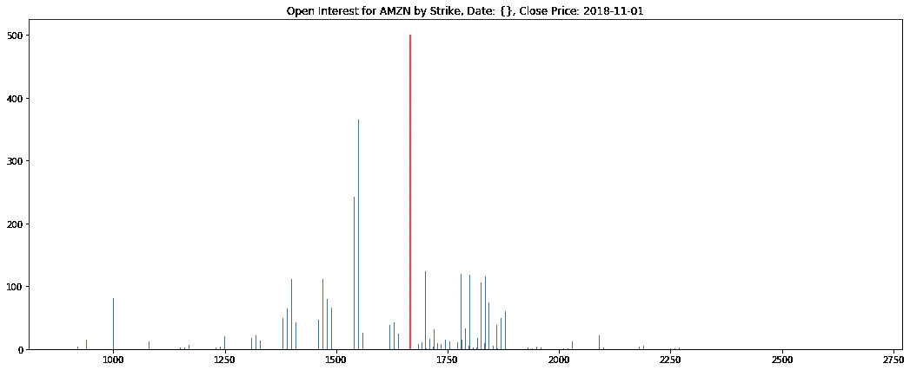
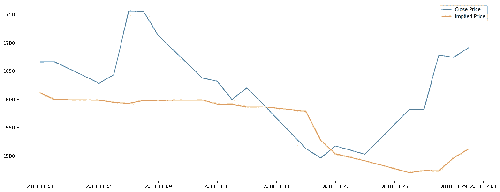
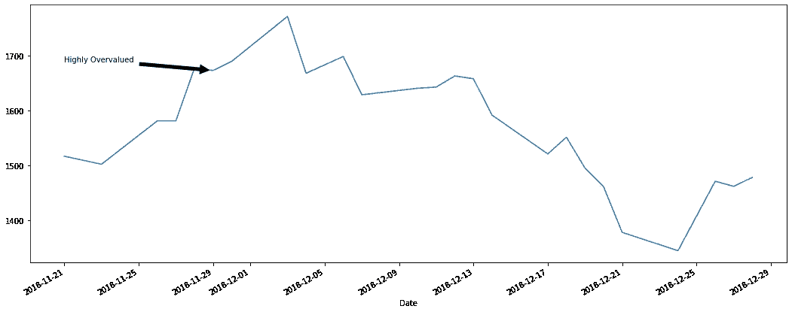

# 股票市场的民意

> 原文：<https://medium.com/codex/vox-populi-in-the-stock-market-734b286fa962?source=collection_archive---------11----------------------->


照片由[雷·比尔克利夫](https://www.pexels.com/@raybilcliff?utm_content=attributionCopyText&utm_medium=referral&utm_source=pexels)从[派克斯](https://www.pexels.com/photo/ox-with-pointed-horns-walking-on-grass-lawn-4614489/?utm_content=attributionCopyText&utm_medium=referral&utm_source=pexels)拍摄

统计学中有一个流行的故事，1907 年，弗朗西斯·高尔顿爵士写下了他在当地牲畜展览会上目睹的一场比赛。一只公牛出现了，参赛者购买纸条，写下他们对这头牛体重的猜测。猜得最接近实际体重的人将赢得公牛。与会者来自各行各业。有经验的个人，如农民和屠夫，以及对奖品有好奇心和兴趣的普通市民。

提交了近 800 个猜测，比赛结束后，高尔顿爵士被允许分析这些失误。这头牛的实际重量是 1198 磅，而猜测的平均值是 1197 磅。高尔顿爵士将他的论文命名为“大众之声”或“大多数人的意见或信仰”。他注意到的现象后来被称为“群体智慧”。

在股票市场上，一家公司的真实价值是未知的。个人愿意为其股票支付的价格给出了一个估计，但这不是一个完美的系统；供求关系、大型机构投资者不断变化的目标以及市场对消息的反应都会导致股票价格的大幅波动。了解一家公司的真实价值肯定有助于更好地选择购买股票的时机，即在该公司似乎被低估时买入。这些波动还导致投资者试图通过一种叫做“对冲”的做法来保护他们的投资，在这种做法中，合同是为了给股东提供保险，防止他们的投资贬值。

一种常见的对冲工具是“期权”，即在未来某个时间点以特定价格买入或卖出特定股票的合约。期权有两种，一种是“看涨”期权，买方有权以预定的“执行”价格购买 100 股标的股票，而一种是“看跌”期权，买方有权以执行价格卖出。

如果投资者认为他们持有的股票会上涨，但希望在下跌时保护自己，他们可以购买一个看跌期权，保证买家以可接受的价格购买，这被称为“罢工”。例如，如果某人目前拥有一只价格为每股 10 美元的股票，他们可以购买一只执行价格为 10 美元(或他们选择的任何价格)的看跌期权。如果股票价格在看跌合约到期前下跌，他们仍然可以以每股 10 美元的价格将股票出售给他们买入合约的实体。

本着“民意”的精神，我们可以把股票价格和期权合约看作是投资者对公司实际价值的猜测。当股价是直接估值时，每份看跌期权合约都是对股票将低于给定执行价格的信心(或恐惧)的投票。由于每个投资者都试图使利润最大化，他们有动机将执行价格设定得尽可能接近实际价值。

## 数据

对于一家公司基于其看跌期权的隐含价值，我将使用来自 https://www.historicaloptiondata.com/的免费样本数据。我将查看 2018 年 11 月 30 日到期的合同的一个月亚马逊数据。我已经将数据加载到我个人网络上的 MariaDB 数据库中。

```
# dbConnect is hiding the connection information for the server on my network.
import dbConnect
con, cur = dbConnect.connect()

# Pull the data for Amazon put options expiring on 2018-11-30
symbol = "AMZN"
expDate = "2018-11-30"
optionType = "put"

sql = "select underlying, sampleDate, strike, bid, openInterest " +\
      "from optionHistory where symbol = %s and " +\
      "expiration = %s and optionType = %s"

cur.execute(sql, (symbol, expDate, optionType))
optionHistory = cur.fetchall()

print(optionHistory[0]){'underlying': 1665.53, 'sampleDate': datetime.date(2018, 11, 1), 'strike': 900.0, 'bid': 0.13, 'openInterest': 61}
```

## 执行价格与股价

作为健全性检查，我们可以绘制给定一天的未平仓合约(称为未平仓“利息”)的直方图。我们看到大多数未平仓合约都集中在当前价格附近。

```
from itertools import groupby
import matplotlib.pyplot as plt

dataset = []
showHist = True

# Group the entries by date
for k, g in groupby(optionHistory, lambda x: x['sampleDate']):
    group = list(g)

    # Show a histogram of the first day of data
    if showHist:
        plt.figure(figsize=(18, 7))
        plt.bar([x['strike'] for x in group], 
                [x['openInterest'] for x in group])
        plt.vlines([group[0]['underlying']], 
                   ymin=0, ymax=500, colors=['r'])
        plt.title("Open Interest for AMZN by Strike, Date: {}, " +\
                  "Close Price: {}".format(k, group[0]['underlying']))
        showHist = False

    # Calculate the weighted average of the strike prices
    totalOpen = sum([x['openInterest'] for x in group])
    totalWeighted = sum([x['strike'] * x['openInterest'] for x in group])

    dataset.append({'date': k, 
                    'price': group[0]['underlying'], 
                    'impliedPrice': totalWeighted / totalOpen})
plt.show()
```



## 隐含的股价相当稳定

我们可以从上面看到，大部分未平仓合约都在股票的收盘价附近，但最有兴趣的期权实际上低于当前价格。这意味着大多数合约持有者认为股票被高估了。我们可以通过对执行价格和该执行价格的合约数量进行加权平均来得到一个实际的数值。当我们绘制这个隐含价格随时间变化的曲线图时，我们可以看到它相当稳定。它几乎没有标的股票价格的可变性。有趣的是，在有限的(免费)数据集上，我们看到当实际价格偏离太远时，它会被拉回到隐含价格。

```
X = [x['date'] for x in dataset]
closePrices = [x['price'] for x in dataset]
weightedStrikes = [x['impliedPrice'] for x in dataset]

plt.figure(figsize=(18, 7))

plt.plot(X, closePrices, label="Close Price")
plt.plot(X, weightedStrikes, label="Implied Price")
plt.legend(loc="upper right")
plt.show()
```



## 数据用完了！

在 11 月 29 日，一个大的转移发生在片尾。如果我们在期权数据用完后不久查看亚马逊的股价，我们会发现股价确实回到了更接近隐含价格的水平。事实上，股价并没有偏离隐含价值，这增加了估值的可信度。为了更进一步，我们可以计算有多个到期日的合约的隐含股价，然后对其进行平均，以估计股价是过高还是过低。

```
import yfinance as yf
import datetime

data = yf.download(symbol, start="2018-11-21", end="2018-12-31")

plt.figure(figsize=(18, 7))
plt.annotate('Highly Overvalued', 
             xy=(datetime.date(2018, 11, 29), 
             data.loc["2018-11-29"]['Close']), 
             xytext=(datetime.date(2018, 11, 21), 1700),
             arrowprops=dict(facecolor='black', shrink=0.05), 
             verticalalignment='top')
print(data['Close'].plot())[*********************100%***********************]  1 of 1 completed
AxesSubplot(0.125,0.2;0.775x0.68)
```



## 链接

*   免费样本的历史期权数据:【https://www.historicaloptiondata.com/ 
*   雅虎！金融市场数据下载器:【https://pypi.org/project/yfinance/ 
*   如何释放群众的智慧:[https://the conversation . com/how-to-unleash-the-wisdom-of-crowds-52774](https://theconversation.com/how-to-unleash-the-wisdom-of-crowds-52774)