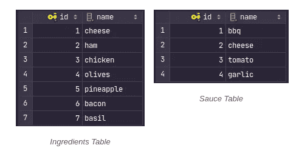
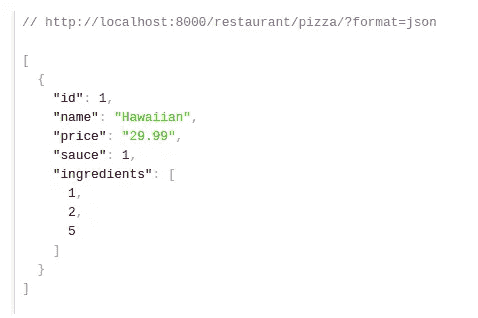
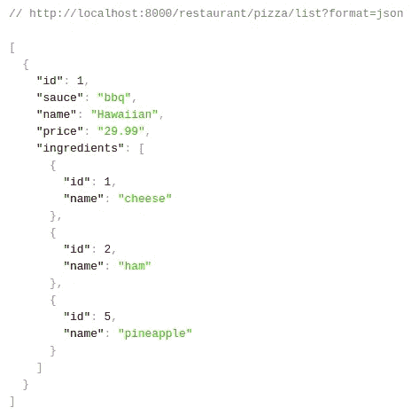

# 等等，我的菠萝呢？

> 原文：<https://medium.com/codex/wait-wheres-my-pineapple-7e02174036b8?source=collection_archive---------10----------------------->

## Django Rest 框架中的多序列化器与多视图


[engin akyurt](https://unsplash.com/@enginakyurt?utm_source=medium&utm_medium=referral) 在 [Unsplash](https://unsplash.com?utm_source=medium&utm_medium=referral) 上拍摄的照片

当你在 Django Rest 框架中创建简单的 CRUD API 视图时，我猜大多数时候你只创建了两个端点:一个用于*列表/创建*动作，另一个用于*检索/更新/销毁*动作。

对多个动作只实现一个视图意味着它们也只有一个序列化器。代码越少，越‘干’，不是吗？然而，有时这并不太好，因为我们的 API 可能在每个操作中都需要不同格式的数据。如果这种情况发生在我们身上，我们该怎么办？

这个问题有许多解决方案和不同的方法，我将试着介绍其中的几种。

# 简介

假设我们有一家披萨店(谁不爱吃披萨？)我们需要实现一个应用程序，我们的客户可以在其中下订单。

这些模型如下所示:

[https://gist . github . com/ewelina 29/c 025651 c 47948 e 46 e 630 dbb f1 d 4 e 211 b](https://gist.github.com/ewelina29/c025651c47948e46e630dbbf1d4e211b)

所以我们有一个带字段的`Pizza`模型:

*   `name`，
*   `price`(在这种情况下不重要)，
*   `ingredients` ( **ManyToManyField** 到`Ingredient`，因为每一个披萨都可以有很多食材)，
*   `sauce` ( **外键**)到`Sauce`模式因为每个披萨只能有一种酱)。

让我们实现一个非常简单的继承自`generics.ListCreateAPIView`的`PizzaAPIView`来处理*列表/创建*动作。

[https://gist . github . com/ewelina 29/86f 4492 aa 832 Fe 65 aa 20 C4 aa 6316 aa 16](https://gist.github.com/ewelina29/86f4492aa832fe65aa20c4aa6316aa16)

而且非常基础的`PizzaSerializer`继承自`ModelSerializer`:

[https://gist . github . com/ewelina 29/f 4 e 2 DFC 0d 5 e 664 CD 8088231 fbca 44 e 40](https://gist.github.com/ewelina29/f4e2dfc0d5e664cd8088231fbca44e40)

`urls.py`中还有一行代码:

[https://gist . github . com/ewelina 29/3ba 603 e 239 e 383d 794 c 027 f 914435036](https://gist.github.com/ewelina29/3ba603e239e383d794c027f914435036)

快速查看我们的`Ingredients`和`Sauces`桌，了解我们餐厅的厨房有什么菜:)



好了，让我们一起创造有史以来最好的披萨吧:)。
JSON(针对 POST 请求)应该是这样的:

```
{
    "name": "Hawaiian",
    "price": 29.99,
    "sauce": 1,
    "ingredients": [1,2,5]
}
```

并发送 GET 请求来获取列表。让我们来看看回应:



GET 请求的响应

嗯，一切正常，但是…我的菠萝在哪里？！我不想在我们的清单上看到酱料和配料的标识，而是它们的名称。

如何不费力地做到这一点并保持代码整洁？

# 多个视图—多个序列化程序

第一个解决方案是将我们的视图分成两个独立的视图:

[https://gist . github . com/ewelina 29/ada 20176 e 8230 e 519 c 8913 e 7598076 Fe](https://gist.github.com/ewelina29/ada20176e8230e519c8913e7598076fe)

这样我们就可以创建一个新的序列化程序来处理`PizzaListAPIView`:

[https://gist . github . com/ewelina 29/2d 85154150 efb 213817472971689 f 233](https://gist.github.com/ewelina29/2d85154150efb213817472971689f233)

我覆盖了字段`sauce`以返回酱油的名称(使用`source`属性)并将`depth = 1`添加到`Meta`类以获得完整的对象。

还有一件事。我们需要为每个视图创建一个单独的端点。

[https://gist . github . com/ewelina 29/810 a 907 e 956 c 77 e 9770971 f 3013674 aa](https://gist.github.com/ewelina29/810a907e956c77e9770971f3013674aa)

现在我们的结果看起来会像这样:



是啊，菠萝披萨！我就喜欢这样:)

但是这种方法需要创建额外的视图和端点。也许有更好的解决办法？

# 一个视图—一个序列化程序

为什么不试一试，将所有内容混合在一个视图和一个序列化程序中呢？让我们回到基本的`PizzaAPIView`并稍微修改一下`PizzaSerializer`:

[https://gist . github . com/ewelina 29/BC 1a 789 b 965 a 72747 d6f 50 f 67d 63 da4c](https://gist.github.com/ewelina29/bc1a789b965a72747d6f50f67d63da4c)

我添加了两个额外的字段:`selected_sauce`和`selected_ingredients`，以我们想要的格式返回对象。我还给它们分配了`read_only`属性，这样它们只在 GET 方法的响应中可用。

还有一件事。通过将`write_only`属性分配给`sauce`和`ingredients`字段，我确信这两个字段在 POST 请求数据中是必需的，但是它们不会显示在响应中。

这种方法允许我们在一个视图和一个序列化器中处理两种方法。但它总是最佳解决方案吗？答案取决于你。

如果你问我的意见，我觉得当*列表*和*创建*视图中的同一个字段有不同的名称时会很混乱。此外，当我需要查看每个字段定义并检查它是`read_only`还是`write_only`的时候，我会因为在一个类中收集了太多信息而感到不知所措，这使得代码不够干净。

这就是我寻找其他解决方案的原因，以下是我的发现…

# 一个视图—多个序列化程序

让我们回到我们的基本观点，稍微修改一下。Django Rest 框架提供了许多方法，我们可以简单地覆盖这些方法来实现我们的目标。(如果你想了解更多，请点击查看[。](https://www.django-rest-framework.org/api-guide/generic-views/#methods)

其中一种方法就是`get_serializer_class()`。当我们发送请求并且 Django 正在寻找 serializer 类时，这个方法被调用。默认情况下，它返回视图中定义的`serializer_class`。但是如果我们覆盖了这个方法，真正的奇迹就会发生…

[https://gist . github . com/ewelina 29/d4bf 88 c 1215 feb 99286 f1 e 369d 50 CAA 5](https://gist.github.com/ewelina29/d4bf88c1215feb99286f1e369d50caa5)

这是怎么回事？只是简单地检查我们的请求方法是否是 POST(这意味着我们正在创建一个新对象)。如果是，我们告诉 Django 使用`PizzaCreateSerializer`。在任何其他情况下，将使用`PizzaListSerializer`。

然后我们可以创建我们的序列化程序:

[https://gist . github . com/ewelina 29/3c 415961609 a 79 fa 185577 a 14 E3 B4 FD 6](https://gist.github.com/ewelina29/3c415961609a79fa185577a14e3b4fd6)

并更新`urls.py:`

[https://gist . github . com/ewelina 29/e 9 CB 1c 26 ce e1046710 a9 d 68 C2 f 026 b2d](https://gist.github.com/ewelina29/e9cb1c26cee1046710a9d68c2f026b2d)

哇，太神奇了！我们刚刚在一个视图中使用了两个序列化器。我们甚至可以更进一步，通过在`get_serializer_class()`方法中实现我们可以想象的任何逻辑来使用我们想要的。

现在代码看起来干净多了，每个序列化器只负责一个动作。

# 结论

正如你所看到的，几乎每个问题都有许多解决方案，每个解决方案在某些情况下都可能是正确的，所以了解不同的方法并根据你的需要交替使用它们真的很有帮助。不要犹豫尝试你的代码——这是发现新事物和(希望)更好东西的最好方法！:)

又及:我希望你不会因为披萨上的菠萝而恨我，但我真的很喜欢它；).