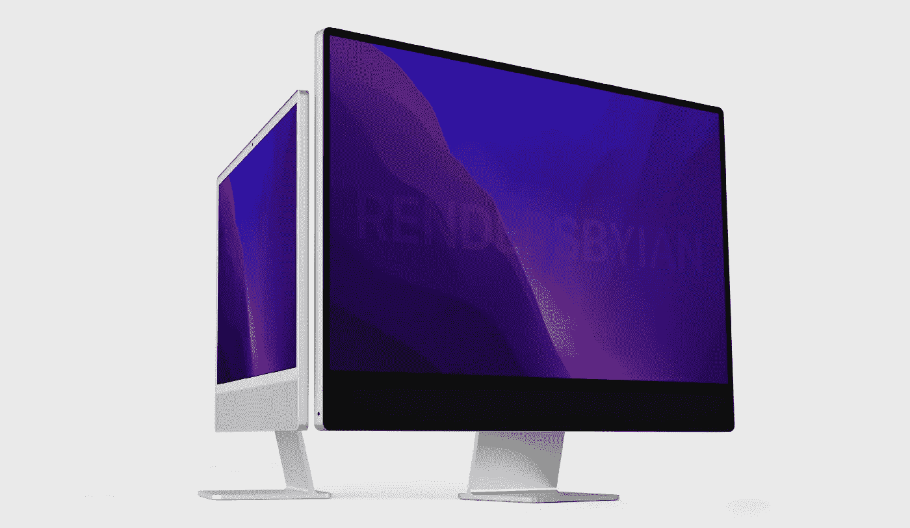
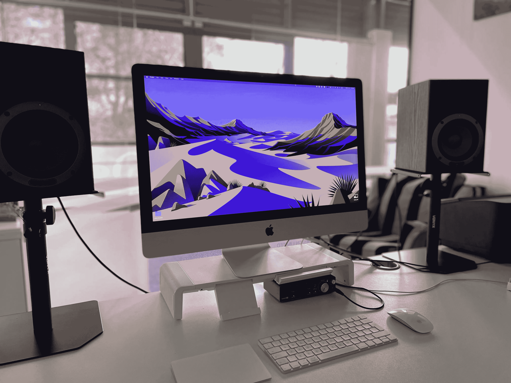
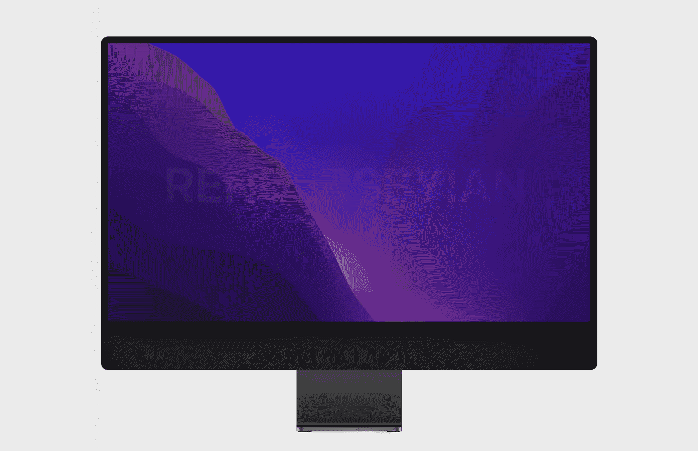
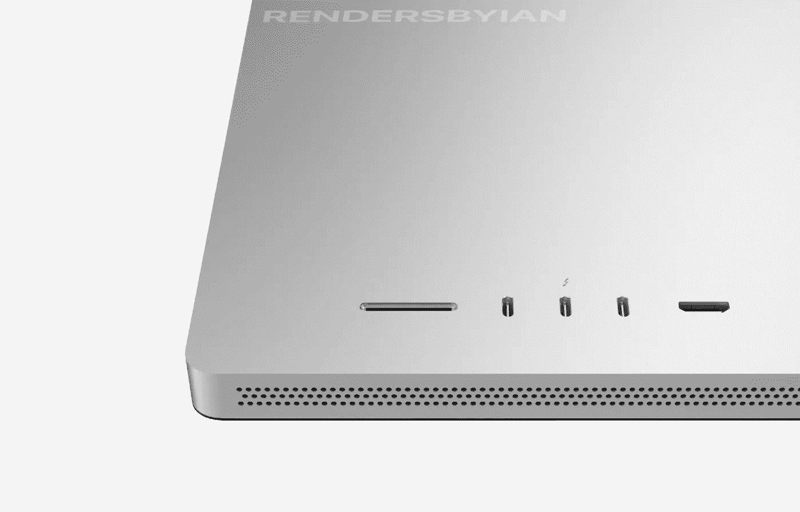

# 等待 iMac Pro

> 原文：<https://medium.com/codex/waiting-on-the-imac-pro-99834bebb4d2?source=collection_archive---------2----------------------->

## 也有很好的理由

我已经做了十多年的苹果电脑用户，在那段时间里，我一直是一名台式机用户。我*拥有*台笔记本电脑——一台非常早期的 MacBook Air，目前我仍在运行一台 2019 款 MacBook Pro。你可以在我的 YouTube 频道，https://youtu.be/G3EVFXz7w-Q上观看我的视频。这很棒，帮助我完成了一些非常重要的项目。但是到了最后，我真的是一个彻头彻尾的电脑迷。

## 为什么桌面恋爱？

简单地说，房地产是主要原因。鉴于我大部分时间的工作性质，我需要那块屏幕空间。当您在 Premiere Pro、多轨道试听会话或多层 Photoshop 文档中处理复杂的时间线时，空间非常重要。

随着去年 MacBook Pro 的发布，我受到了极大的诱惑，老实说，现在依然如此。它们价格不菲，但我肯定它们会毫不费力地吃掉我扔给它们的任何东西。尽管它们无疑很棒，但最终还是要用到 16 英寸显示器(虽然很漂亮)。我最不想做的事情就是在专业显示器 XDR 或 LG 5K 超细显示器上交出更多来之不易的东西。

我被去年的 24 英寸 M1 iMac 所吸引。在这一点上，它们代表着惊人的价值，但是，我知道我会买一个旧的芯片。因此，务实的选择是等待今年新款大型专业版 iMac 的发布。这是我预计我们将得到的。它将在 3 月 8 日的春季活动上发布。然而，根据显示器和屏幕分析师**罗斯·杨**的说法，目前存在供应链问题，这将导致发布会至少推迟到 6 月和夏季 WWDC 活动。

但是当他们真的到达这里时，我们能期待什么呢？

 [## apple Music v Spotify…胜者是？

### 音乐流媒体大战——如何选择

medium.com](/@Davidtalkingtech/apple-music-v-spotify-the-winner-is-8968e7c739a9) 

## 名字？

目前还没有人确定，但看起来苹果可能会希望在他们的产品线中区分这种模式。24 英寸将保持简单的 iMac，它是新的，更大的兄弟将再次承担 iMac Pro 的绰号。这将清楚地表明苹果的目标是什么，以及他们认为什么样的用户会被它吸引。

## 屏幕和显示器

这将是我们在 2021 年 MacBook Pro 上看到的华丽的迷你 LED，120Hz 刷新率，Pro Motion，Retina 显示屏的最新版本。到目前为止，大小正在等待确认。保持目前的 27 英寸似乎是可能的，但有传言称会增加到 30 英寸甚至 32 英寸(5000 美元的专业显示器 XDR 的尺寸)。它的分辨率也可能提高到 6K。

 [## iOS 15.4——你激动吗？

### 目前，仅处于测试阶段，但很快就会出现在你身边的 iOs 设备上！

medium.com](/codex/ios-15-4-are-you-excited-886be765138c) 

## 输入/输出和端口

这将直接从 MacBooks 上取下，至少有三个 Thunderbolt 4 端口、一个 HDMI 端口、SDXC 卡插槽、一个 MagSafe 3 端口和一个高分辨率 3.5 毫米耳机音频插孔。我希望在这些专业级台式机上增加一个以太网端口。不过，总的来说，任何专业人士都希望获得的无加密狗生产力。

## 设计

很可能，它将与目前的 24 英寸非常相似。颜色将被删除，以符合这个台式机庞然大物的专业愿望。有可能，在发布时，它们将只在令人昏昏欲睡的太空中可用——灰色和银色。白色挡板也会因为同样的原因掉落，也会更薄。标志性的下巴会留下来。这是第一次，无论是台式机还是笔记本电脑，我们都将有幸拥有 Face ID。

## 表演

这肯定会令人印象深刻。它将会有苹果硅胶芯片的最新化身，但是你和我一样猜测它将会被叫做什么！想象一下，如果你将两个 M1 最大芯片并排运行…这就是我们将交付。新芯片可能能够处理多达 20 个 CPU 核心和令人震惊的 64 个 GPU 核心，并可能至少有高达 128 GB 的统一内存。基本型号将配备 512 GB 固态硬盘。

## 定价

最后，棘手的价格问题。如果我们从 2021 年发布的 MacBook 中吸取教训，那么价格上涨似乎更有可能。毕竟，正如我所提到的，这些 iMacs 中实际上将有两个 M1 芯片，可能还有一个 6K 显示器。我认为对于基本型号，我们可以期待看到价格从 2600 美元左右开始。

## 结束的

等待即将结束。iMac 系列的最新产品即将上市，我已经等不及了。你可以放心地知道，从现在起到发布，我能找到的所有松散的、沙发靠背上的零钱都将在我的 Mac 储蓄罐中找到，为这些坏男孩做准备！

**出发前**

[**加入我的幕后邮件列表**](https://www.talkingtechandaudio.com)

**原载于 2022 年 2 月 5 日 https://www.talkingtechandaudio.com/blog****[**。**](https://www.talkingtechandaudio.com/blog)**