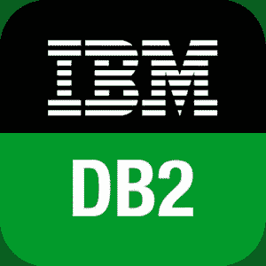

# IBM DB2 模式演练

> 原文：<https://medium.com/codex/walk-through-on-ibm-db2-schema-97aa428f9f32?source=collection_archive---------6----------------------->



IBM Db2 是一种混合数据管理产品，它提供了一大套由人工智能驱动的特性，用于处理内部以及私有和公共云环境中的结构化和非结构化数据。Db2 构建在一个智能的公共 SQL 引擎上，侧重于可伸缩性和灵活性。因此，数据库管理人员和数据科学家都会被 IBM DB2 迷住。

# 什么是图式？

模式是数据库对象的集合，包括表、视图、触发器、函数和索引，它提供了一种对几个对象使用相同自然名称的方法，并防止对这些对象的模糊引用。一个模式与一个用户名相关联，该用户名称为模式所有者，是逻辑上相关的数据库对象的所有者。简单地说，我们可以说模式本身就是一个数据库对象。

## **创建模式**

```
**CREATE SCHEMA** schema_name **AUTHORIZATION**[AUTHORIZATION owner_name]
```

使用 CREATE SCHEMA 语句创建模式，将当前用户或指定的授权 ID 记录为模式所有者。

当一个新的数据库被创建时，PUBLIC 被赋予 ***IMPLICIT_SCHEMA*** 数据库权限。
1。具有隐式模式权限的用户可以通过创建对象并指定不存在的模式名称来定义模式。
2。隐式创建的模式的所有者是 SYSIBM，PUBLIC 被授予在其中构造对象的权限。
3。隐式创建模式时，会授予 CREATEIN 权限，允许任何用户在该模式中创建其他对象。

要控制谁可以隐式创建数据库所需的模式对象，必须使用指定的 ***限制性*** 选项创建数据库。当数据库是限制性的时，PUBLIC 在模式上没有 CREATEIN 特权。

具有 ACCESSCTRL 或 SECADM 权限的用户可以更改用户对任何模式拥有的特权。一些架构名称被保留。比如内置函数属于 SYSIBM 模式，预装的用户自定义函数属于 SYSFUN 模式。

为了更好地理解，我们可以放在一起，因为创建模式对象只有三种方式:

*   任何用户都可以在 CREATE SCHEMA 语句中用自己的授权名创建模式。
*   任何具有 DBADM 权限的用户都可以直接创建任何不存在的模式，并可以选择将另一个用户指定为该模式的所有者。
*   任何具有 DBADM 授权的用户都拥有隐式模式数据库权限，这允许他们在创建其他数据库对象时使用任何名称创建模式。

## **复制模式**

一旦一个模型模式被创建，我们就可以用它作为创建新版本的原型。这可以通过两种方式实现:

1.  ADMIN_COPY_SCHEMA 过程—在同一数据库中复制单个模式。

```
CALL SYSPROC.ADMIN_COPY_SCHEMA('SOURCE_SCHEMA', 'TARGET_SCHEMA',     'COPY', NULL, 'SOURCETS1 , SOURCETS2', 'TARGETTS1, TARGETTS2, SYS_ANY', 'ERRORSCHEMA', 'ERRORNAME')
```

2 **。带有 **-co COPY** 动作的 db2move** 实用程序——将一个或多个模式从源数据库复制到新模式下的目标数据库。

下面的 **db2move** **-co COPY** 选项示例将模式 **ABC** 从示例数据库复制到目标数据库，并将其重命名为 **XYZ** :

```
db2move sample COPY -sn BAR -co target_db  target schema_map 
      "((ABC,XYZ))" -u userid -p password
```

## 删除模式

在删除一个模式中的所有对象之前，必须将其删除或转移到另一个模式。

```
DROP SCHEMA name RESTRICT
```

RESTRICT 关键字规定了一条规则，即不能在从数据库中删除的模式中指定任何对象。关键字 RESTRICT 不是可选的。

参考:[https://www.ibm.com/in-en/analytics/db2](https://www.ibm.com/in-en/analytics/db2)