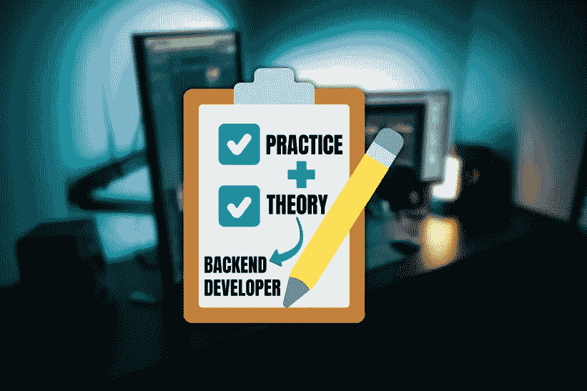

# 想成为更好的开发者？这是我实现它的计划

> 原文：<https://medium.com/codex/want-to-become-a-better-developer-this-is-my-plan-to-achieve-it-1ec318f5200d?source=collection_archive---------4----------------------->

目前，我正在加的斯大学完成我的计算机科学学位。在我的第三年，由于伊拉斯谟奖学金，我在罗马住了 6 个月。因为这个原因，现在我只有两个科目可以完成我的学位，从二月份开始，我有了很多空闲时间。