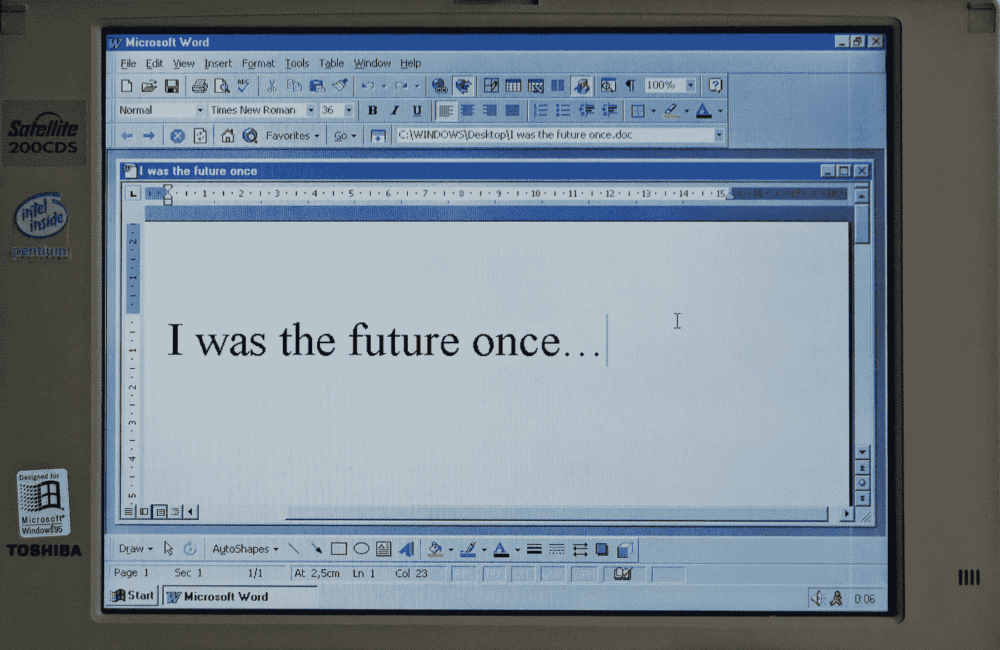

# 想要更快地发布代码吗？停止构建额外的功能

> 原文：<https://medium.com/codex/want-to-ship-code-faster-stop-building-extra-features-40828eb33378?source=collection_archive---------6----------------------->

佩德罗·桑托斯在 Unsplash 上拍摄的照片

***额外功能是软件开发七大浪费中的第二个。***

精益软件开发的鼻祖 Mary 和 Tom Poppendieck 发现了这七种浪费。它源于他们理解精益制造的原理并将其应用于软件工程的努力。**消除浪费是精益原型的精髓，丰田生产系统:**

> 我们所做的就是查看从客户给我们订单到我们收取现金的时间线。我们正在通过消除无附加值的浪费来缩短这一时间。

# 消除浪费就是提高速度。

那么额外的功能是如何让我们慢下来的呢？

**额外功能是软件开发对制造业生产过剩的模拟。如果你检查其他六种浪费，你会发现它们主要与我们如何生产产品有关。额外的功能和生产过剩主要与我们生产什么产品有关。如果我们浪费在构建必要的功能上，我们也会浪费在构建额外的功能上。**

***额外的功能导致所有其他浪费的增加！***

# 额外功能有什么问题？

**简单。我们软件中的所有额外代码:**

*   必须被追踪
*   必须编译
*   必须整合
*   必须测试(每次摸码！)
*   必须维护(在系统的生命周期内！)
*   增加复杂性
*   增加了潜在的故障点
*   很可能在使用之前就已经过时了！

***如果你在照看额外的代码，你就在减慢价值的传递！***

正如戈登·贝尔令人难忘地说:

> 计算机系统中最便宜、最快、最可靠的组件是那些不存在的组件。

# 那么有哪些额外功能的例子呢？

*   有影响力的利益相关者坚持要包括的宠物特征。
*   我们可以通过更快的反馈周期消除的功能。
*   开发人员在简历中加入最新的闪亮科技*(也称为简历驱动的开发)*。
*   客户从未要求过的功能，但您“知道”他们会需要。

****