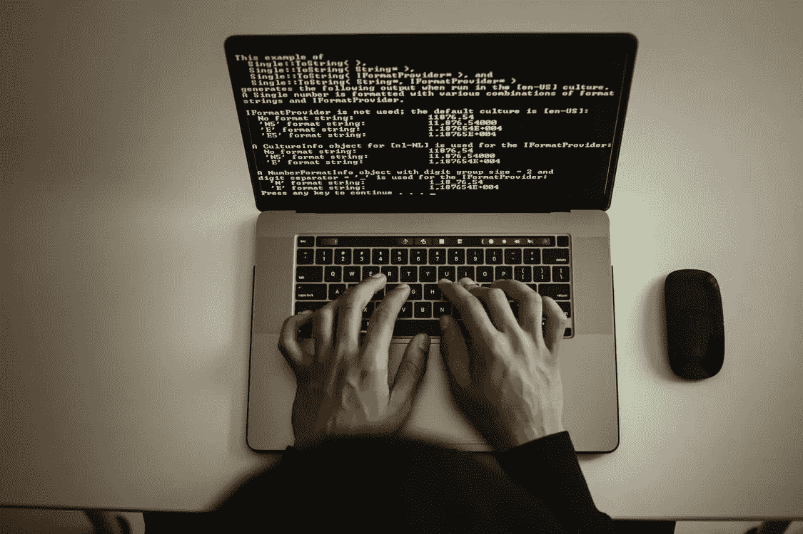

# 警告！你在犯这些 Linux 的错误吗？

> 原文：<https://medium.com/codex/warning-are-you-making-these-linux-mistakes-94e97d89ac5e?source=collection_archive---------25----------------------->

Linux 是一个很难进入的环境，尤其是如果你来自 Windows 操作系统环境的“正常”世界。如果你担心冒险进入 Linux，或者对 Linux 不熟悉，或者似乎在使用它时仍然有困难，那么这篇文章就是为你准备的。

# 学习命令行(就像你命悬一线一样)

您能不使用 Linux shell 命令行而只使用 GIU 吗？是的，你应该吗？不要！Linux 终端是一个强大的工具，你可以用它做任何事情。想要将每个文件从一个目录移动到另一个目录？只需使用一个简单的命令来移动它。想要删除目录中的所有文件吗？只需使用一个简单的命令删除一切。想使一个文件可执行，并使它可以从任何地方调用？只需在终端中使用一个简单的命令。大多数 Linux 版本内置了数百个(如果不是数千个)命令。你只需要学会它们。**但是我应该学习哪些命令呢？从导航开始。了解如何在所有目录中移动。**例如像 ls、cd、pwd 这样的命令。然后你可以移动、删除、复制、编辑文件。例如，这些命令可以是 rm、cp、mv、nano 和 cat。然后，在学习了基础知识之后，你就可以使用更高级的命令了。

# 小心！命令可能会有风险

Linux 很棒，很强大，**并且会给你带来很多麻烦。总的来说，Linux 会给你做你想做的事情的能力。想在没有任何研究的情况下从网上下载一些完全随机的东西并使之可执行吗？没问题。想要删除另一个用户的整个目录吗？你能做到的。想在很短的时间内递归删除系统中一半的文件吗？简单点。**一般来说，你应该小心使用 rm、sudo 和 mv 命令**。这些命令能够删除软件、移动软件，或者立即授予您超级用户权限。如果你不必做某事，那么你可能不必做。而移动或删除软件会破坏系统。**

# Linux 应该与你合作，而不是与你作对

有很多不同的 Linux 发行版，有些会比其他的更适合你。如果你是 linux 新手，你应该从一个更友好的 GUI 友好的 linux 风格开始。这些 linux 发行版可能是像 Ubuntu、Linux Mint、Pop Os 和 Elementary Os 这样的发行版。其中大多数都是“开箱即用”的，包括视频播放器、图像浏览器、丰富的图形用户界面、网络浏览器，甚至办公工具。不需要额外安装。然后还有更高级的，裸机，极简和自建 linux 发行版。这些包括 Arch Linux 和 Gentoo。这些类型的 linux 发行版需要更多的专业知识和研究来工作，因为你要从头开始配置你的硬件。**如果你是一个初学者，或者是想让事情变得简单一些的人，那么就坚持使用 linux 对初学者更友好的操作系统。**

# 临终遗言

感谢您阅读这篇文章。我希望它能为在 linux 世界中避免一些错误，以及如何更有效地使用 linux 提供一点启发。如果你喜欢这样的内容，一定要订阅。

**想知道我最近在忙什么吗？点击这里查看我的个人网站**[**http://davidesquerra.com**](http://davidesquerra.com/)**或者点击这里查看我的 git hub**[**https://github.com/Davidfree2**](https://github.com/Davidfree2)