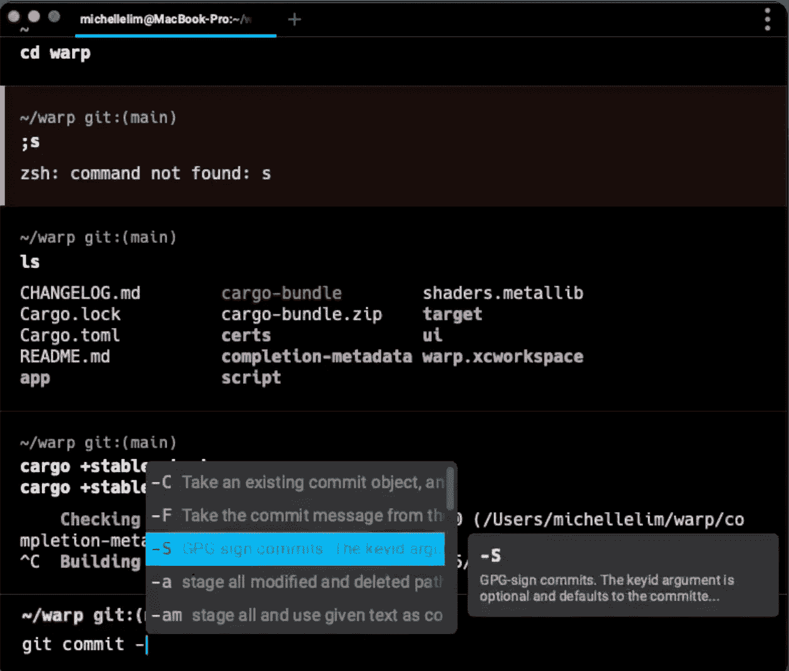
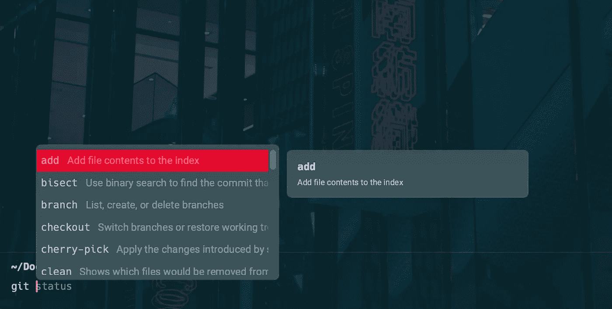
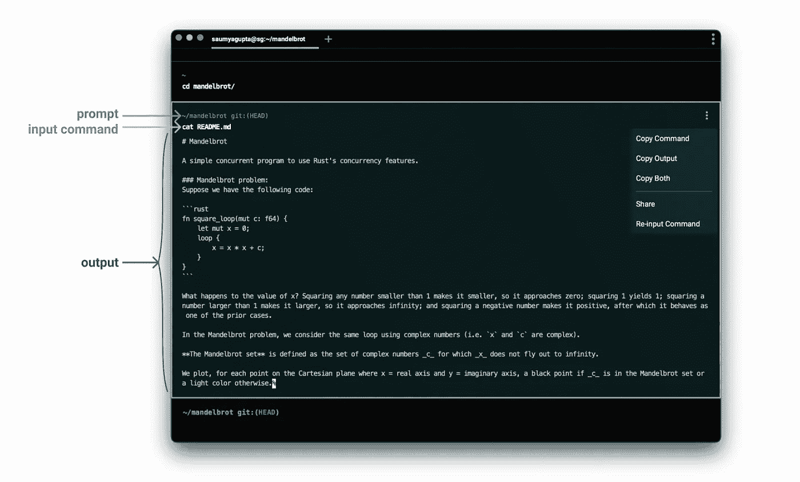

# Warp:提高开发人员生产力的新终端

> 原文：<https://medium.com/codex/warp-a-new-terminal-to-boost-developer-productivity-a9332b42ba84?source=collection_archive---------1----------------------->

今天有一个新的终端发布了他们的测试版，我非常兴奋地谈论我使用它整整一周的经历。

上周，曲速终端团队的一名成员找到我，请我测试他的团队正在构建的基于 Rust 的终端，并给我诚实的反馈。所以我在这里，准备分享我的体验和一些我玩过的很酷的功能。

# 总体体验

首先，我们来谈谈常规的老式命令提示符和终端窗口。开箱即用，它们很无聊，缺乏语法颜色编码，可能很难导航，而且在我个人看来，不完全是初学者友好的，因为你需要一开始就记住所有基本的终端命令。

在下载了 Warp 并第一次试用之后，我的第一反应是:这和代码编辑器太相似了，甚至所有的快捷键都是一样的！还有，我马上去浏览了所有的颜色主题。当然，功能是伟大的，但对我来说，审美也是一切！这是我最后选择的主题:

这个黑暗城市终端主题让我想起了赛博朋克

我创建的很多内容都是为了帮助初学者开始编程，包括资源和工具建议。当我使用 Warp 终端时，我的第一个想法是:“哇，这是一个非常适合初学者使用的终端”。我之所以这么说，是因为终端带有完成命令的自动提示功能，而且在终端上导航要容易得多。

目前我认为这款终端唯一的一个主要缺点是它还不能用于所有的操作系统。目前它只兼容 Mac，但他们的网站上说他们正在努力将终端扩展到 Windows 和 Linux。我期待着这一更新，因为我的许多个人项目都使用我的 Windows 台式机。

让我们回顾一下 Warp 终端提供的一些独特而又酷的功能:

# 自动建议和完成:

正如您在上面的图片中看到的，终端提供了自动建议功能来完成命令的其余部分。此外，它还提供了一个包含描述的常用命令列表。在我看来，在终端中浏览 git 命令列表来记住运行哪个命令要比浏览网页来复习容易得多。

# 查找:

搜索终端的内容非常容易(在终端窗口标签范围内)。搜索功能是从下到上的，因此与的匹配首先对应较新的端子值。

# 键盘快捷键:

Warp 支持您可能习惯在文本编辑器中使用的所有相同的键盘和鼠标绑定。它还向后兼容所有普通的终端键盘绑定。此外，如果你愿意，你也可以在设置中完全自定义键盘快捷键。该终端还允许多行命令。您可以使用 SHIFT-ENTER 转到新的一行。

# 区块:

Warp 中的终端是通过将命令及其相应的输出分组为块来设计的。对于每个块，他们都使得复制命令、复制输出变得很容易，并且可能是所有这些功能中最酷的功能:与他人共享该块。过去，当我遇到错误时，我会通过将错误日志粘贴到我的团队聊天中来询问我的同事。然而，我相信你们知道这变成了一个冗长混乱不可读的错误(大多数时候错误的截图更容易理解)。但是有了 blocks，你可以和你的同事分享连接到曲速终端的链接。

示例翘曲块

现在您已经对终端的一些特性有了一点了解，我鼓励您下载终端并亲自尝试一下！

这里有他们网站的链接，你可以下载:[https://www.warp.dev/](https://www.warp.dev/)

以下是他们的文档链接，共享了终端提供的附加功能:[https://docs.warp.dev/](https://docs.warp.dev/)

一旦你下载并测试了它，在你的想法下面评论吧！很想听听你对曲速终端的看法。