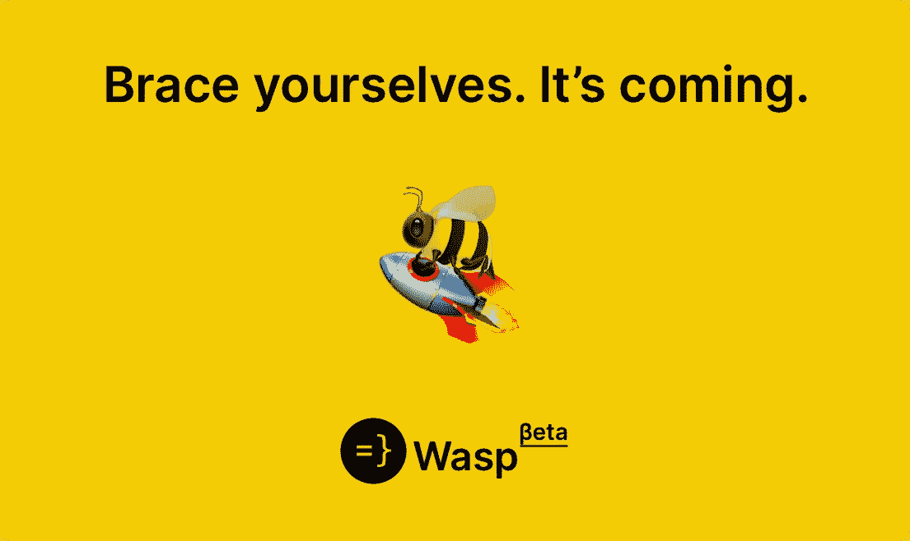
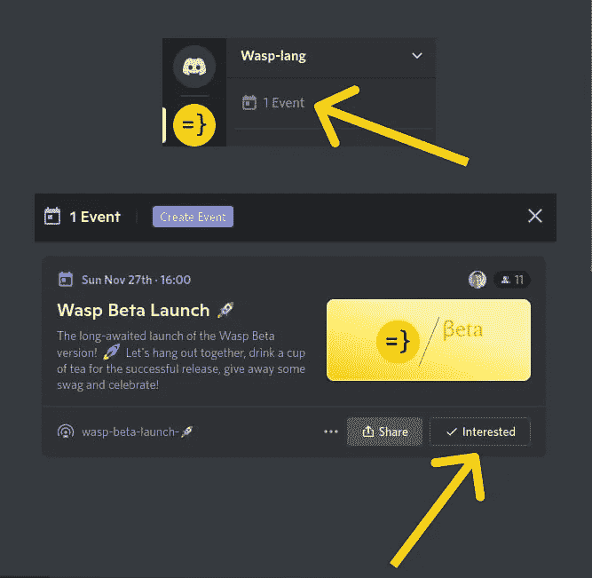
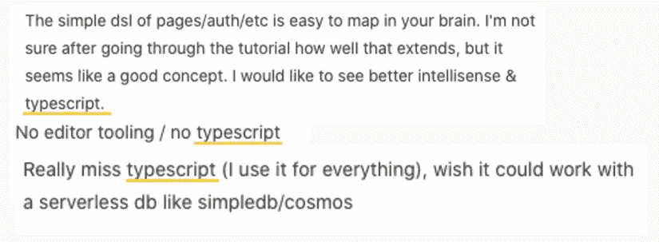
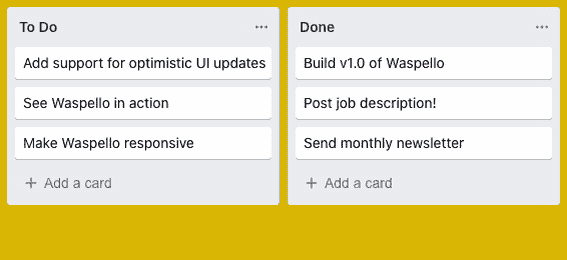
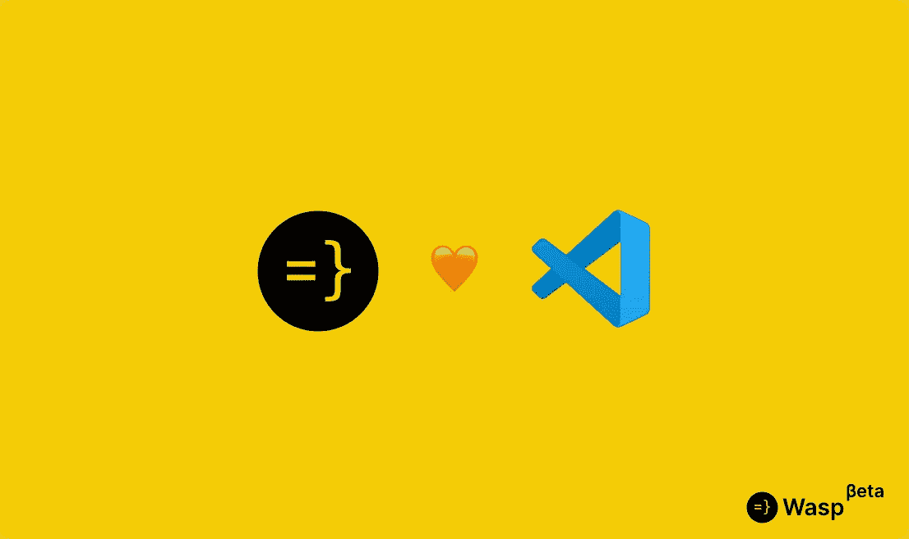
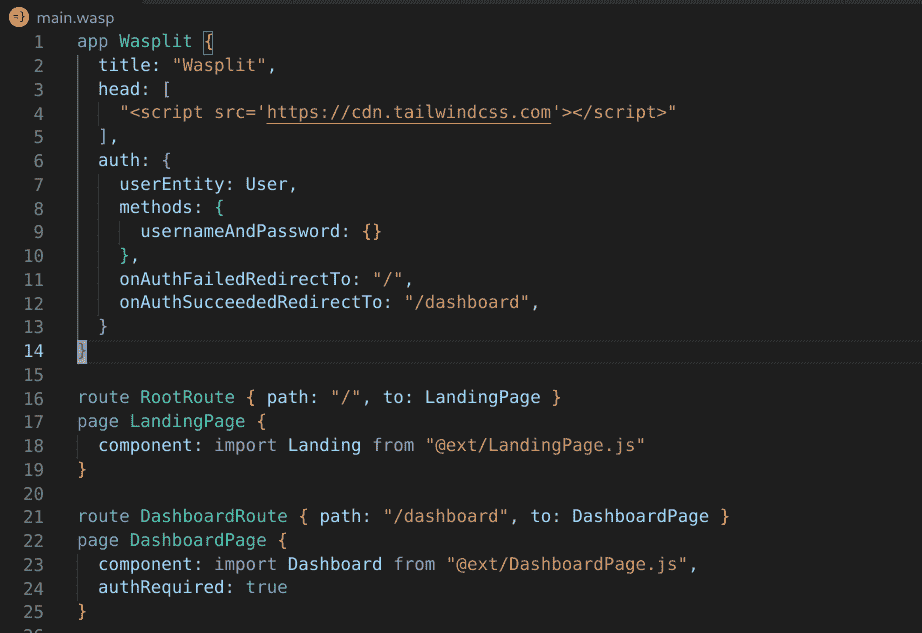
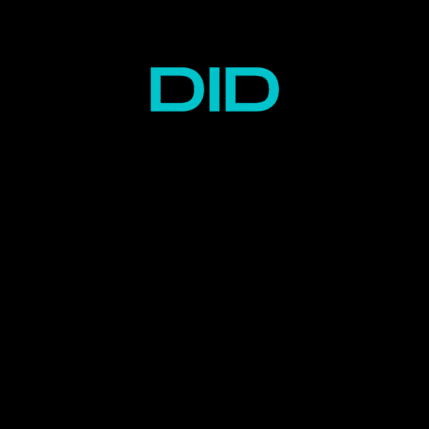

# Wasp Beta 发布周公告

> 原文：<https://medium.com/codex/wasp-beta-launch-week-announcement-b39eebab37ef?source=collection_archive---------9----------------------->

快到了！在我们发布 Alpha 版本将近两年后，无数的应用程序被开发，React 和 Node 版本被升级，PRs 被合并**我们离测试版只有一天了！**

我们将遵循发布周的形式，**，这意味着我们的测试版发布将持续一整周！**从本周日的产品搜索发布会开始(一旦上线，我们会让您知道，所以请竖起您的投票手指！)**我们每天都会突出一个新功能**。

我会尽量不提前破坏太多，但我们真的对此感到兴奋-下面是它看起来会是什么样子的快速概述:

# 11 月 27 日周日——产品搜寻发布活动🚀+让我们开始这个派对吧:Auth🎉

除了捍卫我们的产品搜索冠军头衔(我们上次赢得了 [#1 日产品](https://www.producthunt.com/products/wasp-lang-alpha#wasp-lang-alpha))，这次我们还将为我们所有人举办一个在线聚会，共同庆祝！

它将于美国东部时间上午 9:00/欧洲中部时间 15:00—[在此](https://discord.gg/4kUcXChX?event=1042717917097246720)报名，并确保将自己标记为“感兴趣”！

加入我们与团队见面，参加一个轻松的 AMA 会议，了解关于 Wasp 的一切，从它如何开始到开发挑战(与 Haskell、web dev 和编译器一起玩)以及对未来的想法和计划。

首先要宣布的特性是 Wasp 中的身份验证！它比以往任何时候都更容易，更酷，支持第三方提供商(提示:以“G”开头)，并且比一罐花生酱(当然不是松脆的那种)更流畅！

# 11 月 28 日星期一—支持打字稿！

当我们在 [Alpha 测试项目](https://wasp-lang.dev/blog/2022/11/16/alpha-testing-program-post-mortem)中问你 Wasp 缺少什么时，你非常清楚:

我们听到了你的声音(老实说，我们也错过了)，现在它来了！您可以用 TypeScript 编写代码，享受类型带来的所有好处。有些东西已经运行得很好了，还有一些我们还在想如何让它们变得更好，但是更多的在周二！

# 11 月 29 日星期三——顺风支持！🐈 💨

太美了！测试版中另一个备受期待的特性——对顺风 CSS 框架的支持！由于它有一个额外的构建步骤，它在 Alpha 中不能开箱即用，但现在它像微风一样工作(看我在这里做了什么？)!

老实说，在用它设计了我们的新测试版登陆页面后，我真的明白为什么它这么受欢迎了。这么久了，给类起名字，“容器”，和“包装器”！

# 11 月 30 日星期四——乐观的更新！

停止故障，该死的！

你知道当你把你的 Trello 卡“试用 Wasp Beta”从“Todo”栏移到“Done”栏时，一切都非常顺利，没有任何故障的感觉吗？那是因为乐观的更新！你可能不经常需要它，但是如果你需要它，而这是不可能的，你会感到非常难过。

这就是为什么α叫做α，β叫做β😅。长话短说，现在可以用 Wasp 来做了，而且超级简单干净！我们实际上非常乐观，你会对在 Wasp 中为你的应用程序实现乐观的更新感觉非常好。

# 12 月 1 日星期五—改进的 IDE 支持、工具和 Wasp LSP！

如果你喜欢 TypeScript 中的类型(一般来说)，那么你也会喜欢 Wasp！我们的 DSL 也是一种类型化语言，这意味着它可以在编译时报告错误，例如，在您没有正确配置路由的情况下。现在所有这一切都直接发生在您的编辑器中！

**Beta 带来了 LSP，Wasp 的语言服务器，支持 VS 代码**(对其他编辑器的支持即将推出！我自己也是 VIM 用户，所以猜猜看，:D)。这意味着改进的语法高亮、代码自动补全和实时错误报告——这是你对语言所期望的一切！

黄蜂 LSP 在行动！

# 12 月 2 日星期六—盛大的决赛+ #1 Wasp 黑客马拉松！(瓦斯帕森🐝？)

我不想提前透露太多，但是会有黑客马拉松，会有很酷的奖励(至少我们这么认为)，会很棒！我们将在发布周结束时正式宣布，配备了测试版带来的所有新功能，我们将切换到黑客模式！

这是我们的第一次黑客马拉松，我们迫不及待地想告诉你更多(好吧，我承认，我们仍在努力)，看看你用 Wasp 学到了什么！

# 重述

*   **我们将于 11 月 27 日周日在太平洋标准时间凌晨 1 点/美国东部时间凌晨 4 点/欧洲中部时间上午 10 点**发布产品搜索测试版——请务必投票并发表评论(任何事情都很重要，甚至“加油伙计们！”)当你可以的时候
*   测试版带来了大量激动人心的新功能——我们将在接下来的一周每天重点介绍一个
*   **12 月 2 日周六，我们将宣布一场黑客马拉松**——我们有史以来第一次！

就这样了，waspeeters——一如既往地保持嗡嗡声，很快在另一边见！🐝 🅱️

马蒂亚、马丁和黄蜂队