# 分水岭分割-检测高度聚集的单个对象

> 原文：<https://medium.com/codex/watershed-segmentation-locate-individual-objects-when-heavily-clustered-b07bb1dbc0f6?source=collection_archive---------6----------------------->

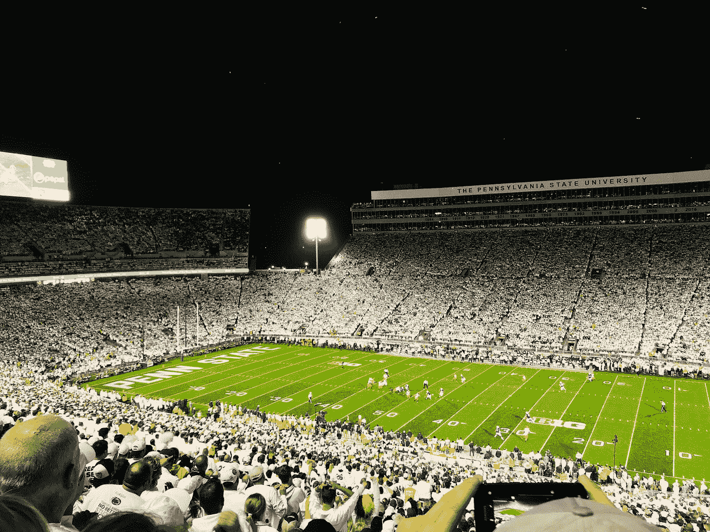

Alex Korolkoff 在 [Unsplash](https://unsplash.com?utm_source=medium&utm_medium=referral) 上拍摄的照片

让我们想象你在比弗体育场的顶层，这里是全国著名的大学橄榄球项目之一——宾夕法尼亚州立大学的所在地。你想在不手动点击计数器的情况下计算出有多少人参加了比赛— *说真的，那太多了。*

在计算机视觉不断发展的帮助下，如今在一幅图像中检测多人甚至不是一个真正的问题。事实上，有许多预先训练的模型可供公众使用，他们可以轻松地将其集成到他们的设备上，而不必训练壁虎的模型，并且仍然可以在应用程序中获得不错的性能。也就是说，利用现代技术，很容易计算出与会者的大致人数。

但是如果你的朋友让你当场就想出来，并且想在休息结束前知道，那该怎么办呢？幸运的是——但不是真的——你有一台笔记本电脑，每次使用重型 GPU 时都会死机。你能想到的唯一方法就是你在图像处理 101 课程中学到的东西。

***是否可以仅通过图像处理来估计与会人数？***

对于今天的文章，我将介绍一个**分水岭分割，**它可以分割对象而不需要**CNN**的帮助。然后，我将演示一个关于数字病理学的案例研究，通过分水岭算法突出显示单个细胞核。最后，我将以对原问题的评论作为结束— *我们是否可以仅使用图像处理来估计出席人数？*

# 分水岭分割

## 逻辑

所有灰度图像都可以被视为**地形表面**，其中高像素值表示山丘，低像素值表示山谷。如果我们开始向每个山谷注水，水位将会上升，最终，来自不同山谷的水将会汇合。为了防止合并，我们在水开始合并的地方设置了一道屏障(分水岭线)。我们继续注水，直到水到达山顶，由此产生的屏障将描绘出每个单独的物体。

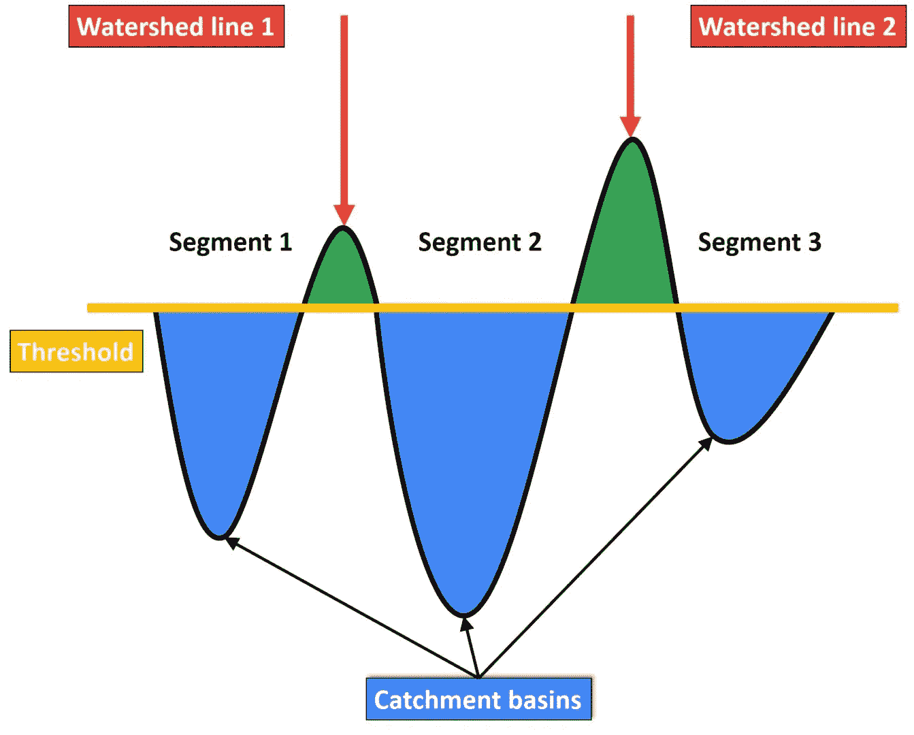

分水岭算法布局。来源:Strahinja Zivkovic[的数据黑客](http://datahacker.rs/author/zile0/)

> 当物体清楚地展开时，它们之间的像素强度有很大的差异，很容易挑出物体。然而，当对象密集聚集时，邻居之间的细微变化会使精确描绘对象变得更加困难。

## 个案研究

我将在一片数字化扫描的活检组织上演示分水岭分割的用法。**主要目标是分割出显示在补片上的每个单个细胞核。(** *附录中附有代码。)*

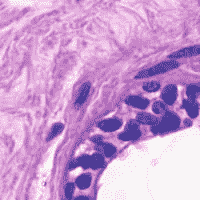

活检组织。

首先，我们要将 RGB 图像转换成二值图像，以便使用分水岭算法。我发现提取红色通道是最好的选择，因为它显示了细胞核与基质和背景的最高对比度。此外，otsu 是这里的最佳阈值选择，因为我们可以清楚地看到细胞核之间的不同强度，Otsu 将找到划分两个强度峰值的最佳阈值。

*提示:通常，我们希望对象为 1，背景为 0。有时，反转需要有正确的标签。*

形态学运算是预处理图像的常用方法。关闭用于填充对象中的小孔，打开用于消除任何噪点。在这种情况下，开口用于去除背景中的小噪声。如下图所示，噪音有效地消失了。

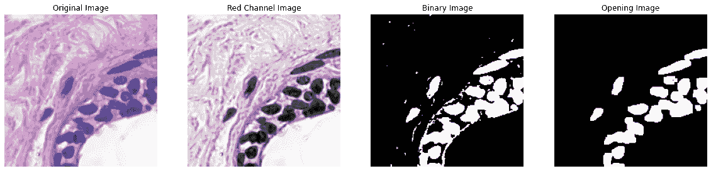

图像预处理

为了利用分水岭分割，需要三条信息: **1)确定的前景，2)确定的背景，以及 3)不确定的区域。**

**确定背景**

从 Otsu 阈值，我们有一个二值图像，其中细胞核标记为 1，背景标记为 0。然而，门槛可能是不完美的，我们需要在选择一个确定的背景时有点保守。因此，膨胀被用来覆盖更多的地面空间。这样，我们肯定剩下的背景是“背景”。

*提示:扩张时，确保找到正确的迭代次数，以防止过度扩张和丢失对象的真实形状。*

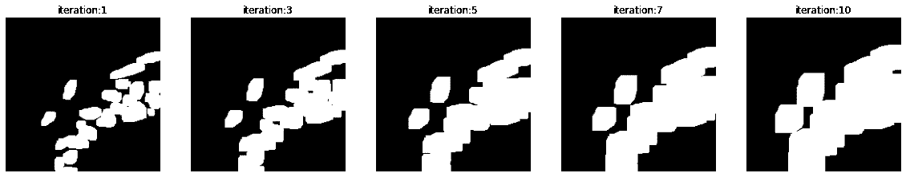

对二值图像进行多次迭代扩张。

**确定前景**

我们可以用侵蚀或距离图(推荐)找到确定的前景。侵蚀更严重，但小物体往往会被冲走，从而丢失物体的基本信息。因为这种分割的全部目的是获得每个单独的对象，所以我们需要一个更好的选项。

距离图是一种替代方法。对于那些不熟悉这个概念的人，这里有一个关于什么是距离图的简单解释。对于二进制图中的每个对象(1 ),重新分配一个值，该值等于其到最近背景(0)的最小距离

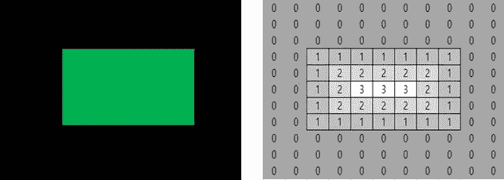

距离图示例。

距离图有助于确定目标次区域。对于这个问题，我们的次区域是核心。因此，如下所示，距离图高亮显示/子定位细胞核区域。

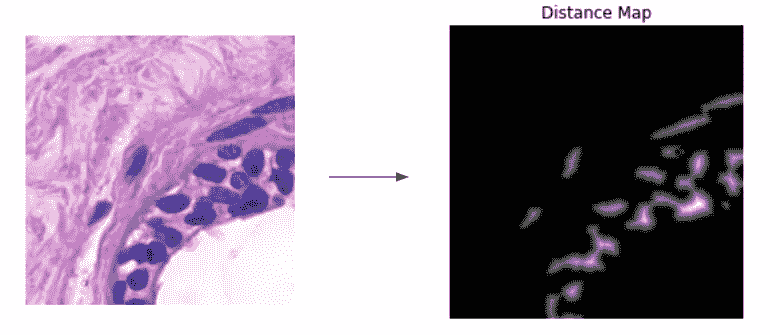

应用于图像时距离贴图的结果。

为了进一步分离物体和巩固确定的前景，我们可以过滤掉任何小于 max(dist)一半的距离转换成背景。

**不确定区域**

找到不确定的区域非常简单。你只需用前景减去背景。

在进行分水岭分割之前，我们需要以下三个关键信息。

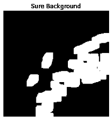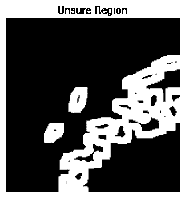

左)确定背景。中间)确定前景。右)不确定区域。

**标记**

在我们有了所有的需求之后，我们可以使用连通分量算法在确定的前景上找到每个单独的对象。该函数扫描图像，并根据像素连接性将其像素分组到组件中。同一连通分量内的所有像素共享相似的像素强度值，并且以某种方式相互连接。一旦确定了所有的组，每个像素就根据其被分配到的组件被标记上唯一的标签。

接下来，用零标记未知区域的区域。一个技巧是将确定的背景分配给除 0 之外的不同数字，因为未知值已经被标记为 0。

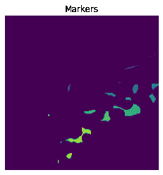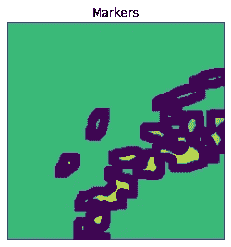

左)每个颜色标记被分配给不同的对象。右图)标记中添加了一个不确定的区域。

**结果**

最后，水彩笔可以装满水了！这是几个不同区域的水域分割结果。

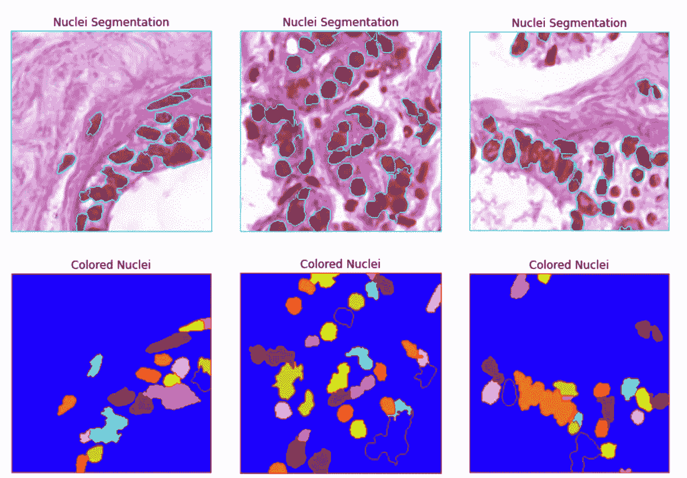

我们可以观察到细胞核的分割相当不错，考虑到只使用了图像处理。然而，分割并不完美。存在过度分割和分割不足的区域。对于大多数部分，我们可以得出结论，分割可以准确地定位细胞核，并将细胞核描绘成个体。

**限制**

水分割的缺点是它的使用范围。当 RGB 图像转换为二进制图像时，分割的结果基本上是确定的。如果物体从背景中清楚地区分出来，分割将会非常有效。然而，当对象很难被定义并且包含太多噪声时，分割将表现不佳。

换句话说，分水岭分割推荐用于简单的图像，其中包含很少的颜色变化，并且在对象和背景之间具有鲜明的对比。

# 回到问题上来

现在，我们已经看到了分水岭分割在数字病理学中的应用，让我们回到最初的问题，这个问题仍然没有答案——分水岭分割可以用来统计与会人数吗？

老实说，这种算法不够健壮，无法使用。在演示中，我强调了一个事实，即分水岭分割需要一个二值图像，该图像显示出物体与背景的明显区别。然而，在体育场内，有太多的颜色差异来构建一个清晰的物体背景图像。所以我对这些问题的回答是【还没有】。

也许，如果这场比赛是一场白色的比赛，这是一种主队穿白色的比赛，表现可能会提高。但是，我再次提出另一个条件语句，当试图在实际应用中使用它时，这通常不是正确的方向。

希望通过先进的摄像机，我们可以自动获得人群的二进制图像，并立即应用分水岭分割来估计体育场中的人数。

感谢大家阅读这篇文章。干杯！

**附录**

**参考文献**:

[1][https://github . com/bns renu/python _ for _ image _ processing _ APEER](https://github.com/bnsreenu/python_for_image_processing_APEER)

[2][http://data hacker . RS/007-opencv-projects-image-segmentation-with-watershed-algorithm/](http://datahacker.rs/007-opencv-projects-image-segmentation-with-watershed-algorithm/)

[3][https://scikit-image . org/docs/dev/auto _ examples/segmentation/plot _ watershed . html](https://scikit-image.org/docs/dev/auto_examples/segmentation/plot_watershed.html)