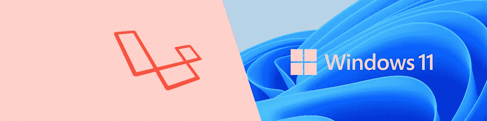

# 在 Windows 11 上安装 Laravel 8.0 的方法

> 原文：<https://medium.com/codex/ways-to-install-laravel-8-0-on-windows-11-10e26244f34b?source=collection_archive---------2----------------------->

具体来说就是 Windows 11 预览版。因此，随着最近 Windows 11 的发布，我想知道从 Web 开发人员的角度来看，一切是如何结合在一起的。

在我继续之前，巨大的免责声明。这是 10.0.22000 的预览版本，更多的东西可能会改变，直到实际的版本发布。但我认为这没关系，我真的想测试出的 WSL2，Docker，和…