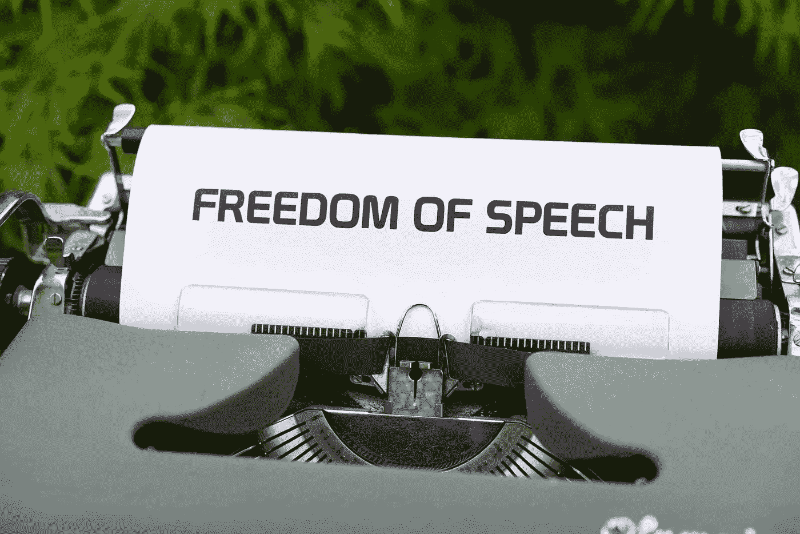

# 我们已经尝试了社交媒体上不受限制的言论自由

> 原文：<https://medium.com/codex/we-already-tried-unchecked-free-speech-on-social-media-27b0c168d66?source=collection_archive---------17----------------------->

## Twitter 已经尝试了埃隆·马斯克的提议

马库斯·温克勒在 [Unsplash](https://unsplash.com/s/photos/censorship?utm_source=unsplash&utm_medium=referral&utm_content=creditCopyText) 上的照片

你有没有想过在社交媒体上体验无节制的言论自由？什么都可以去的环境，只要不违反当地法律？听起来像一个言论自由的乌托邦。对吗？