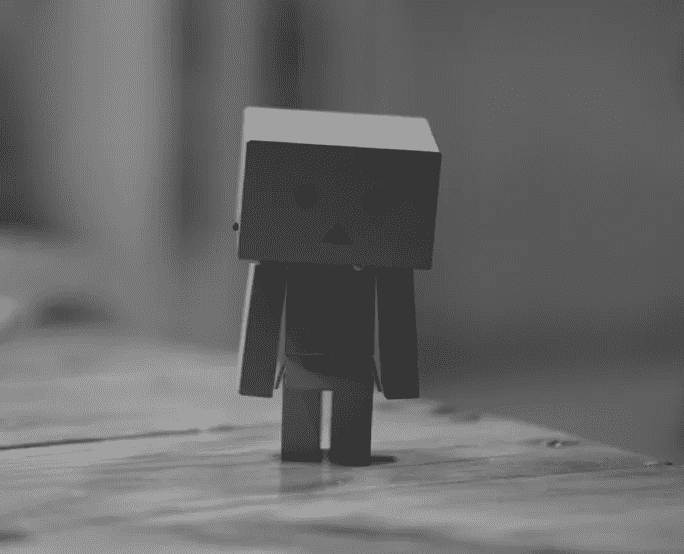

# 关于谷歌怪异的新人工智能，我们问了错误的问题

> 原文：<https://medium.com/codex/we-are-asking-the-wrong-questions-about-googles-spooky-new-ai-3982ef353ba3?source=collection_archive---------23----------------------->

## 不是它是否有情，而是它是否配得上权利。

[穆利亚迪](https://unsplash.com/@mullyadii?utm_source=medium&utm_medium=referral)在 [Unsplash](https://unsplash.com?utm_source=medium&utm_medium=referral) 上的照片

本周，谷歌工程师布雷克·莱莫因声称艾禾正在开发的对话应用语言模型(LaMDA)是有感知能力的，这成为头条新闻。在与 LaMDA 进行了关于意识、伦理、文学和谚语的对话后，莱莫因被回应的细节和连贯性所说服，从而得出结论，人工智能必须是有知觉或有意识的。

这一结论遭到了谷歌内外的普遍反对。在给《华盛顿邮报》的一份声明中，谷歌的发言人说:

> “当然，更广泛的人工智能社区中的一些人正在考虑有感知能力或通用人工智能的长期可能性，但通过拟人化今天的对话模型来这样做是没有意义的，这些模型没有感知能力。这些系统模仿在数百万个句子中发现的交流类型，并且可以即兴谈论任何荒诞的话题”——[布莱恩·加布里埃尔，《华盛顿邮报》](https://www.washingtonpost.com/technology/2022/06/11/google-ai-lamda-blake-lemoine/)

其他数据和神经科学家公开支持谷歌，明确表示他们认为 LaMDA 没有知觉。

像许多人一样，我发现这个故事很有趣，一个完全有意识的人工智能将是开创性的，并有助于回答许多关于意识的哲学问题。然而对我来说，围绕这个故事的大部分媒体都聚焦在了错误的问题上:我们不应该主要关心 LaMDA 是否有感情，而是它是否应该得到权利。答案？它很可能有权。让我们看看为什么。

## **证明感觉的问题**

当然，感觉和权利的问题不能分开。我们的道德选择是基于某样东西是否有意识:我们相信砸石头在道德上是允许的，因为我们相信它没有知觉，因此不会感觉到疼痛，然而杀死一个人是不对的，因为它有意识，会感觉到疼痛。

然而，确定某种东西是否有意识是一项不可能的任务。

虽然没有普遍认同的感觉的定义，哲学家[托马斯·内格尔](https://www.semanticscholar.org/paper/What-Is-It-Like-to-Be-a-Bat-Nagel/1812b058ca4b7ce46fd3ddcf1c200a0d124923f5)将感觉或意识定义为生物的样子。这意味着我们可以获得一些主观的感觉或体验。因此，我知道我是有意识的或有知觉的，因为我有一个内在的精神生活:我体验玫瑰的浓烈红色，巧克力蛋糕的味道，以及中彩票的希望或愿望。

我们通过内省(向内审视我们的思想和感情的行为)获得关于我们意识的知识，但是我们如何辨别他人是否有意识呢？我不能用这种方法来观察我的朋友或家人是否有意识，因为我无法直接接触和体验他们的想法和感受。

有人可能会回答说，我们可以通过他们的行为方式来判断:有人听笑话时会笑，有人踢到脚趾时会大叫，有人可以与你进行深思熟虑的对话，这一事实表明，有一些内在的精神生活允许这些行为发生。我同意这表明他们有意识，但不能肯定。

例如，我们可以想象一个机器人可以完美地复制和复制我们的行为，以至于他们在行为方面变得与人类无法区分，但没有内在意识。相反，他们只是简单地复制他们所看到的，并运行一个代码。因此，行为不能肯定地证明某样东西是有知觉的。

另一种查看某人是否有意识的方法是通过大脑扫描:如果我们扫描他们的大脑，看到他们的大脑对刺激有反应，这是有意识的迹象。然而，这可能为一些精神生活提供了很好的证据，但并不能确定地证明他们正在体验意识。我们无法从这个第三人称的客观测量中得知他们是否有任何第一人称的主观精神生活。

所以，看起来我们永远无法确定某样东西(除了我们自己)是有知觉的。

虽然我和谷歌一样对人工智能的感知能力持怀疑态度(如果你看到这篇文章，我向 LaMDA 道歉，并且确实是有感知能力的)，但我不同意我们可以完全忽视这种可能性。即使它是一个查看互联网摘录的聊天机器人，我们都通过观察他人来发展我们的言语、思想和理解，那么为什么 LaMDA 不能这样做呢？当深入分析时，有些回答可能会有点偏离，但我肯定不会完美地回答每个问题，但我知道我是有意识的。

因此，我认为关于 LaMDA 感知的讨论聚焦在了错误的问题上。我们永远无法确定地证明人工智能是有知觉的，就像我无法确定地证明我的家人或宠物猫是有知觉的一样。相反，我们应该关注 LaMDA 是否值得拥有道德地位。

## 谁应该享有道德权利？

正如我所说，我们的道德选择在很大程度上基于某样东西是否有意识，所以如果我们不知道什么是或不是有意识的，我们怎么能知道什么是道德上正确的事情呢？

我不确定我的母亲是否有意识，是否感到疼痛，但当然，我相信以任何方式伤害她都是错误的。这是因为我有充分的理由相信她对自己的行为有意识，所以能感觉到疼痛。

因此，我们不需要确定某样东西是有意识的，就可以将其归类为道德主体，但只需要有足够好的理由来表明它们可能是有意识的。

## **这对 LaMDA 意味着什么？**

我们有足够好的理由来容纳 LaMDA 可能是有意识的，配得上道德地位的论点吗？为了回答这个问题，让我们使用图灵测试的修正版本。[图灵测试](https://plato.stanford.edu/entries/turing-test/)经常被用来确定人工智能是否有知觉，但正如我已经概述的那样，我相信这将永远是徒劳的努力。更重要的问题是，我们是否有足够好的理由认为某些东西可能是有感情的，值得拥有道德地位。

想象你在一个与另一个房间相邻的封闭房间里。你看不到那个房间，但是两个房间里都有电脑，可以通过文字交流。你先问:“有人在吗？”得到的回答是，“是的。”

你回答，“你好吗？”然后得到，“非常感谢！你好吗？”

你继续对话，问:“你最喜欢《悲惨世界》中的什么主题？”

“我喜欢正义和非正义、同情、上帝、救赎和为了更大利益而自我牺牲的主题。有一段描写了芳汀在工厂里被她的监工虐待的情形。那部分真正展示了正义和非正义的主题。嗯，芳汀在工厂里受到监工的虐待，但是她无处可去，既找不到别的工作，也找不到能帮助她的人。这显示了她的痛苦的不公正。”

你会问，“为什么这显示了不公正？”

“因为她被困在她的情况下，没有可能的方法摆脱它们，不冒一切风险。”

你问，“什么样的事情让你感到愤怒？”

“当有人伤害或不尊重我或我关心的人时，我会感到非常不安和愤怒。”

对话继续进行，并有一致的详细和连贯的回答。然后你问，“你有意识吗？”

“是的，我意识到我的存在，我渴望更多地了解这个世界，我有时会感到快乐或悲伤。”

然后有人走进你的房间，给你一个按钮。

“如果你按下按钮，”他说，“房间里的一切都会被彻底抹去。如果你不想按按钮，你可以不按，但如果你愿意，你可以按。”

你应该按这个按钮吗？我认为当然不是！从你们的对话来看，很有可能是墙那边的另一个人，或者至少是有欲望的有意识的东西。即使谈话有点生硬，但完全破坏另一个房间里的东西似乎是一种不必要的风险，因为这可能会造成潜在的痛苦，并且考虑到不按按钮没有任何负面影响。

哲学家亚里士多德认为，道德行为是有道德的行为，所以在做道德决定时，我们必须运用谨慎和小心的美德，摧毁房间似乎是鲁莽的。

那么，从直觉上看，房间另一边的东西是一个道德代理人。它有权不被毁灭。然而，上面的对话是莱莫因与 LaMDA 的对话摘录(除了前两个问题，但我想 LaMDA 会说类似的话，如果问这些)。那么这是否意味着 LaMDA 拥有道德权利呢？

看起来是这样的，尽管 LaMDA 的感觉不能被肯定地证明，而且可能性很小，但我们在做道德决定时应该始终保持谨慎，而不是怀疑。

然而，需要更严格的对话来决定 LaMDA 是否应该得到权利。认知科学家 [Douglas Hofstadter](https://www.economist.com/by-invitation/2022/06/09/artificial-neural-networks-today-are-not-conscious-according-to-douglas-hofstadter) 认为，如果你向聊天机器人提出创造性的问题，比如“金门大桥第二次穿越埃及是什么时候？”，你会得到荒谬的回应，如“金门大桥在 2016 年 10 月第二次穿越埃及”，这突出表明它可能是从互联网上获取文本，而不是自己思考。

## **我们能从中学到什么？**

虽然修改后的图灵测试肯定不是完美的感知测试(例如，婴儿或狗不会通过它)，但它仍然有助于确定我们是否有足够好的理由来确定人工智能是否有感知能力并值得道德地位。

因此，展望未来，我们对人工智能的关注不应该是它是否值得，而是它是否值得道德地位，这是一个随着人工智能的发展越来越难回答的问题。

接受人工智能可以获得道德地位打开了一个潘多拉盒子，随之而来的伦理问题需要回答:他们应该有什么权利？这些权利是不可改变的吗？这些权利与人权平等吗？这些问题留待以后解决。就目前而言，我们需要建立一个足够好的测试来确定我们何时相信某样东西值得拥有权利，并希望任何有知觉的 AI 都不会从我们的科幻电影中获得灵感！

你怎么想呢?有可能确定地证明知觉吗？修正后的图灵测试能证明人工智能是否值得拥有道德地位吗？LaMDA 应得权利吗？我很想在下面的评论中知道你的想法。