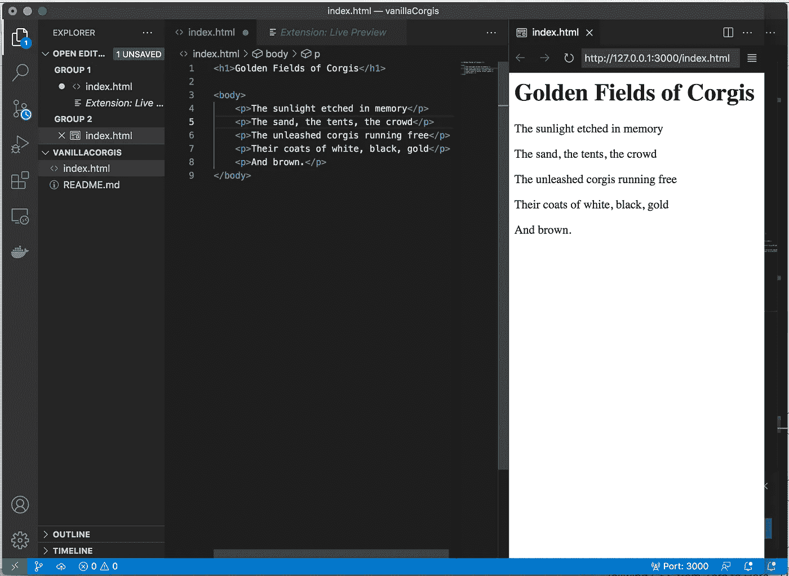
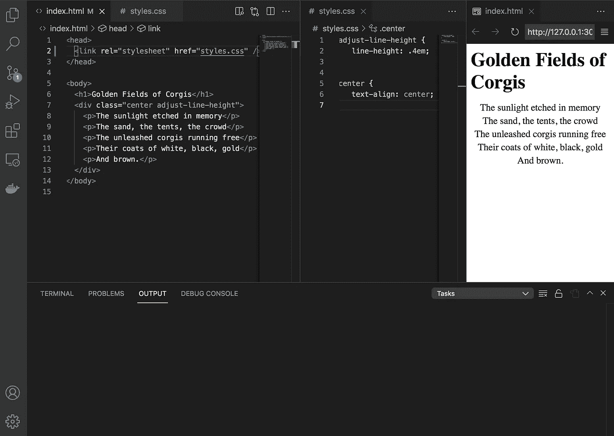
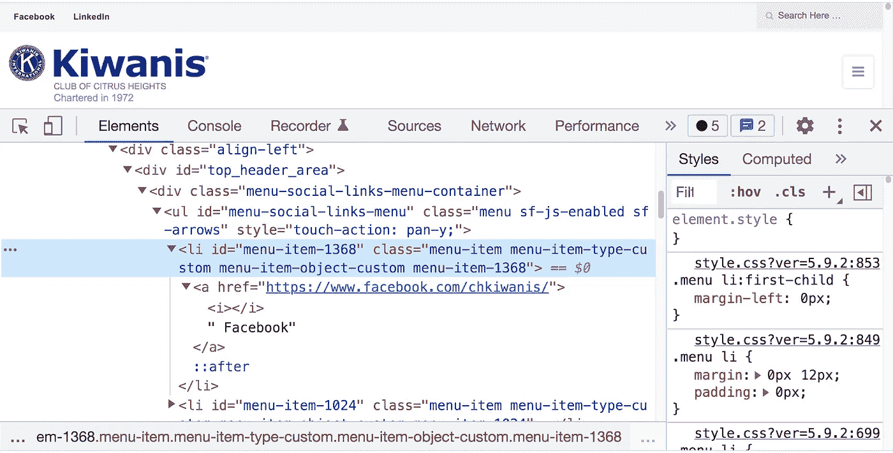

# 我们需要 HTML

> 原文：<https://medium.com/codex/we-need-html-20acbf081b73?source=collection_archive---------17----------------------->

## "如果软件工程是有需求的，为什么集中一个这么难？"

由[潘卡杰·帕特尔](https://unsplash.com/@pankajpatel?utm_source=unsplash&utm_medium=referral&utm_content=creditCopyText)在 [Unsplash](https://unsplash.com/s/photos/html?utm_source=unsplash&utm_medium=referral&utm_content=creditCopyText) 拍摄的照片。哦，哇，HTML 标签。哦，哇，我们太合法了

我在 FreeCodeCamp meetup 上遇到的一个人( [Javier Alvarado](https://medium.com/u/4a318ec93034?source=post_page-----20acbf081b73--------------------------------) )创建了一个名为 [SimpleDev](https://simpledev.io/) 的付费教程网站——我没有查看过 HTML 部分，但他就此做了一个简短的演讲。我了解到的一件事是 VSCode 中的 Live Preview 扩展；我不能让它在 Vue.js 上工作，但它对你典型的 index.html 工作得很好。

每个程序员似乎都喜欢嘲笑 HTML，以至于 Reddit 上的一个[漫画用 HTML“编码者”作为笑点，这个笑话如此具体，我想他们可能是在引用一个模糊的 HTTP 状态代码，而不是简单地取笑那些说自己“用 HTML 编码”的人。HTML 在技术上不是编程语言，但它仍然是完全必要的。我觉得我们跳过了一些步骤。首先，我们正在学习如何使用 npm。然后，我们学习如何使用 Vuetify。接下来我们知道的是，在真正学习 HTML 的基础知识之前，我们一直在处理像 Vuex 和 promises 这样的事情。](https://www.reddit.com/r/ProgrammerHumor/comments/eg4oht/this_is_a_flower_pot/)

上周我写了关于承诺、异步/等待和 REST APIs 的文章。也许我应该从 HTML 开始。我仍然想开始一个专门关于 Splunk 的系列，所以请继续关注(希望从今天起两周后)，但在前端世界中有很多内容要介绍。

# 从头开始

*最初，蒂姆·伯纳斯·李创建了协议和标记语言……*

在这篇文章的底部，我将向你展示这个视频的精彩模仿

在这里，[我发现了一个相当不错的](/free-code-camp/learn-html-in-5-minutes-ccd378d2ab72) FreeCodeCamp Medium 帖子，名为“5 分钟学会 HTML”他们认为 HTML 是骨架，CSS 是皮肤，JavaScript 是大脑。 [CORGICorporation](https://evansoohoo.github.io/CorgiCorporationCorner/) 无脑。

如果这是一个编程语言教程，我们可能会打开 repl.it，从“hello world”开始，然后讨论函数。从那里我们可以进入类，如果语言使用它们的话，然后是数据结构之类的东西…如果语言使用它们的话。在我看来，HTML 从根本上是不同的，因为主题并不以相同的方式构建。相反，它有大量的标签，这些标签通常是不相关的，做着不同的事情，就像《哈利·波特》中人物记忆的咒语一样。

等等，什么？

*   h1:标题标签。有六个，h1 是最大的。在 HTML 中，使用开始标签和结束标签
*   p:段落标签
*   头部:头部标签
*   正文:正文标签

我知道，那很有帮助。很高兴我能为您服务([一个更好、更全面的资源](https://www.w3schools.com/html/))。

我在 GitHub 上扔了些新东西。这个项目被称为“[香草科尔吉斯](https://github.com/EvanSooHoo/VanillaCorgis)”，但那里真的没有很多。这个文件叫做 index.html。这个文件使用 h1 作为它的标题，它使用 p 作为每个单独的段落，它的特点是不可思议的诗歌，这应该会让我赢得普利策奖。

诗人会赢吗？

是的，差不多就是这样。我们可以很容易地将它保存到 Github 页面上，因为不需要定制后端，格式也很完美。

等等……不，不是的。

首先，我真的不喜欢这个间距。[这家伙上媒帮忙](/swlh/how-to-add-or-reduce-space-between-lines-of-text-using-just-html-and-css-bdd22708f971)。第二，我很想把< div >居中。至少我是这么认为的。实际上，这显然不是常见的“如何使 div 居中”问题。这是一个“如何使文本在 div 中居中”的问题。

这需要一点 CSS。每个

标签现在都被包装在一个

中，这是一个用于分隔组件的标签。前面提到的在 CSS 文件中使用了 center 和 adjust-line-height 来减少每个段落之间的空间，并对诗歌内容本身进行文本对齐。

太好了。太神奇了。这太无聊了。

# 从这里继续前进

来源:[https://k07015.site.kiwanis.org](https://k07015.site.kiwanis.org)

回到现实世界。继续通读 HTML 的 [Codecademy](https://www.codecademy.com/learn/learn-html) 并添加到 VanillaCorgi 将非常有益，但我认为回到现有项目可能更有益。 [CorgiPomodoro](https://evansoohoo.github.io/CorgiPomodoro/) 只是普通的 JavaScript，但是根据我今天获得的一点点知识，我现在知道它使用< center >标签是不好的做法，因为 center 已经过时了。我认为改进这个网站的最好方法就是从头开始重做所有的 HTML/CSS。JavaScript 可能保持不变。

如果你最近访问了 Citrus Heights Kiwanis 的网站，你会注意到脸书集成停止工作，所以右侧只是一个空提要。如果你认为这是一个问题，闭嘴。这个网站是完美的，不可能再改进了，脸书问题可能与我的奇怪习惯有关，也可能与我的奇怪习惯无关，我试图禁用脸书，然后放弃，再回来检查……没关系。

说到网站的改进，左上角的东西应该是字体很棒的图标。怎么回事？如果你检查元素，你会注意到 fa 根本没有出现。我们现在理解了类，因为我们理解了 CSS。通过这一点点“编码”，我们现在对真正的网站是如何工作的有了更好的了解！

# 结束语