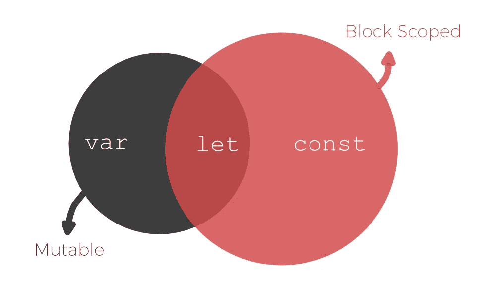

# 我们不再需要生命？让我们去救援吧！

> 原文：<https://medium.com/codex/we-no-longer-need-iife-let-const-to-the-rescue-d08a5f37a1af?source=collection_archive---------1----------------------->

最初，当我听说 LET 和 CONST 被添加到 JavaScript 中时，我对它们的用途持怀疑态度。总的来说，作为一个从 ASM 开始，第一个高级语言是 Pascal，并花了十年时间在 ADA 上工作的人，超越函数级的作用域隔离的想法让我觉得荒谬而没有意义…