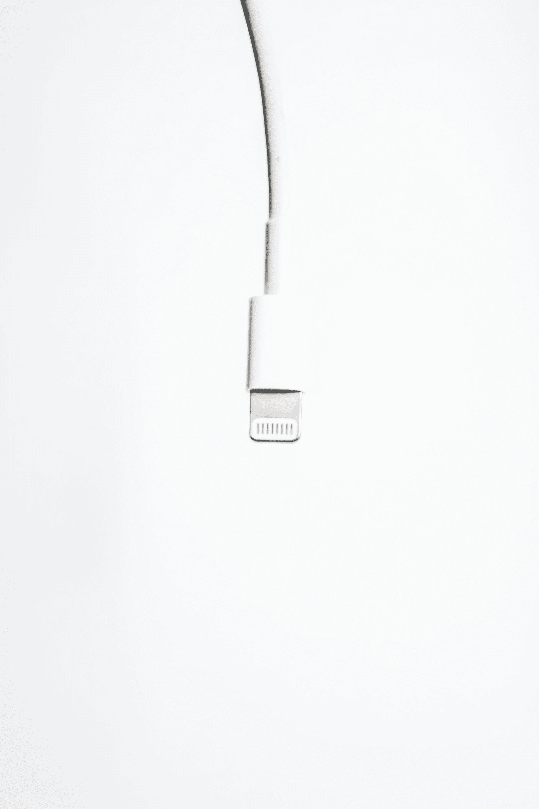

# 我们现在应该在 iPhone 上有 USB-C 了

> 原文：<https://medium.com/codex/we-should-have-usb-c-on-the-iphone-by-now-38f9b3c914df?source=collection_archive---------5----------------------->

## 怎么回事，苹果？

亚当·伯基特在 [Unsplash](https://unsplash.com?utm_source=medium&utm_medium=referral) 上拍摄的照片

尽管我很兴奋在未来几周内将我的 iPhone 13 Pro Max 换成 iPhone 14 Pro Max，但我仍然对今年的产品有一个主要的把握:它仍然是使用 Lightning 的*。*

苹果。哟。为什么我们的 iPhone 上还是没有 USB-C？是什么让你没有做出改变？