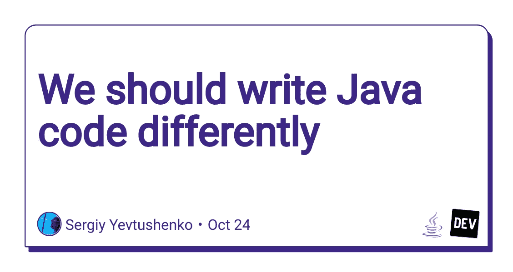

# 我们应该用不同的方式编写 Java 代码

> 原文：<https://medium.com/codex/we-should-write-java-code-differently-c32212152af1?source=collection_archive---------2----------------------->



在过去的几年里，我写了一些文章，描述了一种新的、[更具功能性的方式来编写 Java 代码](/codex/introduction-to-pragmatic-functional-java-md-fba6bdaae6a8)。但是为什么我们应该使用这种新的编码风格的问题在很大程度上仍然没有答案。本文试图填补这一空白。

就像任何其他语言一样，Java 会随着时间的推移而发展。Java 代码的编写风格也是如此。围绕 Y2K 编写的代码与 2004-2006 年之后编写的代码有很大不同，当时发布了 Java5 和 Java6。泛型和注释现在如此普遍，以至于很难想象没有它们的 Java 代码。

然后是带有 lambdas、`Stream<T>`和`Optional<T>`的 Java8。这些功能元素应该会彻底改变 Java 代码，但大部分情况下它们并没有。从某种意义上来说，它们确实影响了我们编写 Java 代码的方式，但是并没有发生革命。相当缓慢的进化。为什么？让我们试着找到答案。

我认为有两个主要原因。

第一个原因是，即使是 Java 作者也不确定新的功能元素如何适应现有的 Java 生态系统。要了解这种不确定性，只需阅读`Optional<T>` JavaDoc:

> *API 注意:Optional 主要用于明确需要表示“无结果”的方法返回类型，并且使用 null 可能会导致错误。*

API 也显示了同样的情况:出现的`get()`方法(可能会抛出 NPE)和几个`orElseThrow()`方法是对传统的命令式 Java 编码风格的尊重。

第二个原因是现有的 Java 代码，尤其是库和框架，与函数式方法不兼容，业务异常是惯用的 Java 代码。

快进到现在:Java 17 几周前发布，Java 11 很快被广泛采用，取代了几年前无处不在的 Java 8。然而，我们的代码看起来几乎和 7 年前 Java 8 发布时一样。

也许值得退一步回答另一个重要的问题:*我们需要改变我们编写 Java 代码的方式吗？*很长一段时间以来，它为我们提供了足够好的服务，我们有技能、指南、最佳实践和大量的书籍来教我们如何以这种风格编写代码。我们真的需要改变吗？

我相信这个问题的答案可以来源于另一个问题的答案:*我们需要提高开发绩效吗？*

我打赌我们有。商业推动开发者更快地交付应用。理想情况下，我们正在进行的项目应该在企业意识到实际需要实现什么之前就被编写、测试和部署。当然是开玩笑，但交货日期“昨天”是许多商务人士的梦想。

因此，我们必须提高开发绩效。每一个框架、IDE、方法论、设计方法等等。等。，关注于提高软件(当然，有必要的质量标准)实现和部署的速度。尽管如此，尽管有这些，发展业绩并没有明显的突破。

当然，有许多因素决定了软件交付的速度。本文只关注开发性能。

从我的角度来看，大多数提高开发性能的尝试都假设编写更少的代码(一般来说更少的代码)自动意味着更好的性能。Spring、Lombok、Feign 等流行的库和框架都试图减少代码量。即使是 Kotlin，也是痴迷于简洁而不是 Java 的“冗长”。历史确实多次证明了这个假设是错误的(Perl 和 APL，也许是最著名的例子)，然而它仍然活着，并推动着大多数的努力。

任何开发人员都知道编写代码只是开发活动的一小部分。大部分时间我们都在*读代码*。读的代码少是不是更有生产力？第一个意图是说*是的*，但是实际上，代码的数量和它的可读性几乎没有关系。阅读和编写相同的代码通常会有不同的“阻抗”,其表现形式为精神开销。

“阻抗”差异的最好例子可能是正则表达式。正则表达式非常紧凑，在大多数情况下非常容易编写，尤其是使用无数专用工具时。但是阅读正则表达式通常是一件痛苦的事情，而且会耗费更多的时间。为什么？原因是**失去了脉络**。当我们编写正则表达式时，我们知道上下文:我们想要匹配什么，应该考虑哪些情况，可能的输入看起来如何，等等。表达式本身是这种上下文的压缩表示。但是当我们阅读它们的时候，上下文就丢失了，或者准确地说，使用非常紧凑的语法来压缩和打包。并且试图从正则表达式中“解压缩”它是一项相当耗时的任务。在某些情况下，从头开始重写比试图理解现有代码花费的时间要少得多。

上面的例子给出了一个重要的提示:减少代码量只有在上下文保持不变的情况下才有意义。一旦减少代码导致上下文丢失，它就开始适得其反并损害开发性能。

那么，如果代码大小不是那么重要，那么我们如何真正提高生产率呢？

显然，通过保存和/或恢复丢失的上下文。但是什么时候，为什么，语境正在消失？

# 上下文食用者

上下文食用者是导致上下文丢失的编码实践或方法。惯用的 Java 代码有几个这样的上下文食用者。流行的框架经常添加它们的上下文食用者。让我们来看看两个最普遍的上下文食用者。

# 可空变量

是的，你没看错。可空变量隐藏了部分上下文—变量值可能丢失的情况。请看这个代码示例:

```
String value = service.method(parameter);
```

仅仅看这段代码，你无法判断`value`是否可以为 null。换句话说，部分上下文丢失了。要恢复它，需要看一看`service.method()`的代码并分析它。导航到那个方法，读取它的代码，返回——所有这些都是对当前任务的干扰。不断地需要记住一个变量可能是`null`，这导致了精神上的开销。有经验的开发人员善于将这些事情记在心里，但这并不意味着这种精神开销不会影响他们的开发绩效。

我们总结一下:

> *可空变量是上下文食用者、开发性能杀手和运行时错误的来源。*

# 例外

惯用的 Java 使用业务异常进行错误传播和处理。有两种类型的例外-已检查和未检查。使用检查异常，[通常不被鼓励，并且经常被认为是反模式](https://phauer.com/2015/checked-exceptions-are-evil/)，因为它们会导致深度代码耦合。尽管引入受控异常的最初意图是保护上下文。编译器甚至帮助保存它。然而，随着时间的推移，我们已经切换到未检查的异常。未检查的异常是为*技术*错误设计的——访问空变量，试图访问数组边界之外的值，等等。

想一想:我们使用*技术*未检查异常进行*业务*错误处理和传播。

在设计语言特性的区域之外使用该语言特性，会导致上下文的丢失和类似于可空变量的问题。甚至原因都是一样的——未检查的异常需要导航和读取代码(通常在调用链的深处)。它们还需要在当前任务和错误处理之间来回切换。就像可空变量一样，如果处理不当，异常可能会导致运行时错误。

总结:

> *业务异常是上下文食用者、开发性能杀手和 bug 来源。*

# 作为上下文食用者的框架

由于框架通常特定于一个特定的项目，因此由它们引起的问题也是特定于项目的。然而，如果你有上下文丢失/保留的想法，你可能会注意到流行的框架，如 Spring 和其他框架，它们使用类路径扫描、“约定优于配置”习语和其他“魔法”，有意删除大部分上下文，并用默认设置的隐含知识(即心理开销)来替换它。使用这种方法，应用程序被分成一组松散相关的类。如果没有 IDE 的支持，在组件之间导航甚至都很困难，所以它们是断开的。除了丢失大部分上下文之外，还有另一个严重的问题，它对生产率有负面影响:大量的错误从编译时转移到运行时。后果是毁灭性的:

*   更多的测试是必要的。著名的`contextLoads()`试验就是这个问题的明显标志
*   软件支持和维护需要更多的时间和精力

因此，通过减少几行代码的输入，我们会遇到很多令人头痛的问题，并降低开发性能。这就是*真实价格*的“魔力”

# 实用函数式 Java 方式

实用函数式 Java 就是解决上述问题的一种尝试。虽然最初的意图只是通过将[特殊状态](https://dev.to/siy/leveraging-java-type-system-to-represent-special-states-688)编码成变量类型来保存上下文，但实际使用表明了所采用方法的许多其他好处:

*   显著减少导航
*   许多错误从运行时转移到编译时，从而提高了可靠性，减少了必要的测试次数
*   删除了样板文件甚至类型声明的重要部分——更少的输入，更少的代码需要阅读，业务逻辑不再充斥着技术细节
*   明智地减少精神负担，需要记住与当前任务无关的技术问题

*原载于 2021 年 10 月 24 日*[*https://dev . to*](https://dev.to/siy/we-should-write-java-code-differently-210b)*。*