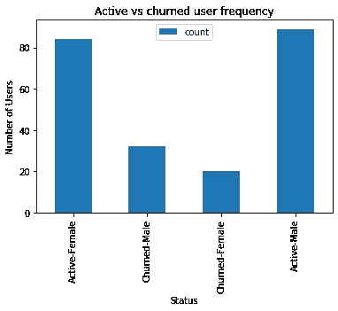
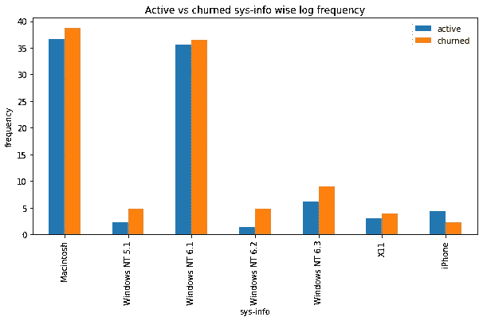

# 我们会让你坚持下去！利用 Pyspark 进行客户流失预测

> 原文：<https://medium.com/codex/we-will-make-you-stick-customer-churn-prediction-with-pyspark-677fd17cf915?source=collection_archive---------24----------------------->

图片来自 zeta tech [博客](https://blog.zeta.tech/banking/post/big-data-customer-experience-in-banking)

# 介绍

流失预测检测哪些客户可能会放弃或取消服务订阅。获得新客户通常比留住现有客户成本更高。因此，流失预测已被证明有利于许多企业。一旦你确定了那些有取消风险的客户，公司或服务提供商就可以为每个客户制定营销策略，以最大限度地增加客户的保留机会。

用户表现出不同的行为和偏好，每个人在搅动之前表现出不同的迹象。因此，主动沟通并跟踪他们的活动以将他们保留在您的客户名单中至关重要。从他们的行为中，如果我们已经知道他们将要改变，就可以在最佳时机安排适当的营销活动来吸引他们并使他们坚持下去！

# 为什么重要？

客户流失是许多行业的企业普遍面临的问题。如果你想作为一家公司成长，你必须投资获取新客户。每次客户离开，都意味着重大的投资损失。需要花费时间和精力来替换它们。预测客户何时可能离开，并向他们提供留下来的激励措施，可以为企业节省大量资金。

因此，了解是什么让客户保持参与是非常有价值的知识。它可以帮助您制定保留策略，并推出运营实践，以防止客户离开。

对任何订阅业务来说，预测客户流失都是一项不可或缺的资产，甚至客户流失的微小波动都会显著影响您的基线。我们需要知道:“这个客户会在 X 个月内离开我们吗？”是还是不是？这是一个二元分类任务。

 [## 什么是客户流失预测，为什么它很重要？

### 流失预测是指检测哪些客户可能会离开某项服务或取消某项服务的订阅…

www.avaus.com](https://www.avaus.com/blog/predicting-customer-churn/) 

# 项目概述

该项目涉及名为 spark ify(Spotify 的代理)的伪音乐流媒体应用程序的客户流失预测。我们有一个巨大的 12GB 的用户日志数据集，我们需要预测哪个客户会流失。我们已经使用 Pyspark 来处理这样的大数据。

Pyspark 图片来自这个 [linkedin 博客](https://www.linkedin.com/pulse/introduction-pyspark-what-isit-leonardo-anello)

# 内容:

*   数据集概述
*   探索数据集
*   特征工程
*   建模
*   超参数调谐
*   结论
*   丰富

# 数据集概述

*Sparkify 是 Udacity 发明的山寨音乐流媒体服务。在这里，用户可以免费听音乐(歌曲之间有广告)或支付固定费用。用户可以升级、降级或取消服务。这个项目的主要任务是在取消订阅之前预测哪些用户会离开给他提供折扣。*

数据集的架构如下:

所有的变更、特征工程和分析都将在这些列上完成。

# 探索数据集

似乎没有 nan 或丢失的值，所以现在，似乎没有行需要被消除，并且可以用于流失预测。但是，即使没有 nan 值，重要列也可能没有值或值为空，这可能会使整行不可用于流失预测。

我们可以从空值的角度看到不同列的模式。列“艺术家”、“长度”和“歌曲”有 20.38%的空值。看起来这些列给出了特定用户所听的艺术家、歌曲长度和歌曲的信息，但是它们帮助预测用户是否会流失的可能性较小。然而，列'名字'，'性别'，'姓氏'，'位置'，'注册'和'用户代理'有 2.91%空值。而这些列似乎并没有误为空。这些是用户的日志，这些用户要么没有帐户，要么已经在 sparkify 上注销，正在使用该应用程序的免费版本。在上面的两个场景中，我们都没有充分的理由消除这些列，所以我们将保留它们，直到我们有充分的理由。

**我们检查了每一列中的空值，我们发现只有 userId 有空值，没有 userId，我们无法识别用户，所以在数据框中保留这些行没有意义，所以我们将删除它。**

在查看了*的取消确认*页面后，我们标记出了那些产生争议的用户。下面是根据性别和会员级别显示活跃用户和不活跃用户分布的条形图。

我们可以观察到，在所有情况下，搅动的用户都比活跃用户少得多，除了最后一种情况，即活跃付费用户比搅动的免费用户少。

现在，让我们根据访问的页面、位置和用户平均使用的操作系统来看一下搅动用户和活跃用户的分布情况。

可以观察到，与活跃用户相比，搅动用户的滚动广告页面特别高。总的来说，活跃用户比不活跃用户更喜欢歌曲。活跃用户比不活跃的用户倾向于添加更多的朋友。

可以观察到，与活跃用户相比，像纽约州、肯塔基州、华盛顿州、密西西比州、俄亥俄州、宾夕法尼亚州这样的位置具有更高百分比的搅动用户。

与活跃用户相比，Macintosh 和 Windows NT 6.1 的不稳定用户比例更高。

接下来，根据时间戳，查看活跃用户与不活跃用户的分布。在这种情况下，所有的观察结果都可以很容易地从图表中推断出来。

# 特征工程

有两种方法可以格式化训练数据。

*   首先，像往常一样，将分类数据转换为虚拟变量，标准化其他数字特征，并将整个数据集输入到机器学习模型中。
*   其次，我们可以使用 userId 列对所有行进行分组，并计算巧妙的特性，这将有助于模型做出更好的决策。可以为每个用户计算的一些特征是:每个用户每次会话的歌曲长度、ThumbsUp、ThumbsDown、InviteFriends、降级、每次会话的歌曲、用户喜欢的艺术家、会话的持续时间、每个用户的计数、用户的订阅年龄、作为免费/付费用户的天数。

# 建模

我将使用两种方法来训练模型:

*   首先，使用每个用户的日志事件，而不需要太多的功能工程。
*   第二，使用我们在上一节中准备的数据集，其中我们根据用户对数据进行分组并压缩日志，最终每个用户 Id 对应一行。

用于数据建模的一些重要函数如下:

首先，我们用默认参数训练模型。用于数据建模的模型如下:

*   逻辑回归
*   梯度推进模型
*   随机森林分类器

# 超参数调谐

为了确保模型不在幸运的分裂上训练或测试，并增加模型的可推广性，我们进行了三重交叉验证。这一次，我们没有对默认参数进行训练，而是对上面提到的每个模型进行了网格搜索。

下面给出了初始化参数和执行交叉验证的代码片段:

# 韵律学

用于评估模型性能的指标如下:

*   准确(性)
*   F-1 分数
*   精确
*   回忆
*   假阳性率
*   真实阳性率

选择这么多指标的原因是因为数据集是倾斜的，准确性只能告诉我们有多少预测与标签相匹配。它没有给出任何关于假阳性和真阴性的概念，这可以容易地通过精确度和召回率来检测。

# 结果

对于没有太多特征工程的完整数据集:

*   逻辑回归:

*   梯度推进模型:

*   随机森林分类器:

对于缩减要素工程数据集:

*   逻辑回归:

*   梯度推进模型:

*   随机森林分类器:

# 结论

在这个项目中，我们与 Pyspark 合作来理解、分析和建模比单台机器上可用内存大得多的数据。我只处理数据的子集，可以在本地模式下工作。但是 Pyspark 的所有概念都得到了正确的实现和使用，就像在独立模式或 YARN 模式下一样。

在对这两种类型的数据建模之后，可以观察到适当的特征工程可以为我们节省大量的空间、时间和计算能力。与此同时，根据适当的特征工程数据训练的模型比完整的数据集工作得更好。这表明数据量可能很重要，但要素的质量更有价值。

# 丰富

如上所述，模型是在具有更好设计的特征的缩减数据集上训练的。我们可以进一步提取更多的质量特征，如量化搅动和活跃用户在搅动前后的活动差异。除此之外，我们可以使用加权结果级融合来给出更一般化的结果。

要知道确切的步骤和代码，去 [Github 链接](https://github.com/rohit18115/sparkify-churn-prediction)。该代码有很好的文档记录，并且有一些可能难以理解的部分的外部链接。

如果这篇文章对你有所帮助，请毫不犹豫地慷慨鼓掌！在 Github 上给我一些星星！:)