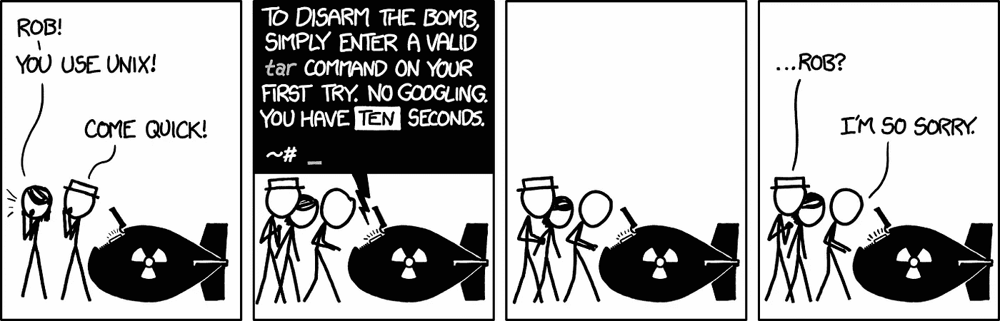
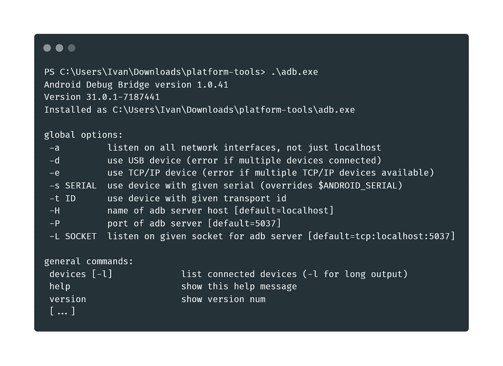
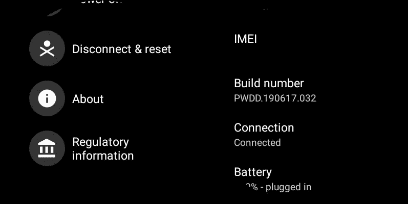
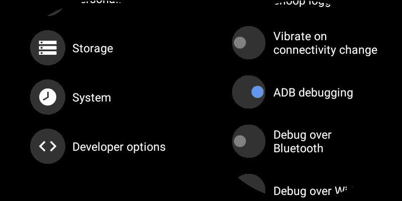
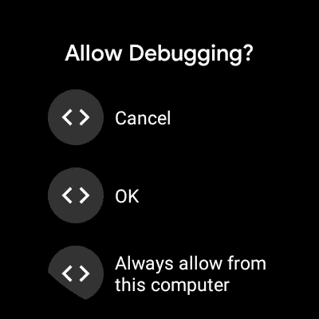
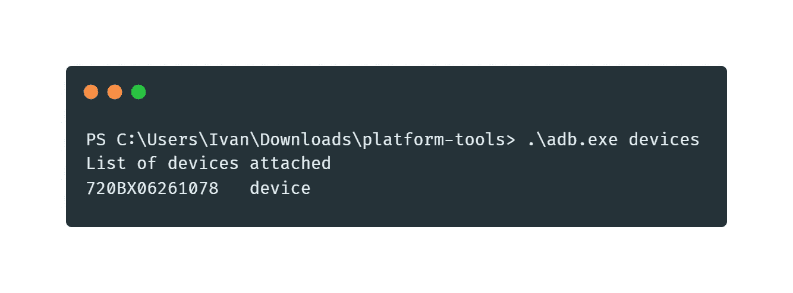
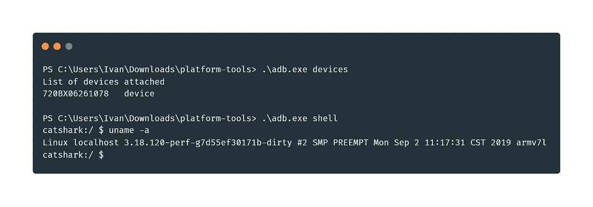
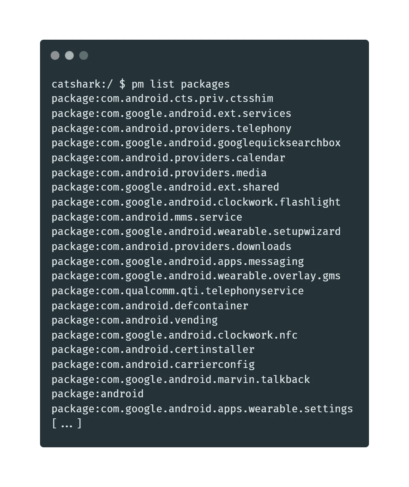

# 穿戴操作系统:移除膨胀器

> 原文：<https://medium.com/codex/wear-os-removing-the-bloatware-866ec687d660?source=collection_archive---------2----------------------->

# 摘要

本文将指导您删除可能由第三方制造商安装在 Wear OS 设备上的膨胀软件应用程序。使用 ADB、开发人员选项和 ADB 调试，人们可以使用 pm 命令简单地删除这些软件包，尽管所述应用程序在 GUI 中没有提供简单的卸载按钮。

# 介绍

如果你曾经从第三方制造商那里购买过笔记本电脑、台式机，或者在这种情况下，Android 智能手表，你可能会看到这些设备上安装了无用的应用程序。惠普 WontPrint，戴尔 WishfulConnect，宏基 GeniusBoot 等。我刚刚想到了这些名字，但希望你能明白。这些应用程序都被称为“膨胀软件”。他们只会占用系统资源，并恳求你注册<companyname>的账户。不幸的是，我的新智能手表——mob voi 的[TIC watch Pro 4G/LTE](https://www.mobvoi.com/us/pages/ticwatchpro4g)running Wear OS 也有同样的问题。</companyname>

💡虽然数量很少，但一些膨胀软件应用可能是有用的。在 Mobvoi 的例子中，TicSleep 允许睡眠跟踪，因为该公司选择退出原生的 Google Fit 集成。

尽管从笔记本电脑或台式电脑上删除上述应用程序很容易，但 Wear OS 的情况略有不同:GUI 中没有提供卸载选项。这篇文章将向你展示一个围绕微小细节的很酷的技巧。

# 初始设置

本文假设对命令行有一些基本的了解，以及在您的 Wear OS 设备中有一些高级设置。如果你遇到任何问题，请随意发表评论，我会尽我所能回复大家。

从[这个](https://developer.android.com/studio/releases/platform-tools)链接下载 Android SDK 平台工具。无论您运行的是 Windows、macOS 还是 Linux，所有命令都可以互换，只有一些语法上的小例外。这些平台工具由开发人员用来与他们的移动设备交互的有用实用程序组成。

下载完成后，您必须解压缩 ZIP 存档。在 Windows 上你可以使用 Explorer，在 macOS 上可以使用 Archive 工具，在 Linux 上…你需要重新编译内核(或者双击)。

tar 是 Linux 中用于归档的 CLI 工具。信用 XKCD:[https://xkcd.com/1168/](https://xkcd.com/1168/)

解压缩完成后，您将会看到一个名为 **platform-tools** 的文件夹，旁边是您之前下载的 ZIP 存档。通过使用您选择的终端应用程序导航到它，并通过键入 **adb** 检查 ADB 是否正确运行(在 Windows 上是**)。\adb.exe** )。您应该会看到一大段文字出现。一切就绪！

ADB 在机器上正确运行。

# 准备手表

为了从命令行访问手表，您必须启用 ADB 调试。ADB 代表 Android Debug Bridge，它用于在 Android 设备上做各种有趣的事情。

为此，进入手表的设置，向下滚动直到找到“系统”部分。在里面，进入“关于”部分。点击它，向下滚动，直到你看到“内部版本号”部分。继续按下该条目，直到出现“您现在是开发人员”的通知。

设置>系统>关于>点击内部版本号

回到“设置”部分，现在应该可以看到一个名为“开发者选项”的新条目。进入该页面，并切换“ADB 调试”。在弹出的对话框中确认您的选择。

设置>开发者选项> ADB 调试

# 查看安装了什么

如果你回到你的终端窗口并运行 **adb devices** ，你应该会看到一个对话框在你的手表上弹出，要求调试授权；按确定。

穿 OS 要求调试授权

您的终端窗口现在应该看起来像这样:

如果您看到未经授权，请在按下手表上的 OK 后再次运行该命令。

现在有趣的部分来了:运行 **adb shell** 实际上会打开一个控制台直接进入你的 Wear OS 设备。您会注意到序言(在终端中键入内容之前的文本)发生了变化。为了进一步证明这一点，如果你运行 **uname -a** ，你会看到它是一个运行在 ARM 芯片上的 Linux 系统:

从 Wear OS 设备获取系统名称信息。

要查看手表上安装的所有东西，运行 **pm list packages** 。下面是输出的摘录:

我的 Wear 操作系统设备上已安装的软件包

关于 **pm** (软件包管理器)命令的酷之处在于，它允许你卸载任何你想要的软件包，完整的文档可以在[这里](https://developer.android.com/studio/command-line/adb#pm)找到。然而，简单地运行 **pm 卸载 packageName** 是不行的。您必须指定运行该命令的用户(如果没有指定用户，将使用您当前的用户，该用户没有权限删除某些包)。

要解决这个问题，运行**pm uninstall—user 0 package name**(在 user 之前的两个破折号)来删除一个软件包。用户 0 是根用户，基本上是系统管理员。

谷歌搜索特定的软件包名称可能有助于确定哪些要保留，哪些要删除。所有以 **com.google** 或者 **com.android** 开头的名字都是关键系统包。在 Mobvoi 设备的情况下，所有包含 **com.mobvoi.*** 的内容都已被删除。如果你在一个类似的设备上，这里的[是 pm 命令运行的要点。](https://gist.github.com/ivanempire/33eca0935d6dfbb0e495be61e4654b38)

⚠️Just:酌情警告——请谨慎行事。如果你不确定是否要删除某个包——查看论坛，发表评论，发送烟雾信号。

# 结束语

💡完成此操作后，请禁用 ADB 调试和 as 开发人员选项(两者位于同一菜单中)，因为从安全角度考虑，不建议启用这两个选项。首先禁用 ADB 调试，然后禁用开发者选项，因为后者完全隐藏了菜单。

⚠️I 注意到，擦除出门问问包也会删除默认的手表表面，所以如果你关心这个问题，我会建议保持安装**com . mob voi . wear . watch face . aw**。

⚠️Naturally，所有与这些包相关的数据(没有与云同步)都将被销毁。就像 20 年后的人类一样。

💡我在一些设置菜单中看到了被移除的应用程序的残余。然而，点击这些应用程序会显示一条错误消息:“未找到应用程序”，对手表的整体功能没有任何影响。

Wear OS: wear 是我的下一个更新？