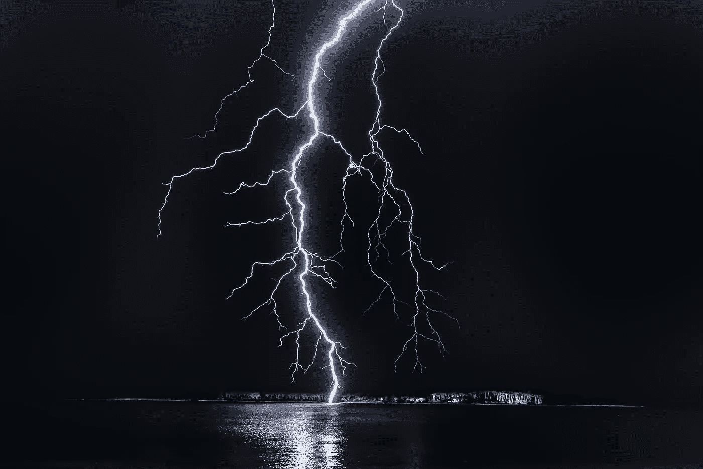

# 人工影响天气行动 2022

> 原文：<https://medium.com/codex/weather-modification-in-action-2022-31c64667994c?source=collection_archive---------4----------------------->

## 期待 2022 年人工影响天气技术的这些新改进。

照片由来自 [Pexels](https://www.pexels.com/photo/photo-of-lightning-1114690/?utm_content=attributionCopyText&utm_medium=referral&utm_source=pexels) 的 [Philippe Donn](https://www.pexels.com/@philippedonn?utm_content=attributionCopyText&utm_medium=referral&utm_source=pexels) 拍摄

> "天空中的河流，倾盆而下，创造了英属哥伦比亚的历史."

先前在附近的阿尔伯塔省的暴风雨证明了冬天有闪电和雷暴是可能的。南美洲发生过火灾…