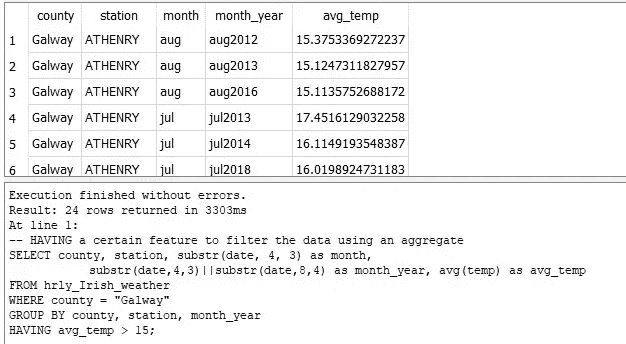

# 经受 SQL 解释器的考验

> 原文：<https://medium.com/codex/weathering-the-sql-interpreter-13ebaa175955?source=collection_archive---------5----------------------->

## *了解解释器是如何构造 SQL 查询的，可以让数据专业人员的工作变得更加轻松*

由[马克·劳森](https://unsplash.com/@mark_lawson)在 [Unsplash](https://unsplash.com/s/photos/ireland-weather?utm_source=unsplash&utm_medium=referral&utm_content=creditCopyText) 拍摄的照片

## 介绍

在处理任何数据集时，您可能会花费将近 80%的时间来发现和准备数据。选择正确的工具可以提高效率，减少完成这一过程所需的时间。通过执行预处理步骤，您可以减少提供可靠数据洞察所需的时间。您可能会面临平衡数据中不同关系的问题，这就是 SQL 可以利用的地方。

## SQL 的简要背景

结构化查询语言(SQL)，通常读作“sequel”，指的是最初版本的名字，是在 20 世纪 70 年代早期开发的。该语言旨在管理关系数据库管理系统(RDBMS)中的数据。有了这个关系模型组件，就可以使用 SQL 来提高处理多个表的效率。如果您正在处理跨多个 excel 文件的大型表格，将这些表格传递到数据库中有助于缩短查询数据时的处理时间。毕竟，像 VLOOKUP()或 INDEX()这样的搜索算法只能有效工作一段时间。随着行数的增加，所需的处理时间将逐渐增加。通过利用关系模型的能力，算法可以更有效地工作。

现在是时候开始使用示例数据集，并开始理解 SQL 解释器如何执行查询了。

## Kaggle 数据集

[Kaggle](https://www.kaggle.com/) 是开始数据工程师、数据分析师或数据科学家之旅的好地方。有许多公共数据集可供清理、探索、可视化和构建模型。由于要深入研究的领域范围很广，回顾每天影响我们所有人的数据才是有意义的。当然是天气，谁不喜欢讨论天气呢？

 [## 爱尔兰天气(每小时数据)

### 从爱尔兰气象站每小时获取的天气数据(1989-2018 年)

www.kaggle.com](https://www.kaggle.com/conorrot/irish-weather-hourly-data) 

我们将执行一些简单的 SQL 处理步骤来理解数据集中包含的内容。

## SQL 解释器编译步骤

首先，让我们回顾一下 SQL 中使用的主要关键字组件。以下列表显示了 SQL 解释器在编译 SQL 查询时采取的关键操作步骤:

1.  **从，包括连接**

在 FROM 子句中定义的表将是评估过程中的第一个。如果包含一个连接，那么所有表中的数据将使用连接中的 ON 子句进行合并。如果存在子查询，则可以创建临时表。需要注意的是，在许多情况下，数据库优化器会首先检查 WHERE 子句，以便了解要包含在查询中的表是否可以以任何方式进行过滤。有了这个流程步骤，数据库优化器与 SQL 解释器一起工作，确保查询中只包含需要检查的数据。

**2。其中**

要评估的第二个特征。我们能够包含 FROM 表中包含的所有变量。但是，我们不能包含任何聚合列。为了过滤这些聚合值，我们必须使用 HAVING filter 子句。通过包含适当的 WHERE 过滤器，我们可以细化搜索算法在返回查询输出时必须处理多少数据集。对索引值应用过滤器是一种有效的方法。

**3。分组依据**

旨在将数据集分成块或桶。通过排除该子句，类似于将所有行放在一个桶中。有了独立的桶，我们就能够生成聚合函数，例如 COUNT()、MIN()、MAX()、SUM()等。这些聚合值有助于提供数据集的汇总详细信息。

**4。拥有**

为了使用 HAVING 子句，必须有 GROUP BY。如果有意义的话，我们可以使用 HAVING 子句从分析中过滤掉某些桶。无论是调用聚合函数还是其别名，该子句都有助于防止在单独的查询中执行额外的分析。

**5。窗口功能**

将在后面的文章中讨论。

**6。选择**

SELECT 语句从通过检查前面的任何子句并丢弃任何不相关的行而选择的列中返回值。

这些操作步骤的其余部分将在以后的文章中讨论。

**7。独特的**

**8。联合**

**9。排序依据**

**10。极限和偏移**

## SQL 数据分析

[SQLite](https://www.sqlite.org/index.html) 用于完成以下分析。市场上还存在许多其他版本的 SQL 实现，例如:Oracle，MySQL，MS SQL Server 和 PostgreSQL。随着各种云计算选项的出现，可用的 SQL 操作的规模持续增长。但是，上面提到的关键指导原则可以应用于每一种情况。

对于与天气相关的数据集，可以查看一些不同的季节影响。在查询数据集之前创建问题列表有助于提供执行数据挖掘任务所需的结构。本教程的目标是了解一年中哪个月的平均温度最高。该国的一个地区将在整个过程中被挑选和保留，以帮助解释。

在更进一步之前，最高平均温度的初步猜测是夏季。让我们看看我们有多接近。

## **元数据**

代码 1.1 显示元数据

通过了解数据库的元数据，您可以维护其中包含的文件的概览。在下面的输出中，初始表是唯一存在的文件。然而，随着时间的推移，随着更多分析的执行，这个列表将会增加。

SQL Output 1.1 概述了 SQL 数据库中包含的数据集

## **来自**

当第一次在 SQL 中查看数据集时，您可能想选择所有记录。

代码 1.2 显示了选择所有列和特定列之间的区别

在代码 1.2 的第一部分中，我们可以看到，通过选择所有值，SQL 输出 1.2 将低效地将所有内容返回到输出视图。

SQL 输出 1.2 从数据集中选择所有列

代码 1.2 中的第二个查询显示了一个更有效的方法。我们可以在下面的输出中看到，当返回感兴趣的列时，需要更短的周转时间。在以后的文章中，我们将看到如何使用极限运算符来帮助选择数据集的小样本。通过这个操作，我们能够看到列的一个小摘要。通常取值为 5。

SQL 输出 1.3 从数据集中选择特定的列

## **哪里**

拥有要查询的变量列表是一回事，但我们需要开始细化搜索。使用 where 子句确保我们可以筛选数据集的特定部分。搜索算法检查过滤器并返回所有匹配值。如果被筛选的列已经应用了索引，那么可以更有效地应用搜索。如果没有使用索引，那么对列值进行排序也有助于减少过滤器开销。但是，大多数变量都是随机排列的，因此，搜索算法在返回最终结果之前必须检查列中的所有值。

下面的代码和输出显示了所应用的 where 子句的几种不同的变体。在第一个查询中，我们使用了一个过滤器来选择来自 county Galway 的所有值。

代码 1.3 where 子句的两种变体，以显示特殊性的差异

SQL Output 1.4 通过筛选一列来检查数据集

而在第二个查询中，我们过滤了所有值，并选择了 12 到 15 之间的带状温度范围。附加子句说明了如何为特定群组指定相似的运行时间，但返回小得多的数据集。正是这种过滤动态使我们能够回答关于数据集的更具体的分析问题。

SQL Output 1.5 通过对多个列进行筛选来检查数据集

## **分组依据**

开始将聚合合并到数据分析中有助于创建摘要。代码 1.4 中的第一个查询通过两列提供了数据集的行分布。

代码 1.4 简单和高级分组依据聚合

SQL Output 1.6 对 group by 列的简单行计数操作

通过合并 where 子句，我们能够对前面的总体总结提供更多的见解。包含额外的指标有助于阐明每列中可用值的范围。每次聚合后分配的别名允许任意范围的自由文本值。但是，合并聚合(例如 min、max、avg)和列的简称，确实有助于提供计算的上下文。

SQL Output 1.7 一组带有分组依据列的高级数据聚合

## 从加入

在前面的部分中生成汇总值开始讲述爱尔兰天气数据集中发生的事情。在数据分析中，通过将数据集结合在一起，故事可以更进一步。在代码 1.5 中，我们将代码 1.4 中的汇总查询合并为子查询。子查询可以看作是在查询中创建的临时表。

代码 1.5 可以使用子查询的内部连接添加 group by 的聚合列

通过连接整个数据集和子查询，我们可以将最高和最低温度值分配给所有行。可以进行进一步的计算，以了解每行的单个温度与汇总统计数据相比如何。因此，提供温度如何与更广泛的人群相关的参考点，有助于理解相对温度随时间的变化。

SQL 输出 1.8 当前温度可以与该列的范围值进行比较

## 拥有

与 where 子句类似，having 允许查询利用聚合计算对输出执行筛选。在本例中，我们创建了平均温度，并过滤了每个月温度高于 15°的情况。

代码 1.6 having 运算符使用聚合变量

由于日期变量是作为字符串值导入数据库的，所以我们可以使用字符串方法 substr()来提取与所需日期信息相关的列值的元素。

SQL 输出 1.9 按月查看平均温度

记住最初的问题，哪几个月的平均气温最高？

代码 1.7 创建一个临时视图来总结最终输出

通过使用 WITH 子句，我们能够调用一个临时表来汇总数据。

SQL 输出 1.10 摘要输出表

不足为奇的是，三个夏季月份中温暖的月份最多。然而，非常有趣的是，进入九月，气温持续上升。

## 结论

当开始执行从 Excel 到 Python 到 R 到 Tableau 的数据分析过程时，有许多不同的选项可用。在本练习中，我们使用了 SQL 来展示如何查询数据库来创建汇总统计信息。通过理解 SQL 解释器如何处理数据，我们可以提交高效的查询来回答我们的问题。在以后的文章中，我们将致力于自动化处理步骤，并理解 SQL 的其他特性。

就目前而言，我们应该高兴地看到，随着夏季的到来，温暖的天气可能会持续更长时间。

非常感谢你的阅读！通过分享，我们都能学得更好！下次见！