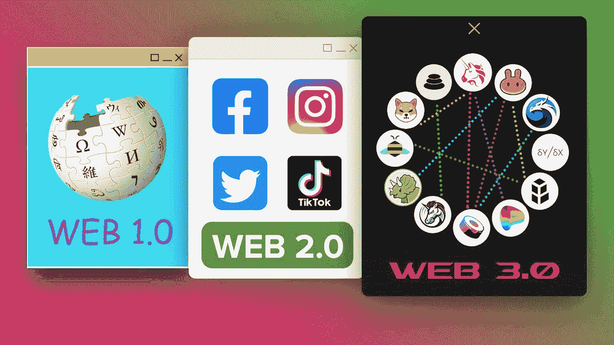
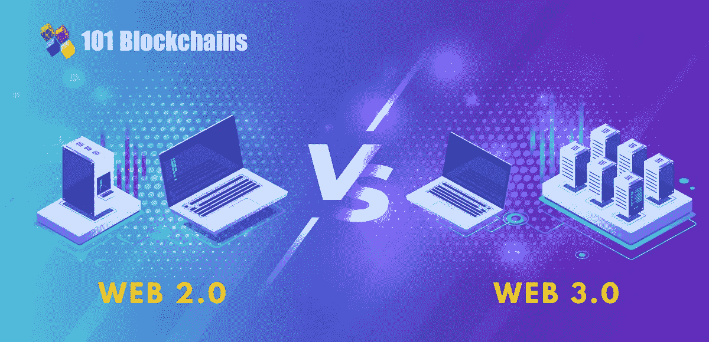
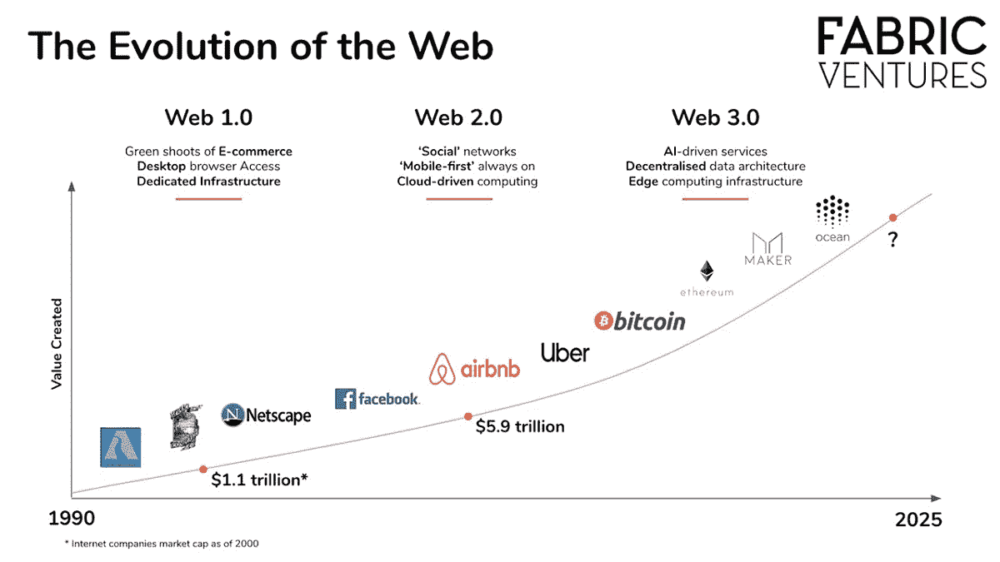
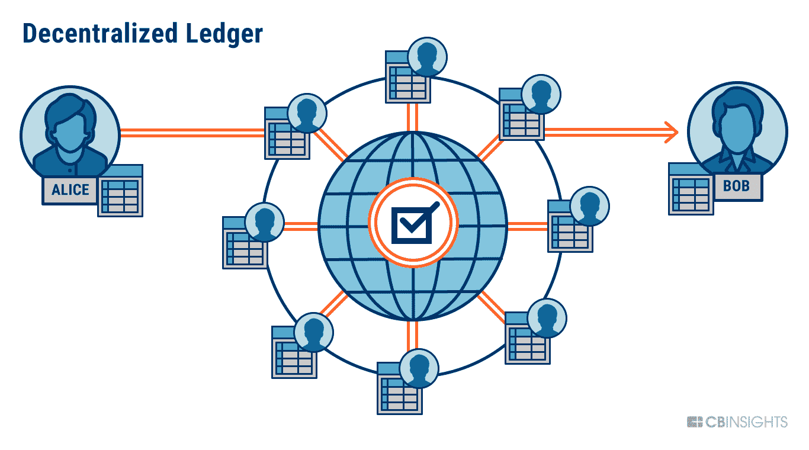

# Web 3.0:在线连接的未来

> 原文：<https://medium.com/codex/web-3-0-the-future-to-online-connections-f11fc0a340dc?source=collection_archive---------4----------------------->

*未来在线连接*

你听说过 web 3.0 吗？它是一个即将席卷全球的新事物。它基于区块链技术的复杂概念。它甚至拥有用人工智能和机器学习实现的高级功能。但是 web 2.0 和 web 3.0 有什么区别呢？

Web 2.0 是我们当前的网络状态，尽管它不会永远保持原样。Web 2.0 和 3.0 有一些主要的区别。Web 2.0 的主要焦点是社区开发，而 web 3.0 的焦点是授权给个人用户。但是 web 3.0 不仅仅是一个单一的目标。

网络的演变(来源:Fabric Ventures)

当我第一次听说 web 3.0 时，我想知道为什么它是这么大的一件事。它真的有那么重要吗？是的，原因如下。据 Peraltadesign.com 称，“据预测，到 2025 年，我们产生和消耗的数据将是 2010 年的 160 倍！”它在推动我们如何使用边缘计算存储数据方面发挥了如此重要的作用，如果这不是不朽的，我无法想象会是什么。

区块链必须成为新一代最大、最明显的特征之一。区块链技术创建了一个分散的数据库，存储和监控所有交易，包括加密等数字货币，并且不使用第三方资源来转移资金。通过这种基于分类账的系统，可以确保交易安全、合法和可信。有人说，在未来，Web 3.0 技术将会在日常生活中普遍使用，例如，收税和集资！你能相信吗？

基于分布式分类帐的 Web 3.0

Web 3.0 将改变我们的生活、我们使用的技术以及我们使用它的方式。我听说它在我们如何编写和实现代码方面有着巨大的潜力，可以为当前的一系列问题提供高效的数字解决方案。然而，许多人还没有编码，或者即使你已经编码，想知道更多的基础知识，迷因和乐趣，以及更有效编码的聪明策略？好吧，我的下一篇文章将讨论这个问题！所以请关注我的下一篇文章，如果你学到了新的东西，请喜欢这篇文章。

已经 SamarSyntax 了，下一篇文章再见！

*Samar Bhowmick(*[*@ Samar syntax*](https://www.tiktok.com/@samarsyntax)*)是一名中学生，喜欢编写代码，解决复杂的挑战，并使用编程技能让这个世界充满乐趣。所有观点都是我自己的。*