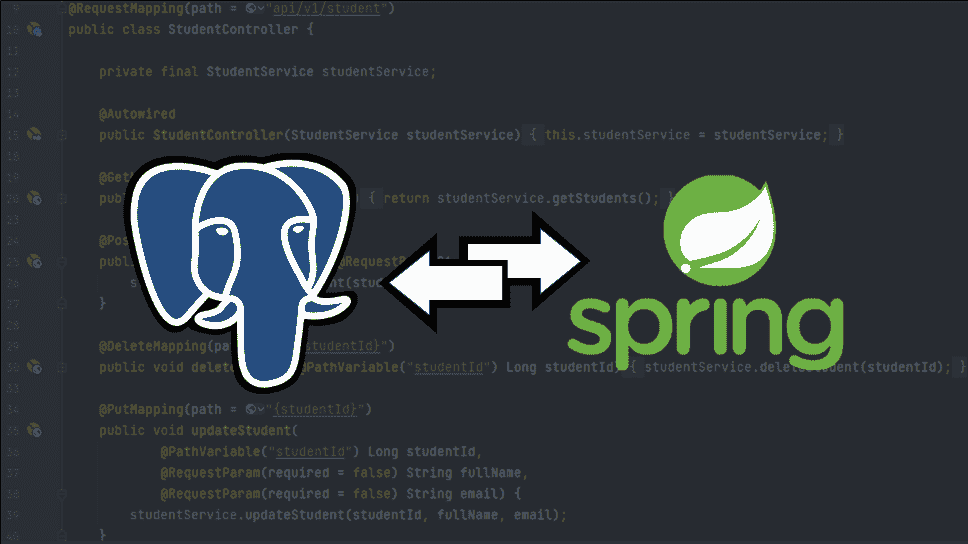

# Web 应用程序开发:Java Spring & Postgres REST API

> 原文：<https://medium.com/codex/web-app-development-java-spring-postgres-rest-api-3c302e28d571?source=collection_archive---------5----------------------->



在与我可能实习的公司的人交谈后，我不断听到我几乎不熟悉的 web 开发概念。其中一家公司强烈建议我学习 Java Spring，因为他们用它来开发他们的 web 应用程序。我认为学习它会很棒，因为我想更多地接触 web 开发，因为它是软件工程的一个重要分支。今年秋天，我在锡耶纳学院学习软件开发课程，到目前为止，我对 Java 编程语言有了基本的了解。

到目前为止，我只把 VS 代码用于个人用途，把 BlueJ 用于我的软件开发课程。虽然我真的很喜欢 VS Code，但我发现当谈到 Java Spring 时，尽管有 Spring 附加组件的选项，它的功能还是比较有限。经过研究，我发现 IntelliJ 是这个项目最好的选择，也是目前需求最大的 Java IDEs 之一。与我之前使用的相比，我发现 IntelliJ 有很多突出的地方，比如它提供的一些独特的[特性](https://tomgregory.com/top-5-intellij-idea-2020-1-features-for-java-developers/)。我发现 IDE 的效率和智能更胜一筹，比如能够随心所欲地生成所有的 getters 和 setters，而不是只能一个接一个地创建它们。除此之外，我非常喜欢标签特性，它根据我创建的构造函数指定了我输入的属性类型。


图 A

## 项目创建的主要过程:

我需要做的第一件事是连接到 PostgreSQL，我决定通过 psql(interactive SQL shell)来完成。在 IntelliJ 中，我使用 Java Spring，设置连接数据库所需的配置。对于本地开发，用户名和密码为空，否则需要信息。Create-drop 使得每次应用程序运行时都有一个干净的状态。


图 B

我一开始用 PostgreSQL shell 连接数据库时遇到了麻烦，因为我输入的密码没有显示出来。我了解到，出于安全原因，当我输入密码时，密码不会被回显，甚至星号(****)也不会被看到。我意识到我只需要试着正确地输入，完成后按回车键就可以了。

图 C 给出了一个例子，展示了一个成功输入的密码，以及使用“\l”命令查看数据库的[列表的能力。所示的每个数据库分别存储在服务器的数据目录中它们自己的目录中。](https://chartio.com/resources/tutorials/how-to-list-databases-and-tables-in-postgresql-using-psql/)


图 C

下面是一个示例，显示了如何创建一个新的数据库，并为指定的用户名分配访问权限，以便能够对数据库进行更改。现在，当我使用“\l”命令时，会显示附加的数据库，并且特权现在会更新，以显示用户 postgres 可以访问多个数据库。为了使用数据库，我将使用“\c”后跟数据库的名称来连接它。使用“\d”命令相当于使用 [DESCRIBE](https://www.geeksforgeeks.org/sql-describe-statement/) 命令，只有当数据库不为空时才会显示附加信息。


图 D

我在 IntelliJ for Java spring 中连接到数据库时遇到了一个问题。我一直在下面得到这个错误。


图 E

然而，我意识到这是一个非常简单的问题。为了解决这个问题，我需要更新我的 application.properties 文件。由于 Spring 要求输入数据源用户名和密码，现在它与 psql 相关联，所以我需要在 application.properties 文件中提供用户名和密码。因此，Java Spring 控制台现在显示 Spring 已经成功连接到数据库。


图 F

为了将 student 类映射到数据库中的一个表，我创建了这个序列生成器。这意味着每个学生的 ID 自动增加 1，从第一个输入数据库的学生开始。


图 G

Java Spring console 现在显示了它与数据库的连接，并为 student 类排序，并在运行应用程序时创建 student 表。


图 H

为了将 IntelliJ 连接到我们的 Postgres 数据库，我需要更改数据库的名称，并插入用户名和密码。然后，我测试了连接，这条消息显示我已成功连接。


图一

这样做的结果是，我能够访问我在 IntelliJ 中创建的表和序列。


图 J

另外，在 psql 中，我可以看到当使用“\d”命令时，我的数据库包含了我之前创建的表和序列。


图 K

现在，我需要为数据库创建一个数据访问层，以便与 Java Spring 一起充分发挥作用。为此，我创建了一个 Java 持久性 API 存储库。它包含一个 API，用于基本的数据库操作以及记录的排序和编号。除此之外，对象的类型及其 ID 需要在方法头中指定。添加注释 [@Repository](https://www.baeldung.com/spring-component-repository-service) ，作为元数据，向用户解释存储库用于搜索、存储和检索对象。


图一

student service 类现在已经修改为支持依赖注入，这意味着 Java Spring 容器将对象注入到其他对象中。每个对象都不依赖于其他对象，并且可以随着时间的推移而被替换。容器用于管理对象从创建到销毁的生命周期。


图 M

在这之后，需要[@配置](https://howtodoinjava.com/spring-core/spring-configuration-annotation/)类。这代表了 Java Spring 容器如何组装应用程序中的对象。在这个类中，定义了最少一个 bean，并且经常由 Spring 容器管理更多的 bean。由 Spring 容器创建的对象被称为 beans，并通过它们的依赖注入来实现。


图 N

现在，由于调用 saveAll 方法，当服务器在 Java Spring 上运行时，会有额外的数据记录。这表示 Hibernate 正在运行的 SQL，用于使 Java 应用程序开发与 Postgres 的交互更加简化，以便在服务器开始运行时实例化对象。


图 O

我发现非常有用的一点是，我能够在 IntelliJ 中拥有一个 Postgres 控制台。所以这意味着我可以在 Java Spring 内部执行查询，而不是使用 psql。除此之外，我还发现查询输出的格式可以更改为多种选项。这包括能够以 CSV、HTML、JSON 等文件格式导出数据。对于查看数据本身，我发现表格选项是我最喜欢的，特别是由于我过去使用 MySQL 和 MS Access 的经验。


图 P

为了从每个记录的 DOB 中自动计算年龄，必须使用注释 [@Transient](https://www.educative.io/edpresso/what-is-the-transient-keyword-in-java) 。使用它的原因是为了避免序列化，这意味着年龄属性将改为从 DOB 属性计算。否则，每次有人变老时，年龄都必须更新，并且很容易出现数据输入错误。为了正确计算年龄，必须从创建对象的参数中删除年龄，并且必须更新 get 方法。这样做还会从图 P(显示了查询的表输出)中删除 age 列，因为年龄不再序列化。


图 Q

为了能够生成 POST 请求，可以将新对象保存到我们的数据库中，使用了注释 [@PostMapping](https://www.sourcecodeexamples.net/2019/10/postmapping-spring-boot-example.html) 。在方法内部，需要注释 [@RequestBody](https://www.baeldung.com/spring-request-response-body) 来将 HTTP 请求体映射到一个新的对象。总的来说，这些注释支持根据发送的 HTTP POST 请求创建一个新对象。


图 R

在图 5 中，有一个 POST 请求的例子。当成功运行时，它会被记录到 Java Spring 控制台。为了确定这一点，响应代码 200 应该出现在下面。


图 S

与此同时，需要创建业务逻辑。这表示对用户界面和数据库之间交换的信息的处理。在这种情况下，我们要确保没有两个学生有相同的电子邮件，这样当新用户添加到数据库中时，同一个电子邮件不会意外地分配给多个人。为此，我需要创建一个可选的容器对象。这将检查电子邮件是否存在，如果存在，它将返回描述电子邮件的可选内容。将它添加到学生类存储库之后，我需要在服务类方法中创建这个逻辑来添加新学生。如果该选项包含为新学生输入的特定电子邮件，将会返回一条消息，说明该电子邮件已被占用。


图 T

现在 POST 请求方法拥有了它需要的所有特性，在测试它时，我只能运行这个请求一次，然后就会得到一个状态代码 500，这意味着存在一个内部服务器错误。我不得不手动向应用程序属性添加以下行:

```
server.error.include-message=always
```

这样做是为了显示“电子邮件被占用”异常消息，并且我将来创建的任何其他服务器错误异常消息也将显示在它们各自的状态代码中。

为了创建删除请求方法，我需要使用注释 [@DeleteMapping](https://zetcode.com/spring/deletemapping/#:~:text=%40DeleteMapping%20annotation%20maps%20HTTP%20DELETE,DELETE%29%20.) ，并将路径设置为学生 ID。为此，我在学生服务类中创建了如下所示的逻辑。这将检查学生 ID 是否已经存在于数据库中，如果不存在，将抛出一个异常。


图 U

这意味着，为了删除一个特定的对象，我将在本地 web 服务器地址后键入我希望删除的学生 ID。例如，删除我要输入的第一个 ID 号

```
DELETE http://localhost:8080/api/v1/student/1.
```

因此，服务器现在看起来像这样:


图五

在这个 Java Spring API 中创建的最后一个请求方法是 PUT 方法。使用注释 [@PutMapping](https://www.sourcecodeexamples.net/2019/10/putmapping-spring-boot-example.html) ，就像删除方法一样，设置一个指定给学生 ID 的文件路径。在学生服务类中的更新学生方法中，使用了注释 [@Transactional](https://docs.oracle.com/javaee/7/api/javax/transaction/Transactional.html) 。这使得 API 能够在生成的对象上以声明方式管理事务边界。除此之外，我还创建了异常消息来检查数据库中是否存在学生 ID 和电子邮件。学生 ID 的例外情况与 DELETE 方法相同，它会查看学生 ID 是否不存在，而电子邮件例外情况会查看用户希望更改的电子邮件是否已被接收，否则他们无法更改他们的电子邮件。


图 W

我刚才所做的步骤中最令人困惑的部分是→操作符，因为我以前从未使用过，甚至从未见过。我只能找到一个使用这个操作符的例子来说明我需要为这个步骤做些什么。查了一下，发现这是一个 lambda 表达式，箭头左边包含参数，右边包含表达式体。所以在我的情况下，实际上没有参数，然后表达式体包含了抛出的异常。我发现[这一页](https://stackoverflow.com/questions/15146052/what-does-the-arrow-operator-do-in-java)，以及[这一页](https://www.w3schools.com/java/java_lambda.asp)非常有助于更深入地解释什么是箭头操作符。

为了测试这一点，我运行了 HTTP 请求:

```
PUT http://localhost:8080/api/v1/student/4?email=liverpoolfan11@gmail.com 
```

这导致电子邮件在本地 web 服务器上相应地更新。第一个数字指定正在更新的学生 ID，问号后面的内容解释正在更改的对象的特定属性。


图十

我需要做的最后一件事是将应用程序打包成一个. jar 文件，以便在 Java Spring 中运行。为了做到这一点，我需要在 IntelliJ 中清理和安装应用程序，并使用 jar 命令。现在我可以部署。jar 文件加载到服务器，并可以通过改变 web 服务器端口来测试应用程序的不同实例。例如，如果我想测试端口 8081，我会运行:

```
java -jar demo-0.0.1-SNAPSHOT.jar — server.port=8081
```

这将导致本地服务器下的那个端口号发生变化。


图 Y

**TLDR 版本:**在构建一个执行 HTTP 请求的简单 web 应用程序的过程中，我学习了很多关于 Java Spring、Postgres、Rest APIs 以及 web 开发和编程的知识。这包括管理大学生联系信息的 GET、POST、PUT 和 DELETE 方法。

**本项目最有用的来源:**

*   【https://www.youtube.com/c/amigoscode 
*   [https://www.baeldung.com/](https://www.baeldung.com/)
*   [https://www . freecodecamp . org/news/learn-things-4-things-and-working-with-lambda-expressions-b0ab 36 e 0 fffc/](https://www.freecodecamp.org/news/learn-these-4-things-and-working-with-lambda-expressions-b0ab36e0fffc/)
*   [https://www.redhat.com/en/topics/api/what-is-a-rest-api](https://www.redhat.com/en/topics/api/what-is-a-rest-api)
*   [https://www . jamesshore . com/v2/blog/2006/dependency-injection-demystified](https://www.jamesshore.com/v2/blog/2006/dependency-injection-demystified)