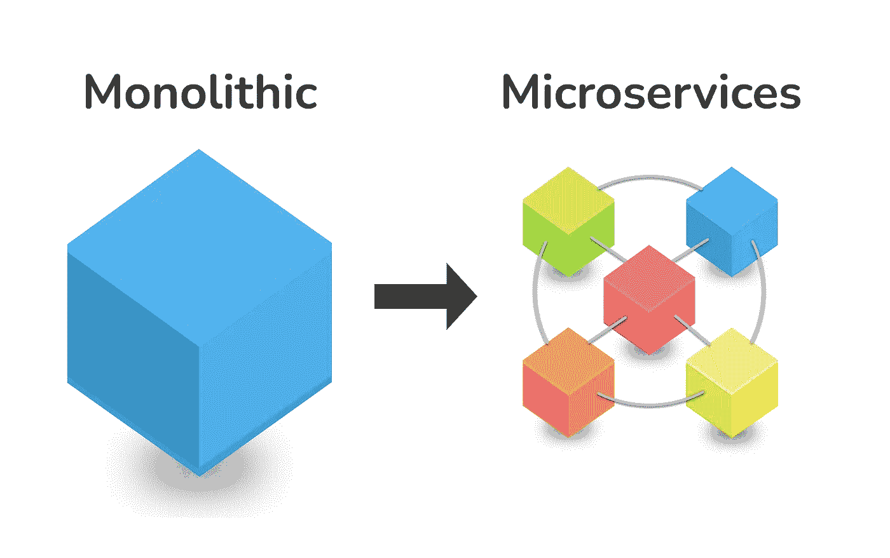
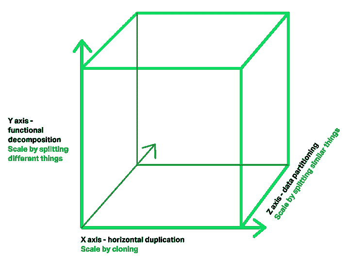

# Web 应用到微服务

> 原文：<https://medium.com/codex/web-application-to-microservice-4321c5fbecd2?source=collection_archive---------6----------------------->

## 微服务是目前软件工程师中非常热门的话题。

2011 年，为软件架构师举办了研讨会。在那个车间术语中，第一次使用了微服务。詹姆斯·刘易斯在 2012 年 3 月展示了他对微服务的一些想法。2013 年，马丁·福勒写了一本关于这个主题的书。

2014 年，詹姆斯·刘易斯和马丁·福勒一起提供了一些真实世界的例子，并展示了微服务。它为 web 应用程序提供了一个新的架构视图。之后，它变得足够流行，被认为是大型企业的有力竞争者。

在本文中，我将讨论 web 应用程序和微服务之间的主要区别。然后，您可以决定是否从 web 应用程序迁移到微服务。

什么是单片应用？

在微服务出现之前，许多应用都是为单片架构开发的。因此，这些应用被称为单片应用。整体式应用程序是作为一个统一的单元构建的。这意味着一个单一的应用程序对于整个应用程序只有一个可执行文件。这可能不可执行。这可以是 war 文件、er 文件或任何其他档案。但问题是整个应用程序被打包到一个文件中。

比如，假设你有一个学校管理系统。该系统包括学生注册、考试成绩发布、费用管理和考勤管理等流程。这是一个整体的应用程序。所以所有的进程都构建到一个文件中。假设在部署应用程序后，委托人请求更改费用管理中的简单业务逻辑。为了更新这个简单的逻辑，你必须休眠整个文件。不仅如此，我们还必须测试整个应用程序。这是使用单片应用程序的缺点之一。

对于单片应用程序来说，调试过程非常困难。它维护着一个巨大的代码库。大量工程师参与开发过程。所以每个工程师对应用程序的开始到结束都没有概念。那么调试就变得非常困难。部署过程也很复杂。

**什么是微服务？**

微服务是一种架构。要开发您的微服务架构，您可以使用任何平台、任何语言和任何工具。微服务架构风格，将单个应用程序开发为一组小服务。

微服务没有提取定义。但马丁·弗劳尔对此给出了一些想法。所以人们以此为基线给出微服务的定义。

你想建一栋房子。当你想盖一栋房子时，你可以去找建筑师，解释你对建筑的要求，然后他们会画一个好的建筑师并还给你。当你建立这一点，它需要六个月或一年的过程，这取决于你的情况；在此期间，你可以稍微修改。对于该架构，我们可以进行修改，但我们必须确保您知道自己在做什么，并且您应该能够承担风险。

微服务是有专门的生活目的的。换句话说，就是领域驱动开发。微服务必须具备一些特征。那些是，

*   定义明确的范围
*   运行自己的流程(自己的 web 容器)
*   通过轻量级机制与其他服务通信。大部分时间它使用 HTTP。但并不局限于 HTTP。
*   能够作为单独的服务进行扩展和部署
*   应该尽可能保持分散控制。

**可独立扩展**

独立可扩展是微服务的主要特性之一。

在《可伸缩性的艺术》一书中，这本书对伸缩应该如何工作给出了一个很好的解释。

他们将三个轴定义为 x、y 和 z。

x —应用程序必须能够通过 x 轴向外扩展。这意味着一个实例不足以正常运行服务，那么它必须能够产生其他实例并平稳地运行应用程序。我们可以进行群集，并添加更多的数据中心。等等，重要的是它应该能够横向扩展。

y——这应该能够进行功能分解。让我们以之前的单一学校管理系统为例。有 4 个主要过程学生注册，考试成绩发布，费用管理，和出勤管理。所以所有进程都在一个应用程序上。

作为第一阶段，我们可以将这些分成 4 个服务。而不是成为 4 个不同的独立服务。但是你不应该追求粒度级别。那么就会有问题，因为一个服务需要一些时间与另一个服务进行通信。所以你必须确保正确的平衡。

现在我们有 4 种不同的服务。有一个很重要的事情要考虑，学生模块有学生，s 和支持模块有学生。当学生来到支持模块时，这是一个不同的视角。这是一个不同的领域和不同的观点。这就是称之为领域驱动开发的原因。

假设当考试结果公布时，系统上有巨大的流量。所以作为一个开发者，我必须再推出 3 个考试服务。在单片应用程序中，这是不可能的，因为所有进程都在同一个文件中。所以我必须生成整个应用程序。这是一种浪费。但是如果我们将这些实现为服务，我可以为考试结果生成 3 个实例。不会受到其他服务的影响。它节省了一些成本和时间。

z —这个应该可以分片。此外，它应该在地理上划分流量，类似亚洲客户直接到亚洲服务器，美国客户到美国服务器。等等…

您可以使用任何编程语言来开发服务。使用编程语言没有限制。有一些开发微服务最流行的语言，比如 Java、JavaScript (NodeJS、NestJS)和 Python。大多数人用 Java。如果你使用 java，有一些框架，如 spring-boot、microservices for java、Wso ms4j 和 drop wizard。等等…

当考虑设计时，使用领域驱动的设计是非常重要的。任何服务都不应该依赖于任何因素。这意味着服务应该能够在任何给定的时间从系统中移除，也可以在任何时候插入系统。这意味着不应该将一个服务与另一个服务紧密耦合。

微服务最重要的一部分就是服务弹性和容错。这是必须实现的，因为这不是一个特性。例如，您将从服务 a 调用服务 B。让我们假设考试结果发布服务从学生管理服务请求学生验证。但遗憾的是，学生管理系统停运了。在这种情况下，它应该能够管理故障。这就叫宽容。为此，我们可以使用代理和断路器模式等故障机制。等等…

要开发微服务，你应该有一个完整的团队。这个团队必须包括来自所有领域的人，比如 UI 和 QA。这个团队由 10 到 12 个成员组成，整个团队对系统负责。有一个概念叫微服务“你建立它，你拥有它”。部署之后，系统支持团队负责维护应用程序。但是对于微服务来说，即使在部署之后，整个开发团队也要对系统负责。

优势:

*   它易于维护，因为所有的服务都是隔离的。
*   这很容易扩展
*   可以独立部署每项服务
*   独立可扩展

缺点:

*   不容易监控。因为它有不同的服务。
*   测试的复杂性
*   已单独启动每项服务。

谢谢大家！