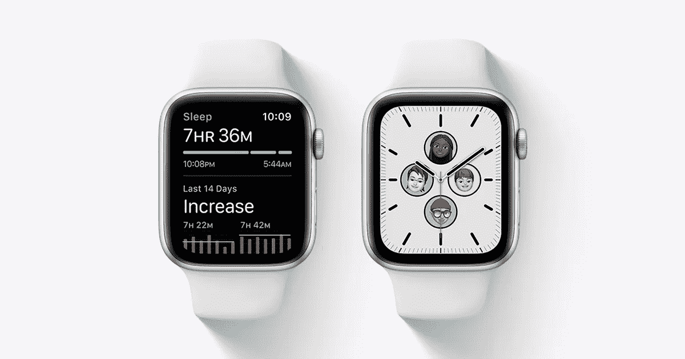

# 网络应用不是未来

> 原文：<https://medium.com/codex/web-apps-arent-the-future-f71476087e92?source=collection_archive---------0----------------------->

## [法典](http://medium.com/codex)

## 嘿 Siri，接下来是什么？

更受欢迎的接触点，如可穿戴设备，可能是更有吸引力的接触点。来源:苹果。

媒介是由来自北美的白人主导的。作为一个来自马来西亚的亚裔男生，这一点超级明显。因为北美和马来西亚是两个世界。政治。文化。我们说话的方式，即使是同一种语言。最后但同样重要的是，技术。