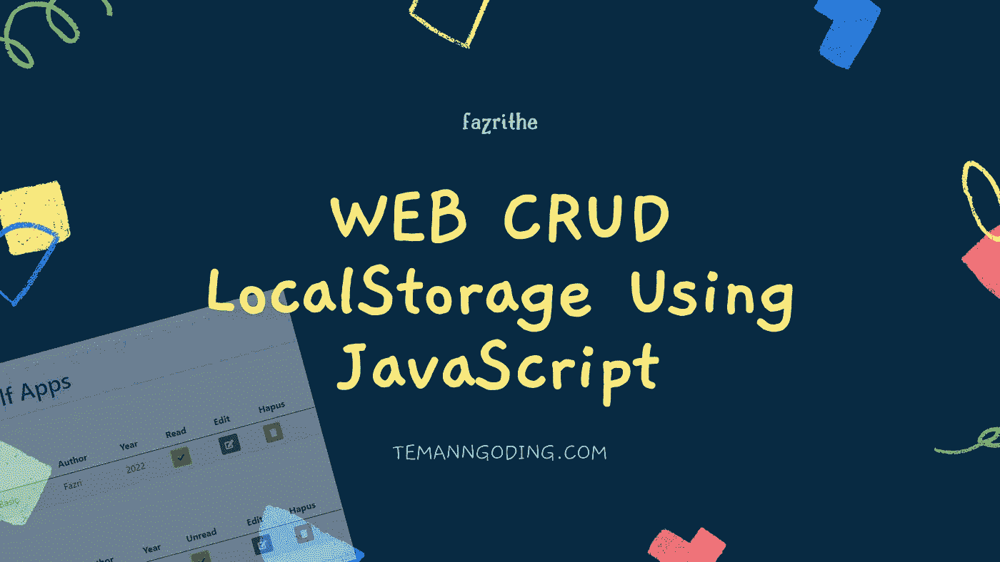
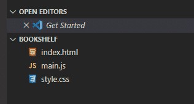
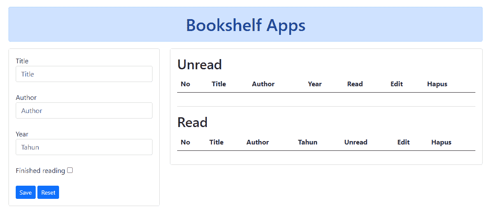
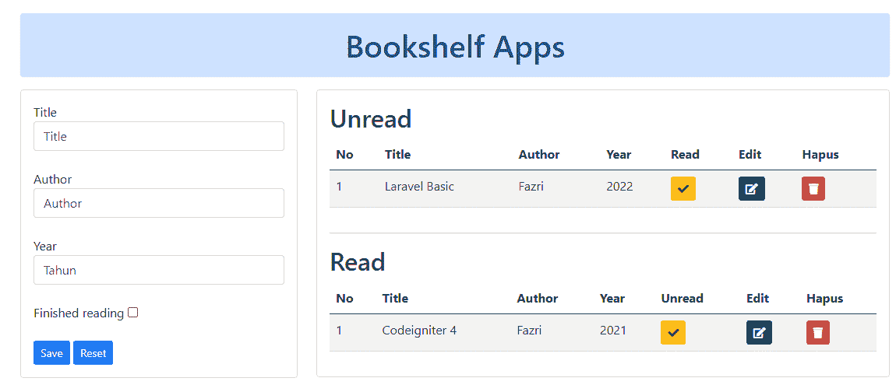

# 使用 JavaScript 的 WEB CRUD 本地存储

> 原文：<https://medium.com/codex/web-crud-localstorage-using-javascript-10b4802c28a9?source=collection_archive---------2----------------------->



大家好，朋友们好，这次我们将再次讨论 JavaScript。但是我们将立即练习使用 Web 存储制作 CRUD。

LocalStorage 是一种没有时间限制的存储介质。当浏览器关闭时，存储不会丢失。如果你删除它，数据将会丢失。

要使用 localStorage，您必须使用其名称**“local storage”**。然后当你保存它的时候你必须使用**系统()。** SetTime()有两个参数，即存储在 localStorage 中的键和值。要删除它，您必须输入代码 removeItem()，它只接受一个项目键。

我们将涉及的目录:

1.  **创建项目文件**
2.  **创建 HTML 代码**
3.  **创建 CSS 代码**
4.  **创建 JavaScript 代码**

您可以在此了解更多教程:

[JavaScript 中 BOM 和 DOM 的区别](https://temanngoding.com/en/difference-between-bom-and-dom-in-javascript/)

[基础 JavaScript 第 6 部分:If Else JavaScript](https://temanngoding.com/en/basic-javascript-part-6-if-else-javascript/)

[基础 JavaScript 第 5 部分:JavaScript 运算符](https://temanngoding.com/en/basic-javascript-part-5-javascript-operators/)

# 创建项目文件

创建如下三个项目文件:



**index.html 文件**

用于根据程序代码处理的结果创建输入和输出表单。

**File style.css**

用于美化您创建的表单页面。

**main.js 文件文件**

用来创建 javascript 代码来处理我们想要的所有代码。

# 创建 HTML 代码

现在我们创建 html 代码来创建表单及其输出。编写如下代码。

```
<!DOCTYPE html>
<html lang="en">
  <head>
    <meta charset="UTF-8" />
    <meta name="viewport" content="width=device-width, initial-scale=1.0" />
    <meta http-equiv="X-UA-Compatible" content="ie=edge" />
    <link
      rel="stylesheet"
      href="https://cdnjs.cloudflare.com/ajax/libs/twitter-bootstrap/5.1.0/css/bootstrap.min.css"
    />
    <link
      rel="stylesheet"
      href="https://cdnjs.cloudflare.com/ajax/libs/font-awesome/5.15.4/css/all.min.css"
    />
  </head>
  <body>
    <div class="container mt-4">
        <div class="row">
            <div class="col-lg-12">
                <h1 class="alert alert-primary text-center">
                    Bookshelf Apps
                </h1>
            </div>
            <div class="col-lg-4">
                <div class="card">
                    <div class="card-body">
                        <form id="form">
                            <input type="hidden" name="id" id="inputBookId">
                            <label for="inputBookTitle">Title</label>
                            <input type="text" placeholder="Title" class="form-control" id="inputBookTitle" required>
                            <br>
                            <label for="inputBookAuthor">Author</label>
                            <input type="text" placeholder="Author" class="form-control" id="inputBookAuthor" required>
                            <br>
                            <label for="inputBookYear">Year</label>
                            <input type="number" placeholder="Tahun" class="form-control" id="inputBookYear" required>
                            <br>
                            <label for="inputBookIsComplete">Finished reading</label>
                            <input id="inputBookIsComplete" type="checkbox">
                            <br>
                            <br>
                            <button class="btn btn-sm btn-primary" type="button" onclick="save()">Save</button>
                            <button class="btn btn-sm btn-primary" type="button" onclick="clearData()">Reset</button>
                        </form>
                    </div>
                </div>
            </div>
            <div class="col-lg-8">
                <div class="card">
                    <div class="card-body">
                      <h2>Unread</h2>
                        <div class="table-responsive">
                            <table id="datatable" class="table table-striped">
                                <thead>
                                    <tr>
                                        <th>No</th>
                                        <th>Title</th>
                                        <th>Author</th>
                                        <th>Year</th>
                                        <th>Read</th>       
                                        <th>Edit</th>
                                        <th>Hapus</th>
                                    </tr>
                                </thead>
                                <tbody id="table">

                                </tbody>
                            </table>
                        </div><hr>
                        <h2>Read</h2>
                        <div class="table-responsive">
                          <table id="datatable" class="table table-striped">
                              <thead>
                                  <tr>
                                      <th>No</th>
                                      <th>Title</th>
                                      <th>Author</th>
                                      <th>Tahun</th>
                                      <th>Unread</th>
                                      <th>Edit</th>
                                      <th>Hapus</th>
                                  </tr>
                              </thead>
                              <tbody id="table2">

                              </tbody>
                          </table>
                      </div>
                    </div>
                </div>
            </div>
        </div>
    </div>
    <script src="https://cdnjs.cloudflare.com/ajax/libs/popper.js/2.9.2/umd/popper.min.js"></script>
    <script src="https://cdnjs.cloudflare.com/ajax/libs/twitter-bootstrap/5.1.0/js/bootstrap.min.js"></script>
    <script src="main.js"></script>
    <script>
        allData()
    </script>
    <script>
        function clearData(){
            document.getElementById('form').reset()
            document.getElementById('id').value = ""
        }
    </script>
  </body>
</html>
```

# 创建 css 代码

为了美化页面，在 style.css 文件中创建一点 css 代码。代码如下:

```
.imgLogo{
    height: 50px;
    width: 120px;
}
a:hover{
   text-decoration: none;
    color: navy;
    font-weight: bold;
}
#slide-out li a:hover{
    color: navy;
    font-weight: bold;
}
.divCenter{
    margin: auto;
    width: 50%;
}
.modal-body .form-horizontal{
    width: 100%;
}
```

那么我们将得到如下结果:



# 创建 javascript 代码

接下来我们创建 javascript 代码，这个代码是我们将要创建的主要函数。我们将创建几个函数，其中包括:

1.  函数 save(){} = >保存和更改数据的函数
2.  function allData(){} = >显示数据的函数
3.  function removedata(){} = >删除数据的函数
4.  函数 find(id) = >用于查找我们将要更改的数据
5.  函数 read(){} = >用于将数据移动到不同的存储器

您将在这个应用程序中创建两个存储。让我们逐一讨论

函数保存()

```
function save(){ var read = document.getElementById('inputBookIsComplete');
    if(read.checked == true){
        bookList = JSON.parse(localStorage.getItem('listItem3')) ?? [] var id
        bookList.length != 0 ? bookList.findLast((item) => id = item.id) : id = 0

        if(document.getElementById('inputBookId').value){ bookList.forEach(value => {
                if(document.getElementById('inputBookId').value == value.id){
                    value.title         = document.getElementById('inputBookTitle').value, 
                    value.author        = document.getElementById('inputBookAuthor').value, 
                    value.year          = document.getElementById('inputBookYear').value, 
                    value.isComplete    = 1
                }
            }); document.getElementById('id').value = '' }else{ var item = {
                id          : id + 1, 
                title       : document.getElementById('inputBookTitle').value, 
                author      : document.getElementById('inputBookAuthor').value, 
                year        : document.getElementById('inputBookYear').value, 
                isComplete  : 1,
            } bookList.push(item)
        } localStorage.setItem('listItem3', JSON.stringify(bookList))
    }else{        bookList2 = JSON.parse(localStorage.getItem('listItem4')) ?? [] var id
        bookList2.length != 0 ? bookList.findLast((item) => id = item.id) : id = 0
        if(document.getElementById('inputBookId').value){ bookList2.forEach(value => {
                if(document.getElementById('inputBookId').value == value.id){
                    value.title         = document.getElementById('inputBookTitle').value, 
                    value.author        = document.getElementById('inputBookAuthor').value, 
                    value.year          = document.getElementById('inputBookYear').value, 
                    value.isComplete    = 0
                }
            }); document.getElementById('inputBookId').value = '' }else{ var item = {
                id          : id + 1, 
                title       : document.getElementById('inputBookTitle').value, 
                author      : document.getElementById('inputBookAuthor').value, 
                year        : document.getElementById('inputBookYear').value, 
                isComplete  : 0,
            } bookList2.push(item)
        } localStorage.setItem('listItem4', JSON.stringify(bookList2))
    } allData() document.getElementById('form').reset()
}
```

函数 allData()

```
function allData(){

    table.innerHTML = ``
    bookList = JSON.parse(localStorage.getItem('listItem4')) ?? [] bookList.forEach(function (value, i){

        var table = document.getElementById('table')
        // if(value.isComplete == 0){
        table.innerHTML += `
            <tr>
                <td>${i+1}</td>
                <td>${value.title}</td>
                <td>${value.author}</td>
                <td>${value.year}</td>
                <td><button class="btn btn-sm btn-warning" onclick="read(${value.id},'${value.title}','${value.author}',${value.year})">
                <i class="fa fa-check"></i>
                </button></td>
                <td>
                    <button class="btn btn-sm btn-success" onclick="find(${value.id})">
                        <i class="fa fa-edit"></i>
                    </button>
                </td>
                <td>
                    <button class="btn btn-sm btn-danger" onclick="removeData4(${value.id})">
                        <i class="fa fa-trash"></i>
                    </button>
                </td>
            </tr>`
        // }

    }) table2.innerHTML = ``
    bookList2 = JSON.parse(localStorage.getItem('listItem3')) ?? []

    bookList2.forEach(function (value2, i){

        var table2 = document.getElementById('table2')
        // console.log(value2.isComplete);
        // if(value2.isComplete == 1){
        table2.innerHTML += `
            <tr>
                <td>${i+1}</td>
                <td>${value2.title}</td>
                <td>${value2.author}</td>
                <td>${value2.year}</td>
                <td><button class="btn btn-sm btn-warning" onclick="read2(${value2.id},'${value2.title}','${value2.author}',${value2.year})">
                <i class="fa fa-check"></i>
                </button></td>
                <td>
                    <button class="btn btn-sm btn-success" onclick="find(${value2.id})">
                        <i class="fa fa-edit"></i>
                    </button>
                </td>
                <td>
                    <button class="btn btn-sm btn-danger" onclick="removeData3(${value2.id})">
                        <i class="fa fa-trash"></i>
                    </button>
                </td>
            </tr>`
        // }

    })

}
```

函数 removeData()

```
function removeData3(id){

    bookList = JSON.parse(localStorage.getItem('listItem3')) ?? [] bookList = bookList.filter(function(value){ 
        return value.id != id; 
    });
    // localStorage.clear();
    localStorage.setItem('listItem3', JSON.stringify(bookList)) allData()
}function removeData4(id){ bookList = JSON.parse(localStorage.getItem('listItem4')) ?? [] bookList = bookList.filter(function(value){ 
        return value.id != id; 
    }); localStorage.setItem('listItem4', JSON.stringify(bookList)) allData()
}
```

函数 find()

```
function find(id){
    bookList = JSON.parse(localStorage.getItem('listItem4')) ?? []
    bookList.forEach(function (value){
        if(value.id == id){
            console.log(id);
            document.getElementById('inputBookId').value = id
            document.getElementById('inputBookTitle').value = value.title
            document.getElementById('inputBookAuthor').value = value.author 
            document.getElementById('inputBookYear').value = value.year
        }
    })
}
```

函数读取()

```
function read(id1,title1,author1,year1){ if(id1){
        var item = [{
            id          : id1, 
            title       : title1, 
            author      : author1, 
            year        : year1, 
            isComplete  : 1,
        }];   
        bookList = JSON.parse(localStorage.getItem('listItem3')) ?? []
        books = item.concat(bookList);
        var itemString = JSON.stringify(books);
        localStorage.setItem('listItem3', itemString);
    }

    bookList4 = JSON.parse(localStorage.getItem('listItem4')) ?? []
    bookList4 = bookList4.filter(function(value){ 
        return value.id != id1; 
    }); localStorage.setItem('listItem4', JSON.stringify(bookList4)) allData()
}function read2(id1,title1,author1,year1){
    if(id1){
        var item = [{
            id          : id1, 
            title       : title1, 
            author      : author1, 
            year        : year1, 
            isComplete  : 1,
        }];   
        bookList = JSON.parse(localStorage.getItem('listItem4')) ?? []
        books = item.concat(bookList);
        var itemString = JSON.stringify(books);
        localStorage.setItem('listItem4', itemString);
    }

    bookList3 = JSON.parse(localStorage.getItem('listItem3')) ?? []
    bookList3 = bookList3.filter(function(value){ 
        return value.id != id1; 
    }); localStorage.setItem('listItem3', JSON.stringify(bookList3)) allData()
}
```

在我们创建了所有代码之后，结果将是这样的:



这就是我们如何使用网络存储来满足您的应用需求。希望这篇教程是有用的，希望这段代码能成为大家的参考。

***谢了。***