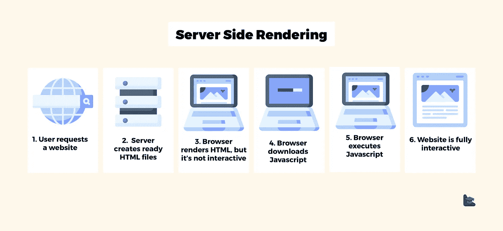
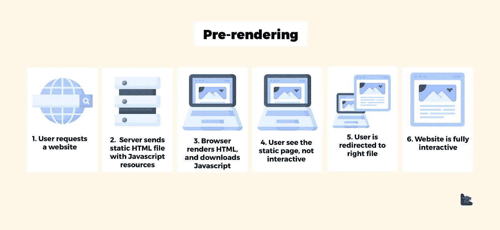
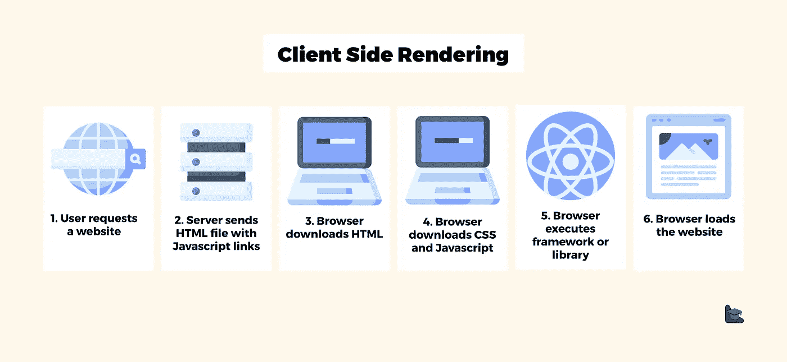

# 网页设计模式——SSR、SSG 和 SPA

> 原文：<https://medium.com/codex/web-design-patterns-ssr-ssg-and-spa-fadad7673dfe?source=collection_archive---------0----------------------->


马库斯·斯皮斯克在 [Unsplash](https://unsplash.com?utm_source=medium&utm_medium=referral) 上的照片

现代 web 开发有时看起来很复杂。SSR、SSG 和 SPA 这些术语通常出现在绝大多数内容中。当我第一次听到这些名字时，我确实很困惑。那些是什么？用哪个？什么时候选择一个而不是另一个？同一个 app 可以用多种模式吗？我将为你分解这些问题。希望在本文结束时，您将对它们有更好的理解，并有更好的能力为您的下一个项目做出更好的架构决策。

# 服务器端渲染

在 SSR 中，当网页被请求时，它被呈现在服务器上，提供给客户机，最后由客户机呈现。



来源:[https://www . blog . duomly . com/client-side-rendering-vs-server-side-rendering-vs-prerender/](https://www.blog.duomly.com/client-side-rendering-vs-server-side-rendering-vs-prerendering/)

这为什么有用？想象一个模板系统，比如 Django 模板系统，其中有如下所示的动态数据。

```
Hello {{user.name}}!
```

使用 SSR，HTML 的动态内容在**运行时**根据服务器状态进行评估，并返回给客户端。所以发送给用户的 HTML 实际上是:

```
Hello John!
```

浏览器(客户端)只需将页面呈现到 DOM 中，瞧，这就是页面。

# SSG(静态现场发电)



来源:[https://www . blog . duomly . com/client-side-rendering-vs-server-side-rendering-vs-prerendering/](https://www.blog.duomly.com/client-side-rendering-vs-server-side-rendering-vs-prerendering/)

SSG 与 SSR 有相似之处。页面也在服务器中生成，*但是，*页面在**构建时**呈现。因此，页面已经呈现在服务器上，等待提供给客户端，而不是在收到请求时在服务器上呈现页面。我将讨论这种方法的优点和缺点，并在下面进一步将其与 SSR 进行比较。

# 单页应用程序



来源:[https://www . blog . duomly . com/client-side-rendering-vs-server-side-rendering-vs-pre rendering/](https://www.blog.duomly.com/client-side-rendering-vs-server-side-rendering-vs-prerendering/)

与前两种方法相比，这种方法相对较新。这是过去二十年来互联网、软件和硬件行业快速发展的结果。通过 SPA，服务器为用户提供了一个**空 HTML** 页面和 **Javascript** 。后者是奇迹发生的地方。当浏览器收到 HTML + Javascript 时，它会加载 Javascript。一旦加载完毕，JS 就会发生，并通过 DOM 中的一组操作将必要的组件呈现给页面。然后，路由由浏览器本身处理，而不会影响服务器。这通常是通过前端框架(或库)完成的，如 React、Vue 或 Angular。

# 服务器端渲染(SSR 和 SSG)与客户端渲染(SPA)

*注:在本节中，当我提到 SSR 时，我指的是 SSR 和 SSG，CSR 指的是 SPA。*

*   **SSR 允许更好的 SEO** (搜索引擎优化)因为内容不需要像 CSR 中那样由 Javascript 加载，所以搜索引擎的网络爬虫可以直接解析信息。
*   **SSR 更适合慢速连接**，因为 HTML 会立即提供，而在 CSR 中，用户会看到一个空白页面，直到加载 Javascript 并呈现页面内容。
*   **SSR 允许查看禁用 Javascript 的内容**。我知道这听起来很奇怪，但是，用户可以有意无意地禁用它。参见此[链接](https://kryogenix.org/code/browser/everyonehasjs.html)，此处揭露了其中一些情况。
*   **SSR 首次加载通常更快**，因为它不需要像 CSR 那样在 Javascript 包中获取整个网站(可以在 CSR 中进行一些性能优化以减少这种负载，如动态导入)。
*   **CSR 在第一次加载后速度更快**，因为没有服务器请求改变页面，这使得它快得惊人。
*   **CSR 提供了更好的 UX(用户体验)**因为它给页面带来了原生应用的感觉。

# SSR vs SSG

这两者的区别在于，在 SSR 中，服务器需要在将页面发送给用户之前渲染页面(在**运行时**渲染)，而在 SSG 中这是不必要的，因为这是在**构建时**完成的。你可能会觉得“那我到底为什么要用 SSR 呢？”。很简单:大多数网站通常都有动态的、有状态的数据(例如:用户登录时 navbar 上的用户电子邮件/徽标)。这意味着我们不能用这些数据在构建时预渲染模板，所以让 SSG 拥有这些数据的唯一方法是通过 Javascript 导入(这将违背 SSG 的核心目的)。

# 什么时候用什么？

这三种方法各有利弊。总的来说没有更好的选择了。您可以在同一个项目中使用所有这三种方法。在这一节，我会给你一些实际案例的例子。

## 文档网站

假设您正在构建 React 的文档。你想在里面放什么？当然,**可访问性**对广大受众，包括网速慢的用户和禁用事件 javascript 的用户。 **SEO** 也是一个问题(当用户搜索与 React 相关的东西时，你会希望用户点击文档)。有了这个，我们可以把范围缩小到 SSR 或者 SSG。选哪个？**我会选 SSG** 。文档没有动态内容，因此根据请求在服务器上呈现它们既多余又慢。有了 SSG，我们可以快速将内容交付给客户。

*补充说明:React 确实使用 SSG 作为他们的文档(他们使用 Gastby)。*

## 博客

博客有定期插入的数据。SEO 和可访问性都是一个成功博客的必要条件。因此，我们将在 SSR 和 SSG 之间做出决定。这一次，**我会选择 SSR** 。这是因为我们经常插入动态数据，我们希望为用户提供最新的数据。

## 客户关系经理

CRM 有不同的要求。 **SEO 不是问题**，因为大多数页面都在登录之后，因此搜索引擎无法到达那里。用户通常在一个稳定的环境中访问 CRM(通常在办公室，有很好的网速和一台电脑)。因此，使用 **SPA 将是我的选择**。它将提供一种用户会喜欢的原生应用程序的感觉。请注意，我们可以在同一个项目中使用其他渲染方法。例如，我们可以把 SSG 放在登录和常见问题页面上。

# 最后的想法

暴露的技术是现代网络的日常基础。对它们的深刻理解有助于开发人员做出更好的架构决策，为最终用户提供更好的体验并创造更好的价值，这是我们的最终目标。

我希望这篇文章有助于理解这些概念。有任何问题，随时通过 LinkedIn 联系我！