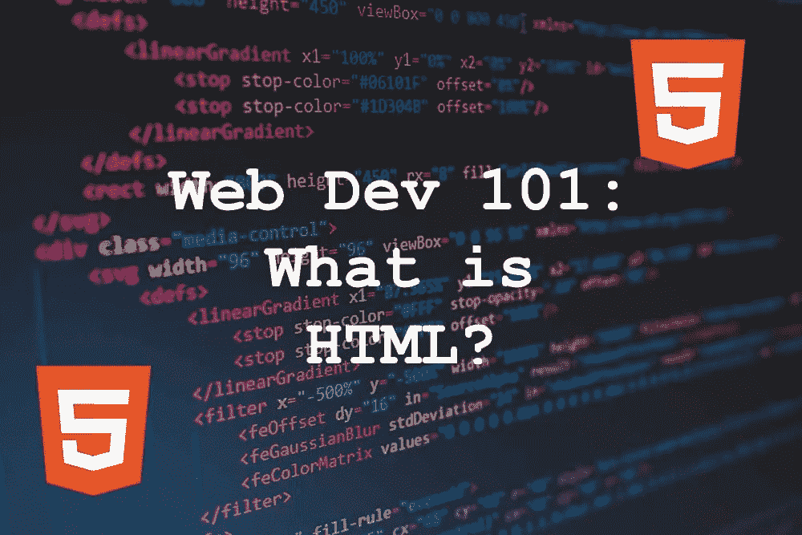

# Web Dev 101:什么是 HTML？

> 原文：<https://medium.com/codex/web-dev-101-what-is-html-ef0328c9b5b4?source=collection_archive---------12----------------------->

如果你想从事 web 开发，有一个似乎永无止境的学习清单。事实上，甚至开始做起来似乎都让人不知所措。

但要开始，你只需要学习 HTML、CSS 和 JavaScript。你会遇到的大多数其他缩略语都围绕着这三种语言。正是这三者推动了网络，一旦你掌握了这三者，你就可以了解…