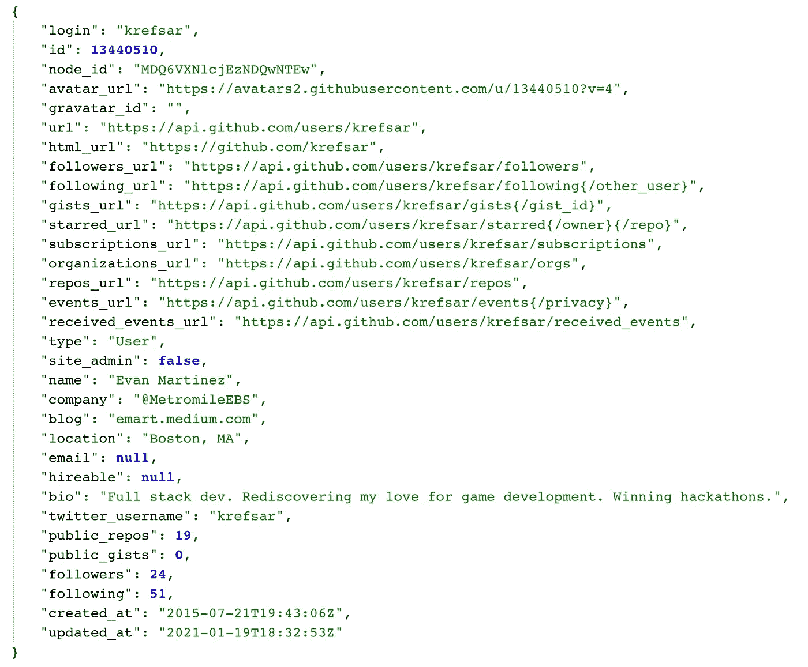

# Web 开发字节—对 API 满意吗

> 原文：<https://medium.com/codex/web-dev-bytes-happy-with-apis-ff7979587cbc?source=collection_archive---------3----------------------->

## [法典](http://medium.com/codex)

## 有价值的数据在那里，这里是如何得到它！

照片由[伊莫·威格曼](https://unsplash.com/@macroman?utm_source=unsplash&utm_medium=referral&utm_content=creditCopyText)在 [Unsplash](https://unsplash.com/s/photos/buttons?utm_source=unsplash&utm_medium=referral&utm_content=creditCopyText) 拍摄

当我刚开始接触科技时，我面临的最大障碍是我没有任何互联网运作的基础知识。这些文章是我回馈给任何有抱负的 web 开发人员或寻求拓宽视野的知识者的方式。

我仍然被我第一份技术工作中的一项任务所困扰。我的经理让我做一些关于“映射 API”的研究，这样她就可以对选项进行成本比较。我是一名产品管理实习生，不知道她是什么意思，所以我当然说“是的”,并猛烈抨击谷歌。我觉得我花了三天才放弃求助，而且我**还**不知道什么是 API！所以这是我希望我当时找到的文章:我将分解 API 到底是什么。

# 掌握控制权

像许多 web 开发概念一样，**应用程序编程接口**听起来技术上很复杂，但实际上很容易理解。一个 **API** (发音为 ay-pee-eye)就是你可以用来操作一个软件的函数集合。想象一个应用程序是一个大的金属盒子，外面有旋钮和控制杆。外部控件(API 函数)允许你使用盒子(应用程序)，即使你看不到里面发生了什么。

照片由 [s2 art](https://unsplash.com/@s2artz?utm_source=unsplash&utm_medium=referral&utm_content=creditCopyText) 在 [Unsplash](https://unsplash.com/s/photos/knobs-dials?utm_source=unsplash&utm_medium=referral&utm_content=creditCopyText) 上拍摄

Web API 非常常见，甚至非程序员也可能会与它们交互(我实习期间就是这种情况)。通常的设置是有一个服务器，你可以通过 **URL 的**使用它的 API。使用这些 API 可以触发像下订单这样的动作，但是它几乎总是返回**数据**。

# 寻找克雷夫萨

因为他们使用 URL，所以使用 web 浏览器很容易看到 API 的运行。例如，我的 Github 用户名是“krefsar ”,所以尝试在`api.github.com/users/krefsar`用我的用户名访问 Github API:

是我！

您刚刚使用浏览器进行了一个 **API 调用**。检查所有关于我的数据！您甚至可以使用这些数据来驱动应用程序！

# 数据费用

数据可能很有价值。如果你建立了一个 API，让人们访问有用的数据，那么你甚至可以向他们收费！你需要做的就是给每个付费用户一个唯一的 **API 密匙**，当他们访问 API 时使用。然后你可以跟踪他们的使用情况，并相应地向他们收费。例如，你可以付费访问谷歌地图的方向 API，这样你就可以在自己的应用程序中使用他们的寻路引擎。

# 那很容易！

不算太糟吧？API 只是描述了你可以使用软件的公开方式，与软件可能做的隐藏的、幕后的事情形成对比。回到我最初的映射 API 任务，我的经理要求我找到允许访问映射数据的 API。由于地图数据很有价值，我应该搜索出售这些数据的公司，并收集价格和易用性等信息。

尝试在互联网上探索。如果有数据，就有可能有 API 来访问它。直到下一次，这里有一些免费的 API 供您使用:

*   卡特彼勒事实—【https://alexwohlbruck.github.io/cat-facts/docs/ 
*   https://random.dog/woof.json
*   Agify — [https://api.agify.io？name=evan](https://api.agify.io?name=evan)
*   露天空气质量—[https://api.openaq.org/beta/averages](https://api.openaq.org/beta/averages)