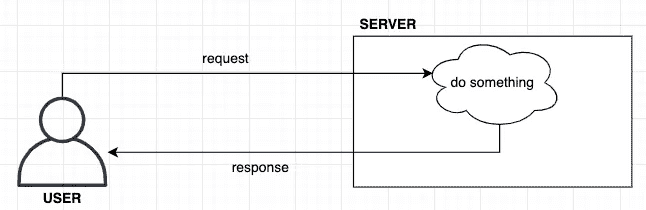
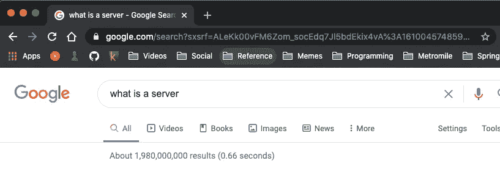

# Web 开发字节—服务器很整洁

> 原文：<https://medium.com/codex/web-dev-bytes-servers-are-neato-2abfbe579f64?source=collection_archive---------8----------------------->

## 来了解服务器到底是什么，并加入对话。

在 [Unsplash](https://unsplash.com/s/photos/server?utm_source=unsplash&utm_medium=referral&utm_content=creditCopyText) 上[科学高清](https://unsplash.com/@scienceinhd?utm_source=unsplash&utm_medium=referral&utm_content=creditCopyText)拍摄的照片

*当我开始涉足科技领域时，我面临的最大障碍是我没有任何互联网运作的基础知识。这些文章是我回馈给任何有抱负的 web 开发人员或寻求拓宽视野的知识者的方式。*

我非常清楚地记得我的第一次技术实习是什么样子，无助地坐在那里，我的同事会漫不经心地讨论 API 和 SQL 之类的东西。但总是出现的词是“服务器”。当我开始学习 web dev 时，课程要求“立起”服务器。我甚至记得问过一位 CTO，构建一个天气应用程序是否是学习编码的好方法。他的回答是:

> “哦是啊，那应该很容易。你也许可以设置一个节点服务器，然后——”

其余的对我无知的头脑来说是静止的。过了几个星期，我才终于明白服务器到底是什么:

# 服务器是一个满足或者说**服务于**请求的程序。

所以答案就在名字里！我曾经认为服务器是某个仓库里的巨型单片计算机。相反，服务器是软件(虽然它可以运行在单片计算机上)。而且因为服务器只是一个程序，所以你在数据仓库里看到的那些巨型计算机经常同时运行很多服务器！

# 心理模型

信不信由你，这个图表是我自己做的

在高层次上:你向服务器发出请求，它做一些事情，然后向你返回一个响应，告诉你发生了什么。有这么多不同种类的服务器是有道理的。

例如，使用文件服务器，你可以请求你想要下载的文件，服务器会将它们发送给你。或者您可以发送您自己的文件并请求存储它们，在这种情况下，服务器会告诉您它是否能够这样做。

服务器处理各种请求是很常见的。一台服务器可能负责:

*   验证用户登录并响应用户名/密码组合是否正确。
*   跟踪页面访问，其中每个页面访问作为一个单独的请求发送到服务器。
*   运行一系列复杂的任务，如检查商品库存、处理付款，然后更新库存和处理运输。

在某些情况下，请求者希望响应中有数据(“密码正确吗？”)，而在其他情况下，重要的是操作是否成功。

# 在网络开发的世界里

服务器通常是任何 web 开发事业的重要组成部分，因为它们负责**操纵数据**。这里需要注意的一点是，出于安全原因，网站几乎从不直接访问数据库。它们向服务器发送请求，然后服务器与数据进行交互。这些数据甚至不必与服务器在同一台物理计算机上！

当网站上的用户点击购买新帽子时，该请求从网站发送到服务器，服务器处理更新库存数据、用户数据、运输数据等工作。然后，服务器让网站知道订单的状态，以便可以呈现给用户。这样，网站只负责**显示**数据。操纵是服务器的工作。

因此，当您的企业需要构建一个允许客户浏览新书的新功能时，有人需要修改(或创建)服务器，以便它可以为新书的数据请求提供服务。

# 现实世界的要求

最后，我们将揭开“请求”这个概念的神秘面纱，以及向服务器发出请求意味着什么。如果您已经阅读了网站上的 Web Dev Bytes 文章，您可能记得当您导航到一个网站时，您的 Web 浏览器会访问另一台计算机。你的浏览器**请求**网站，另一台电脑**响应**你需要的文件来渲染和使用网站。那台电脑是一台**服务器！要找到请求，只需查看 URL 即可！**

请求就在 URL 中！

我们将在另一个时间更深入地研究请求，但是这里的关键要点是服务器请求是以 URL 的形式构造的。网站、程序甚至其他服务器都可以很容易地向服务器发出请求。您的浏览器一直在发出服务器请求！服务器知道如何解析 URL，以确定要做什么。在谷歌上搜索发送请求:

[https://www.google.com/search?q=what+is+a+server](https://www.google.com/search?q=what+is+a+server&rlz=1C5CHFA_enUS913US914&oq=what+is+a+server&aqs=chrome.0.0i457j0l2j0i395l7.2598j1j15&sourceid=chrome&ie=UTF-8)

谷歌服务器完全明白你在做什么。它执行搜索并返回网站文件，以便您的浏览器可以呈现结果。

# 小心点！

现在，您已经了解了一些服务器基础知识。服务器只是一个根据请求工作的程序。它们可以用来发送文件(如网站)，或操纵数据(页面访问)，或任何其他需要的工作！当您浏览互联网时，请留意地址栏的变化。你可以想象另一端的服务器如何解析该 URL，以确定向你发送什么网页，甚至它可能在后台做什么工作。