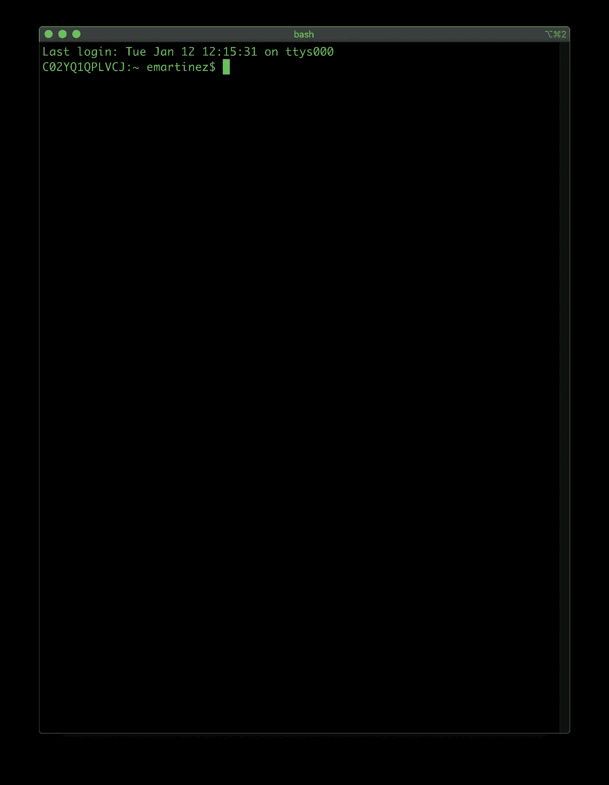
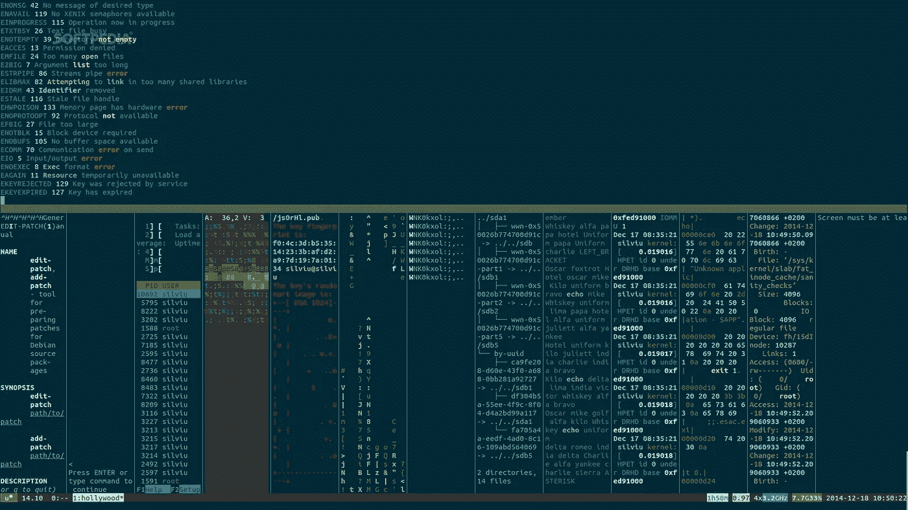
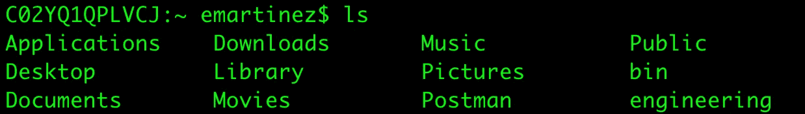

# Web 开发字节—非常棒的终端

> 原文：<https://medium.com/codex/web-dev-bytes-terrific-terminals-511d5cc118db?source=collection_archive---------10----------------------->

## [法典](https://medium.com/codex)

## 那些电影黑客拿着那些绿色文本在做什么？来获取终端的独家新闻吧！

由[马库斯·斯皮斯克](https://unsplash.com/@markusspiske?utm_source=unsplash&utm_medium=referral&utm_content=creditCopyText)在 [Unsplash](https://unsplash.com/s/photos/code?utm_source=unsplash&utm_medium=referral&utm_content=creditCopyText) 上拍摄的照片

当我开始接触科技时，我面临的最大障碍是我没有任何互联网运作的基础知识。这些文章是我回馈给任何有抱负的 web 开发人员或寻求拓宽视野的知识者的方式。

啊，终点站。如果说开发中有什么是我喜欢的，那就是开始使用终端。我甚至承认，我有时会在桌面上开着一个终端窗口，因为这让我觉得自己像一个很酷的黑客。终端功能强大得惊人，每台电脑都有，但是对于外行人来说，它们看起来简直是令人生畏。今天，我将拉开终端的帷幕，向您展示到底发生了什么。

如果您没有见过，终端看起来像这样:

但你可能在电影中见过它们，它们看起来更像这样:

如果你和任何软件工程师一起工作，你很有可能至少一次在他们的屏幕上看到这样的窗口。在技术世界中，通常，需要在开发中使用软件的人需要使用终端。这个列表包括工程师、测试人员、产品经理，甚至销售人员。

# 控制

那么什么是终端呢？终端是一种允许你用文本运行计算机命令的程序。如果这听起来含糊不清，那是因为只要你知道键入什么，终端几乎可以让你做任何事情(当然，不包括任何安全策略)。它们如此强大的原因是你的电脑能做的任何事情，你都可以通过终端来控制。我是认真的！移动文件，播放音乐，甚至浏览互联网都可以通过文本命令来完成！

要理解文本命令是如何完成任何事情的，你需要从不同的角度思考你的计算机是如何工作的。我们大部分的计算机交互都是通过键盘和鼠标完成的，因为程序运行在窗口中，需要我们打字和点击。例如，使用电子邮件客户端意味着我们必须点击应用程序来打开它，然后我们可以滚动电子邮件列表，也许还可以键入回复。但是要记住的是，一切，我指的是**一切**都是由代码控制的。

当你打开电子邮件应用程序时，你的点击正在执行处理启动电子邮件程序的代码。当您发送回复时，会执行一个底层命令来处理消息的发送。甚至图形界面的整个概念——视窗，你的鼠标光标——都是一个程序，它被创造出来是为了让我们可以用鼠标更容易地控制我们的计算机。如果你知道你在做什么，终端允许你直接向计算机发出命令**而不需要任何图形操作。**

# 在窗帘后面

作为一个真实的例子，考虑打开一个文件夹来查看里面的内容。图形界面可能会将所有文件和文件夹显示为图标。使用终端，您可以通过键入以下命令并按 enter 键来完成同样的工作:

`ls`

这将向你展示:

实际上，我们使用的图形界面基本上是运行终端命令，并将它们转换成我们可以轻松处理的可视信息。如果你把一个 dogphoto.jpg 文件拖到你的 doggos 文件夹中，运行的后台终端命令是

`mv dogphoto.jpg doggos`

# 无限潜能

但是我们为什么要使用终端呢？毫无疑问，使用网络浏览器以图形方式浏览互联网要容易得多，而且对于许多应用程序来说，操作视觉元素更有效。一个原因是，有时根本没有图形界面来执行我们构建软件所需的命令。通常情况下，我们知道我们需要的终端命令，但是没有人构建一个简单的可视化界面来为我们运行它们。

我认为直接使用终端的更有说服力的理由是命令本身是简单的和可组合的。以下是一些基本命令:

*   `mv` -移动文件
*   `cd` -在文件夹间导航
*   `ls` -列出文件夹中的文件
*   `cp` -复制文件
*   `rm` -删除文件
*   `cat` -读取文件
*   `curl` -通过互联网发送请求

每个命令只做一件非常简单的事情。这使得他们很容易记住。我们也可以像这样把命令串起来:

`cp myfile.txt otherfolder/ && rm myfile.txt && cd otherfolder/`

该示例将文件复制到文件夹中，删除原始文件，然后导航到现在包含副本的文件夹。这就是我们的图形程序正在做的事情！电子邮件客户端必须运行一系列命令，如

1.  启动程序
2.  从互联网请求新的电子邮件
3.  列出所有的邮件

但是这就是拥有这些基本终端命令的真正力量:我们可以按照我们想要的任何顺序运行命令！命令就像积木，程序就像完工的建筑。当你需要发送邮件时，邮局是很好的选择，但是如果我直接使用构建模块，那么我就可以构建一些东西，当我从互联网上获得新信息时，它就可以发送邮件。这是一个奇怪的例子，但我希望它能说明，通过终端命令，我可以让计算机做**我需要它做的事情。**

# 安全注意事项

当然，能够使用终端看起来很棒。这感觉就像是魔法，能够用一些神奇的单词来控制电脑。但是这种力量也有黑暗的一面。举例来说，图形程序有内置的防护栏来确保你不会意外删除一个包含重要代码的文件。有了终端，你就可以直接控制你的电脑。通常，在终端级别有一些安全措施来使事情变得稍微安全，但这仍然是一个潜在危险的世界。如果不小心，可能会对操作系统造成不可修复的损害，需要完全重新安装。所以**要小心**！

# 现在你明白了！

多棒的工具啊！使用终端可以让你直接控制你的计算机，让你可以做任何你想做的事情，而不受图形程序的限制。软件开发人员通常需要这种能力来开发新软件，而其他人可能不得不使用终端，因为没有图形替代品(就像仍在开发的软件)。我希望你对什么是终端有了更清楚的了解。如果你喜欢这个内容，或者想让我在将来讨论另一个话题，请留下评论让我知道！