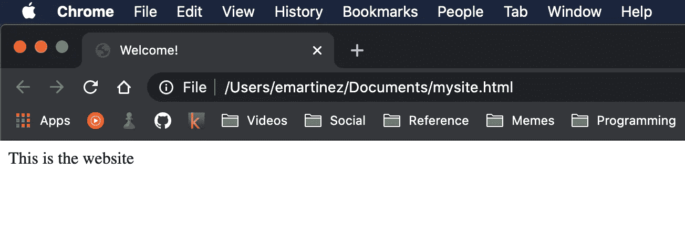

# web Dev Bytes——什么是网站？

> 原文：<https://medium.com/codex/web-dev-bytes-what-is-a-website-100bcbca0b88?source=collection_archive---------11----------------------->

## 到底什么是网站，网络浏览器是做什么的？


图片由 [Unsplash](https://unsplash.com/s/photos/web?utm_source=unsplash&utm_medium=referral&utm_content=creditCopyText) 上的 [Taras Shypka](https://unsplash.com/@bugsster?utm_source=unsplash&utm_medium=referral&utm_content=creditCopyText) 拍摄

*当我开始涉足科技领域时，我面临的最大障碍是我没有任何互联网运作的基础知识。这些文章是我回馈给任何有抱负的 web 开发人员或寻求拓宽视野的知识者的方式。*

互联网和我们用来上网的浏览器是我们一直在使用的工具。我个人每天至少花 4 个小时上网看书，看视频，玩游戏。在这篇文章中，我们将谈论网站和那个重要的工具:网络浏览器。

几乎每台联网的电脑上都安装了网络浏览器，最大的浏览器是 Chrome、Firefox 和 Safari。要浏览互联网，你所要做的就是打开一个新窗口，键入一个网站地址，按回车键，然后你就可以了！但是你有没有想过到底发生了什么？“访问”一个网站意味着什么，你的浏览器如何知道当你到达那里时显示什么？最后，给网站“编码”是什么意思？

# 我们都是联系在一起的

简单地说，互联网是一个巨大的计算机网络。就像你可能有一台台式机或笔记本电脑一样，互联网只是一堆连接在一起的电脑。当您连接到互联网时，您就加入了所有其他也在线的计算机。即使当人们谈论“云”时，他们仍然在谈论某个地方的物理计算机。

现在，所有这些计算机都需要能够相互通信。为此，每台计算机都有自己唯一的地址，如下所示:

> 172.217.10.14

这被称为一个 **IP 地址。如果你有一台电脑的 IP 地址，那么你就可以使用，你猜对了，网络浏览器来访问它！但是谁会记得 172.217.10.14 带你去谷歌呢？我们将在后面的文章中讨论具体细节，但基本上，有一些服务可以做到这一点，所以你只需输入更加用户友好的“[google.com](http://google.com)”并连接到正确的计算机。**

# 把数据给我！

好的，那么你的网络浏览器在 google.com 与电脑连接，现在做什么？你的浏览器做的下一件事是向谷歌电脑请求谷歌网站。然后，谷歌电脑发送过来一个文本文件，里面有如何显示页面的所有说明。该文件可能是这样的:

```
<!DOCTYPE html>
<html>
  <head>
    <title>Welcome!</title>
  </head>

  <body>
    <div>
      <p>This is the website</p>
    </div>
  </body>
</html>
```

但更有可能是一个复杂的网站，看起来像这样:


照片由[弗洛里安·奥利佛](https://unsplash.com/@florianolv?utm_source=unsplash&utm_medium=referral&utm_content=creditCopyText)在 [Unsplash](https://unsplash.com/s/photos/code?utm_source=unsplash&utm_medium=referral&utm_content=creditCopyText) 上拍摄

这个文件是用一种叫做 HTML(超文本标记语言)的语言写的，它是网站的语言！您的 web 浏览器可以解析 HTML 文件并呈现一个网页供您查看。浏览器知道如何将 HTML 的一部分转换成搜索栏、图像、按钮以及你所熟悉的网站的所有其他部分。

# 编码之路

让我们再看一个简单的 HTML 例子:

```
<!DOCTYPE html>
<html>
  <head>
    <title>Welcome!</title>
  </head>

  <body>
    <div>
      <p>This is the website</p>
    </div>
  </body>
</html>
```

HTML 被设计成易于读写，这也是编码人员，尤其是前端工程师所做的。这里有一个有趣的练习:复制上面的代码，在你自己的电脑上保存为一个名为`mysite.html`的文本文件。接下来，找到文件并将其拖到打开的浏览器窗口中。你会看到一个使用 HTML 文件的新网站！你会注意到，这些人类可读的片段“欢迎”和“这是网站”出现在网站的不同位置:



如果你决定成为一名网络开发人员，你的工作的一部分将是为网站创建这些 HTML 文件，以便它们可以被网络浏览器正确地呈现。您的浏览器还会使用其他文件来呈现网站(例如 CSS 和 Javascript)，但我们会在以后的文章中介绍它们。

# 把所有的放在一起

下次您使用 web 浏览器时(或者现在，对于本文来说)，您可以想象正在发生的过程:

1.  你的浏览器连接到世界上某个地方的另一台电脑上，
2.  另一台计算机向您发送了一个 HTML 文件(和一些其他文件)，
3.  您的浏览器使用该文件为您呈现网页。

你的旅程才刚刚开始！我们将一起探索 web 开发的更多方面，例如:

*   使网站运行的其他文件是什么？
*   为什么我们可以键入“[google.com](http://google.com)”而不是 IP 地址？
*   您的 web 浏览器究竟是如何向另一台计算机“询问”网站的？
*   HTML 是如何工作的？它能做什么？

我希望你将来能和我一起获得更多的网络开发字节。如果你喜欢这篇文章或有反馈，一定要留下评论！