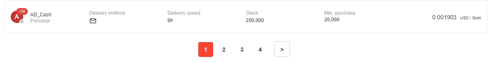
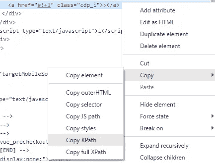

# 使用 Python、Selenium 和 BeautifulSoup4 进行网页抓取分页网页

> 原文：<https://medium.com/codex/web-scraping-paginated-webpages-with-python-selenium-and-beautifulsoup4-8b415f833132?source=collection_archive---------1----------------------->


图片来自[https://unsplash.com/photos/OqtafYT5kTw?utm_source=unsplash&UTM _ medium = referral&UTM _ content = creditShareLink](https://unsplash.com/photos/OqtafYT5kTw?utm_source=unsplash&utm_medium=referral&utm_content=creditShareLink)

# 在这篇文章中，我介绍了从多个不同的网页中一次性抓取数据的一般过程和技术。我将从 g2g.com[为 MMORPG 失落的方舟](http://g2g.com)刮出所有地区和服务器的黄金价格，这是一个受玩家欢迎的在线市场，为各种游戏购买游戏内物品或货币。

# 先决条件

在我们开始之前，您需要做一些事情:

1.  Chrome 网络驱动
2.  安装了必要的 Python 库

幸运的是，这两个步骤非常容易实现。Chrome webriver 是用于测试 web 应用程序的自动化工具；但是，我们将使用它来自动浏览网页，以到达我们想要的位置。Chromedriver 下载可以在[这里](https://chromedriver.chromium.org/downloads)找到。你会想要下载与你系统上安装的 Chrome 版本相匹配的 Chrome 驱动，你可以在浏览器的“帮助”部分点击“关于谷歌 Chrome”找到。


作者图片


作者图片

在撰写本文时，我有 Chrome 版本 99.0.4844.82，所以我想下载 Chrome 版本 99 的 Chrome 驱动程序。将它存储在一个您以后能够找到的地方，因为我们需要在代码中指定它的路径。

接下来，如果您的系统上还没有安装它们，那么在您的控制台或 anaconda navigator 中使用`pip install [library name]`或`conda install [library name]`安装下面的 python 库。您将需要以下库:

1.  `**bs4**`解析 html 并使其可读
2.  `**selenium**`使用 Chromedriver
3.  `**pandas**`对于数据帧
4.  `**datetime**`获取数据被抓取的时间
5.  `**time**`用于暂停某些网页
6.  `**os**`写文件
7.  `**re**`对表达式进行格式化

安装好这些之后，我们就可以开始了！

# 入门指南

首先，我们打开一个 Jupyter 笔记本或 Python 文件，并导入所有必要的库:

```
from bs4 import BeautifulSoup as bs
from selenium import webdriver
import pandas as pd
from datetime import datetime
import time
import os
import re
from selenium.webdriver.chrome.options import Options
from selenium.webdriver.common.by import By
from selenium.webdriver.chrome.service import Service
from selenium.common.exceptions import NoSuchElementException
from selenium.common.exceptions import ElementNotInteractableException
```

最后五行帮助我们使用 Chromedriver，并且更有效地在 g2g.com 的 HTML 代码中搜索项目。我会根据需要介绍这些内容。现在，行`from selenium.webdriver.chrome.options import Options`使我们能够指定我们希望如何打开 Chrome。就我个人而言，我喜欢我的 Chrome 实例被最大化(这样我就不必手动最大化浏览器)和隐姓埋名模式(这样我的个人历史就不会受到抓取很多很多页面的影响)。这是通过代码实现的:

```
service = Service('insert path to your Chromedriver download')options = Options()
options.add_argument('--incognito')
options.add_argument('start-maximized')driver = webdriver.Chrome(service=service, options=options)
```

在这里，我全局设置了一个 Chromedriver，供我们稍后将编写的几个函数使用。我创建了一个`Service`对象，它指定了 Chromedriver 的路径，以及一个`Options`的实例，它使我们能够在匿名模式下最大化地打开 Chrome。接下来，我打开 Chrome，将我们的`Service`和`Options`实例传递给`webdriver.Chrome()`。这将打开 Chrome，如果你按原样运行代码的话，什么也不做。无论如何，这完成了我们的初始设置。现在我们将继续刮削。

# 最初的刮擦步骤

在我们开始降低黄金价格之前，我们必须克服几个障碍。其中一个障碍是，有 62 个独立的服务器可以购买黄金，并且它们都有不同的 URL。见下图来自[https://www.g2g.com/categories/lost-ark-gold](https://www.g2g.com/categories/lost-ark-gold)。


这些服务器中的每一个都有我们需要访问的不同的 URL！作者图片

让我们获取所有这些服务器的 URL，因为我们想要从所有这些服务器的*中抓取数据。我们想查看页面的 HTML 代码，看看在哪里可以找到它们。在 Chrome 中，我们只需在[https://www.g2g.com/categories/lost-ark-gold](https://www.g2g.com/categories/lost-ark-gold)导航到合适的 URL，右键点击页面并点击 inspect。接下来，我们希望查看页面上某个元素的 HTML 代码，特别是 offer 框，这样我们就可以知道在哪里可以找到指向该服务器黄金价格的 URL。在 Chrome 中，我们可以通过点击侧边栏左上角的按钮来检查特定的元素，只需将鼠标悬停在我们想要查看其 HTML 代码的元素上。*

**

*选择按钮以选择元素。作者图片*

**

*将鼠标悬停在我们想要的项目上。作者图片*

*当点击上图中的项目时，该元素的 HTML 代码会在侧边栏中显示出来。在检查代码时，我们可以看到，在我们正在查看的 HTML 代码部分中只有一个 URL，服务器的所有元素都有相似的代码，如下图所示。*

**

*这些服务器由一个类为“col-12 col-md-3”的“div”元素分隔。作者图片*

*现在我们已经准备好抓取 URL 了。在初始化了之前的 Chromedriver 之后，我执行了以下代码:*

```
*URL = '[https://www.g2g.com/categories/lost-ark-gold](https://www.g2g.com/categories/lost-ark-gold)'# initialize an empty list to store the URLs in
links = []driver.get(URL)
time.sleep(5) # my internet is slow, so this pauses to load it in
html = driver.page_source
soup = bs(html, features='html.parser')boxes = soup.find_all('div', class_='col-12 col-md-3')
for box in boxes:
    links.append(box.find('a', href=True)['href'])*
```

*上面，我们告诉我们的驱动程序转到我们一直在检查的 URL，并允许它使用`time.sleep(5)`行加载(由于我的网速很慢，这对你来说可能是不必要的)。接下来，我们使用`html = driver.page_source`获取网页的 HTML 然而，如果我们照原样打印 HTML，它将是一堆混乱的、不可理解的文本。因此，我们使用 BeautifulSoup4 来解析 HTML 代码，使它对我们来说更具可读性。对于“features”参数，您可以使用您喜欢的 HTML 解析器，但是为了简单起见，我喜欢使用 html.parser。在这之后，`boxes = soup.find_all(...)`行将返回一个所有“div”元素的列表，这些元素的类等于“col-12 col-md-3”，我们将它标识为“失落的方舟”黄金销售页面上每个服务器的 HTML 代码。然后，我们遍历每个“box”元素，提取我们遇到的每个服务器的 URL。*

*向下滚动到页面底部，我们看到服务器列在两个不同的页面上:*

**

*作者图片*

*为了解决这个问题，我使用了强力方法，因为合理的假设是页面数量在不久的将来不会增加。我只是对游戏服务器的第二页重复上述过程:*

```
*URL2 = URL + '?page=2'
driver.get(URL2)
time.sleep(5)
html = driver.page_source
...*
```

*这种强力方法可以满足本文的目的。现在我们有了每个服务器的 URL，我们将继续讨论如何收集数据。*

# *导航多个分页页面*

*为了简单起见，我将演示如何获取一台服务器的所有黄金价格。如果你对我如何浏览每一个服务器并处理一些发生的异常感兴趣，你可以在这里查看这个项目[的原始代码。](https://github.com/cbarger233/Lost-Ark-g2g-Scraping-and-Dashboard-App/blob/main/gold_scraping.py)*

*我们将查看 Azena 的黄金价格，它应该是“链接”列表中的第一个(Python 中的第零个)链接，而不是链表。通过设置`azena_link = links[0]`可以轻松获得链接。首先，让我们看看页面是如何设置的，以及我们将如何计划收集数据。导航到黄金列表页面，我们看到它们都列在一个表格中，由四个不同的页面分隔。就像我们对链接所做的那样，我们想要识别每个列表的 HTML 代码。这一次，我们还希望我们的 Chromedriver 为我们在页面之间导航，这样我们就不必手动操作了。*

**

*作者图片*

*…*

**

*底部表示我们有四页要浏览。作者图片*

*上面我们看到，这个特定的服务器，至少在撰写本文时，有四页的黄金价格。为了浏览所有四个页面，我们需要收集初始页面上的数据，单击下一页按钮，收集第二页上的数据，单击按钮，等等。因此，我们需要单击按钮进入下一页，直到它不再出现，同时收集我们想要的数据。为此，我通常使用下面的助手函数:*

```
*def check_exists_by_xpath(driver, xpath):
    try:
        driver.find_element(By.XPATH, xpath)
    except NoSuchElementException:
        return False
    return True*
```

*在这个函数中，我通过使用元素的 XPATH 来检查元素是否存在，这可以通过检查 HTML 代码来找到，类似于我们前面所做的。只需右键单击元素的 HTML 代码，就会出现复制其 XPATH 的选项，如下所示:*

**

*作者图片*

*在我们的例子中，我们特别寻找包含文本'>'的按钮。因此，我们希望使用我们的函数来检查该按钮是否存在:*

```
*if check_exists_by_xpath(driver, "//a[contains(text(), '>')]"):
    element = driver.find_element(By.XPATH, "//a[contains(text(), '>')]")
    driver.execute_script('arguments[0].scrollIntoView();', element)
    driver.execute_script('window.scrollBy(0, -200);')
    element.click()else:
    print('No next page!')*
```

*在上面的代码块中，我们使用 helper 函数检查按钮是否存在，如果存在则返回`True`，如果不存在则返回`False`。如果按钮确实存在，我们通过执行几行脚本滚动到它的位置，然后单击它进入下一页。现在，我们可以简单地执行类似这样的代码块，直到按钮不存在，在这种情况下，我们会看到消息“没有下一页！”当然，我们会希望一路刮走黄金价格(以及你想要的任何其他信息)。*

*我们基本上完成了！现在我们要做的就是收集数据。与我们之前所做的类似，检查任何 gold 列表以查看其 HTML 代码的结构。*

**

*作者图片*

*通过检查，我们看到这些“报价箱”中的每一个都包含在一个“div”中，其“class”等于“other _ offer-desk-main-box other _ offer-div-box”。我们将希望使用 BeautifulSoup4 来专门搜索这些内容，并将它们存储在一个列表中。*

```
*offer_boxes = soup.find_all('div', class_='other_offer-desk-main-box other_offer-div-box')*
```

*现在，我们浏览每个报价框，提取我们想要的数据。*

```
*for box in offer_boxes:
    name = box.find('div', class_='seller__name-detail').text.strip()
    price = box.find('span', class_='offer-price-amount').text.strip()
    price = re.sub(',', '', price)
    price = float(price)*
```

*在上面的代码块中，我取出了卖家的名字和他们出售黄金的价格。我使用 regex 来确保价格没有不必要的字符，并将其转换为浮点值。就是这样！在我的原始代码中，我将值存储在列表中，并将其转换为 pandas 数据帧，以便以后转换为。csv 文件。如何组织数据以及想要收集什么取决于你自己。同样，如果你想更详细地查看我的代码，你可以在这里查看原始代码。你可以在这里查看我为这个项目[制作的仪表盘。](https://lost-ark-gold-prices.herokuapp.com/)*