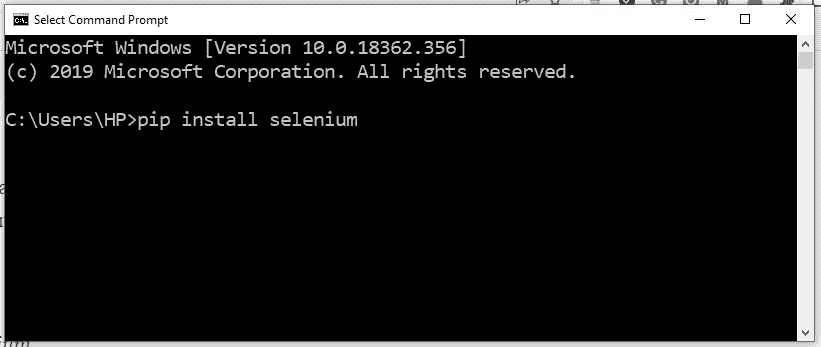
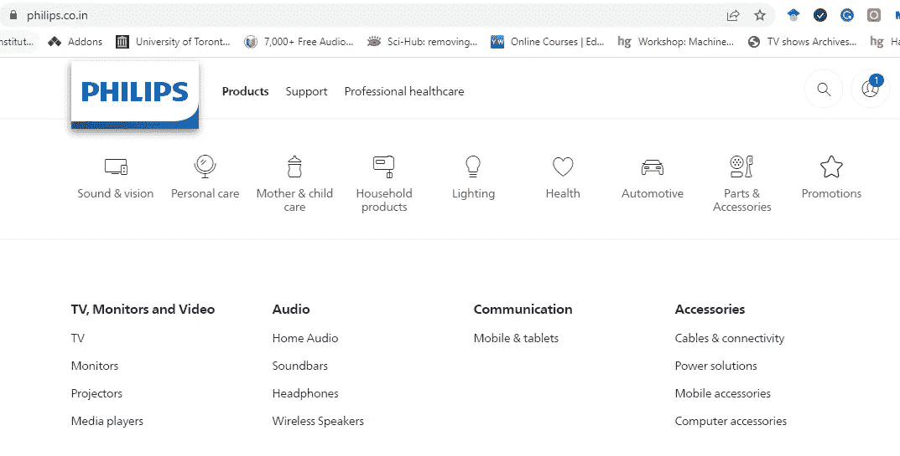
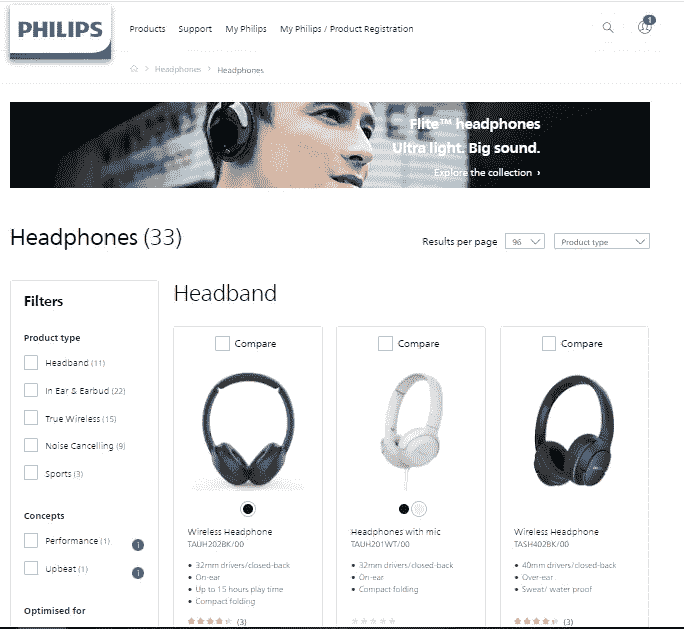
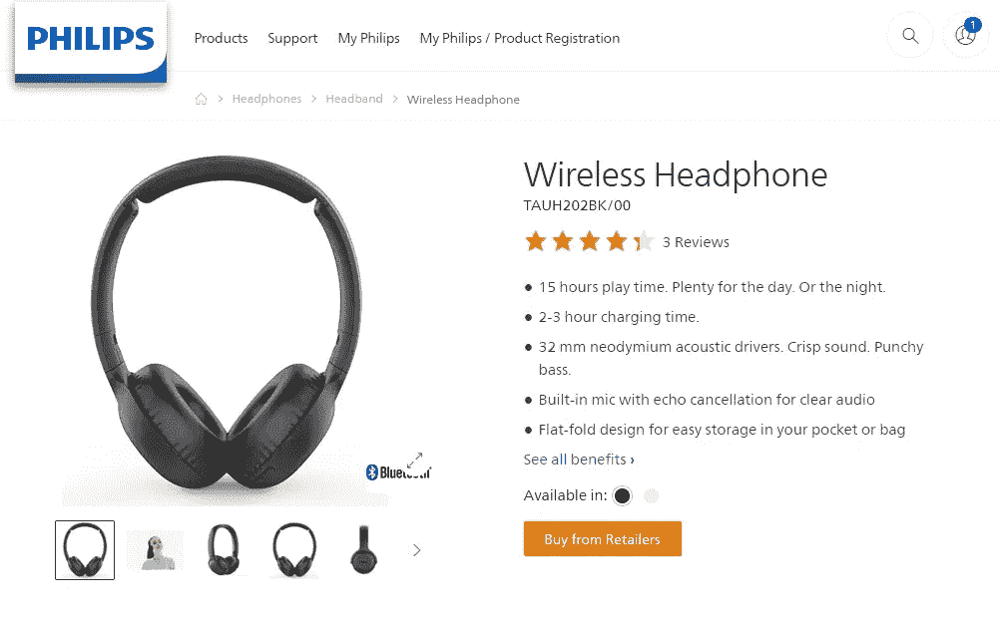
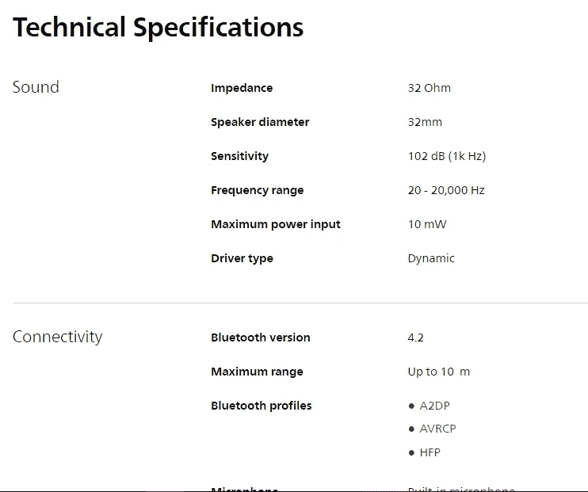
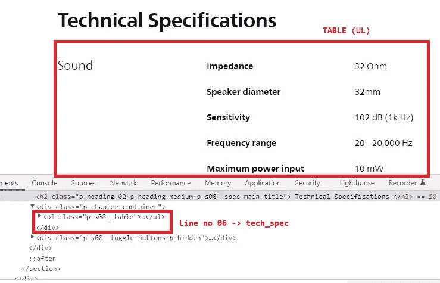
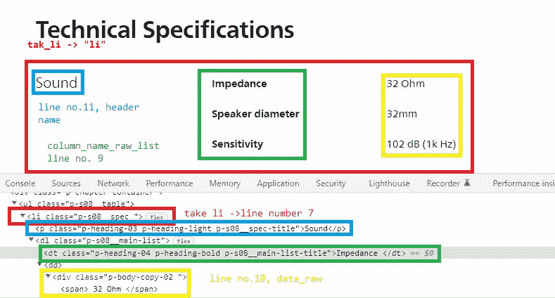
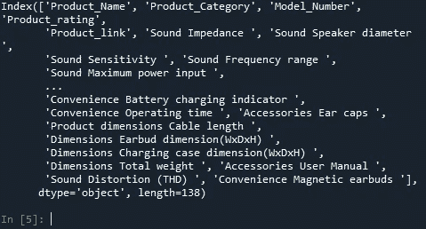
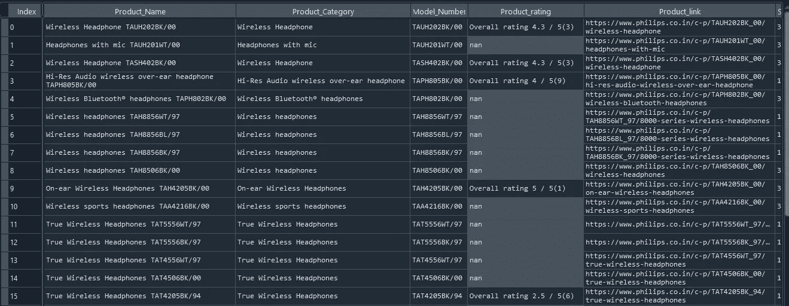

# 菲利普印度网站的网页抓取——抓取耳机类别。

> 原文：<https://medium.com/codex/web-scraping-the-phillips-india-website-scraping-the-headphone-category-e69cc8c80b1?source=collection_archive---------4----------------------->

照片由 [Iwona Castiello d'Antonio](https://unsplash.com/@aquadrata?utm_source=medium&utm_medium=referral) 在 [Unsplash](https://unsplash.com?utm_source=medium&utm_medium=referral) 上拍摄

这里我会把菲利普斯网站上的内容全部刮下来。内容将是耳机类别。该网站是菲利普斯的印度网站。

通常，web 抓取是数据科学/数据分析师工作的一部分，即数据生成或数据聚合。

在这里，我们将一步一步的方法，我们如何做网站抓取，我们将使用的技术是，Python，Selenium 和 Beautiful Soup。

首先，我们要安装一些包，我们在 cmd 或 anaconda 提示符下键入特定的命令。

> pip 安装 lxml
> 
> pip 安装硒
> 
> pip 安装 beautifulsoup4
> 
> pip 安装熊猫
> 
> pip 安装 web 驱动程序-管理器
> 
> pip 安装正则表达式

首先，我们将导入我们需要的包。

我要做的是，直接访问包含所有耳机和所有类型耳机的网站。因此，我们很容易尝试不做太多的网站自动化。

我在下面提到了我们网站的外观，你可以去看看这个网站是如何为你设计的。【https://www.philips.co.in/c-m-so/headphones/latest# 

首先，我们所做的是将所有的数据收集到小容器中，或者我们可以说是一个小盒子。我将提取型号、类别名称和总体评分。

上面代码的第 19 行是收集产品的链接。通过收集产品链接访问产品网站，并收集详细格式的技术规格等数据。

现在，最后我们收集所有数据，最终结果是我们将数据保存为 CSV 格式。

内部数据如上图所示。

该文件将被存储为“Final_Headphones.csv”

完整的代码如下所示:

这就是收集数据的全部内容。

谢谢你。